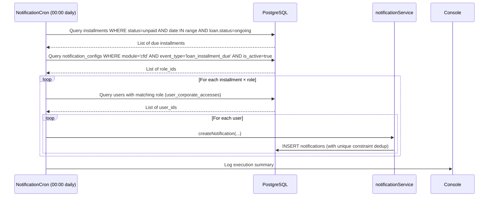
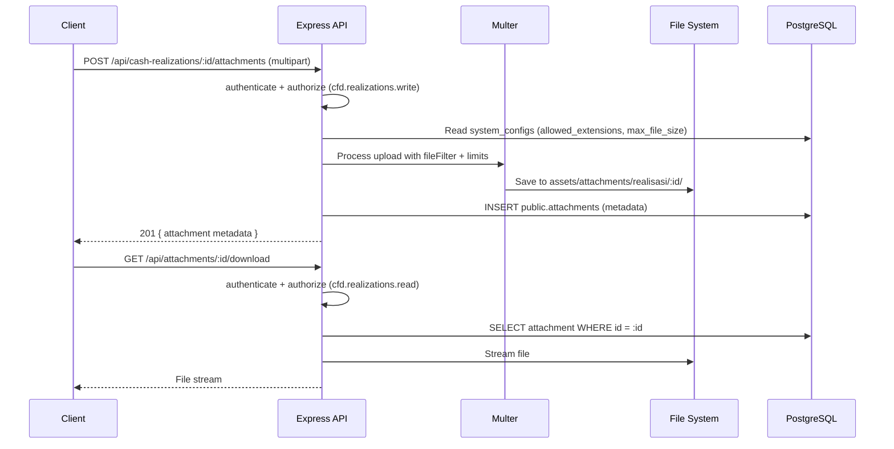

# Design Document — CFD Financial Enhancements

## Overview

Fitur ini memperluas aplikasi Corporate Finance Dashboard (CFD) dengan menambahkan lima kapabilitas utama:

1. **Menu Realisasi** — pencatatan realisasi kas (cash-in/cash-out) per departemen/proyek dengan lampiran file multi-file yang aman.
2. **Master Bank** — manajemen data bank sebagai referensi modul pinjaman.
3. **Data Pinjaman Bank** — pencatatan pinjaman beserta jadwal cicilan (flat/effective) dan auto-status update.
4. **Cron Notifikasi Cicilan** — notifikasi otomatis H-N sebelum jatuh tempo, dengan konfigurasi penerima berbasis role yang dinamis.
5. **Migrasi Master Tabel** — tiga konfigurasi JSON di `system_configs` (`corporate_sectors`, `currencies`, `cost_center_categories`) dipindahkan ke tabel relasional masing-masing.

Semua fitur mengikuti konvensi yang sudah ada: Drizzle ORM, Zod validation, JWT auth, i18n, `SearchableSelect`, dan pola CRUD dari `CorporateManager.tsx`.

---

## Architecture

### High-Level Flow

```mermaid
graph TD
    subgraph Frontend [React 19 + TypeScript]
        UI_Real[RealizationManager]
        UI_Bank[BankManager]
        UI_Loan[BankLoanManager]
        UI_NotifCfg[NotificationConfigManager]
        UI_Masters[CorporateSectorManager / CurrencyManager / CostCenterCategoryManager]
    end

    subgraph Backend [Express 4 + TypeScript]
        R_Real[/api/cash-realizations]
        R_Bank[/api/banks]
        R_Loan[/api/bank-loans]
        R_NotifCfg[/api/notification-configs]
        R_Masters[/api/corporate-sectors, /api/currencies, /api/cost-center-categories]
        R_Attach[/api/attachments]
        Cron[NotificationCron]
        AttachSvc[AttachmentService]
        NotifSvc[notificationService]
    end

    subgraph DB [PostgreSQL — Neon]
        PUB[(public schema)]
        CFD[(cfd schema)]
    end

    UI_Real --> R_Real
    UI_Bank --> R_Bank
    UI_Loan --> R_Loan
    UI_NotifCfg --> R_NotifCfg
    UI_Masters --> R_Masters

    R_Real --> AttachSvc
    AttachSvc --> R_Attach
    Cron --> NotifSvc
    NotifSvc --> PUB

    R_Real --> CFD
    R_Bank --> PUB
    R_Loan --> CFD
    R_NotifCfg --> PUB
    R_Masters --> PUB
```

### Cron Notification Flow



### File Upload / Download Flow



---

## Components and Interfaces

### Backend — New Route Files

Semua route baru di-mount di `src/server/createApp.ts` dengan pola yang sama seperti route yang sudah ada.

| Route File | Mount Path | Auth |
|---|---|---|
| `src/routes/financial/banks.ts` | `/api/banks` | `authenticate` |
| `src/routes/financial/corporateSectors.ts` | `/api/corporate-sectors` | `authenticate` |
| `src/routes/financial/currencies.ts` | `/api/currencies` | `authenticate` |
| `src/routes/financial/costCenterCategories.ts` | `/api/cost-center-categories` | `authenticate` |
| `src/routes/financial/cashRealizations.ts` | `/api/cash-realizations` | `authenticate` |
| `src/routes/financial/attachments.ts` | `/api/attachments` | `authenticate` |
| `src/routes/financial/bankLoans.ts` | `/api/bank-loans` | `authenticate` |
| `src/routes/financial/notificationConfigs.ts` | `/api/notification-configs` | `authenticate` |

### Backend — New Service Files

| Service File | Tanggung Jawab |
|---|---|
| `src/services/financial/attachmentService.ts` | Validasi ekstensi/ukuran, simpan file, baca config dari system_configs |
| `src/services/financial/notificationCron.ts` | Cron job logic, query cicilan jatuh tempo, dispatch notifikasi |

### Frontend — New Component Files

Semua komponen mengikuti pola `CorporateManager.tsx` (table + search + filter + pagination + modal form).

| Component File | Fitur |
|---|---|
| `src/components/financial/admin/BankManager.tsx` | Master Bank CRUD |
| `src/components/financial/admin/CorporateSectorManager.tsx` | Master Sektor Perusahaan CRUD |
| `src/components/financial/admin/CurrencyManager.tsx` | Master Mata Uang CRUD |
| `src/components/financial/admin/CostCenterCategoryManager.tsx` | Master Kategori Cost Center CRUD |
| `src/components/financial/admin/NotificationConfigManager.tsx` | Konfigurasi Notifikasi CRUD |
| `src/components/financial/cfd/RealizationManager.tsx` | Realisasi Kas CRUD + Lampiran |
| `src/components/financial/cfd/BankLoanManager.tsx` | Pinjaman Bank CRUD + Cicilan |

### Frontend — New i18n Files

| i18n File | Digunakan oleh |
|---|---|
| `src/i18n/bank.ts` | BankManager |
| `src/i18n/corporate-sector.ts` | CorporateSectorManager |
| `src/i18n/currency.ts` | CurrencyManager |
| `src/i18n/cost-center-category.ts` | CostCenterCategoryManager |
| `src/i18n/realization.ts` | RealizationManager |
| `src/i18n/bank-loan.ts` | BankLoanManager |
| `src/i18n/notification-config.ts` | NotificationConfigManager |

### API Endpoint Contracts

#### Master Tables (Banks, Corporate Sectors, Currencies, Cost Center Categories)

Semua master table mengikuti pola yang sama:

**For Table Display (with pagination):**
```
GET    /api/{resource}?search=&page=&pageSize=
POST   /api/{resource}
GET    /api/{resource}/:id
PUT    /api/{resource}/:id
DELETE /api/{resource}/:id
```

Response GET list:
```json
{ "records": [...], "totalCount": 42 }
```

**For Dropdown/Selector (NO pagination, active items only):**
```
GET    /api/{resource}/dropdown   (or use query param ?dropdown=true)
```

Response:
```json
[
  { "id": "uuid", "code": "BCA", "name": "Bank Central Asia", ... },
  { "id": "uuid", "code": "MANDIRI", "name": "Bank Mandiri", ... }
]
```

**Backend Behavior:**
- Status filtering (`status = 'active'`) is applied automatically at the backend
- Frontend does NOT send status parameter
- Dropdown endpoints return only active records without pagination

#### Cash Realizations

```
GET    /api/cash-realizations?search=&entityType=&category=&dateFrom=&dateTo=&page=&pageSize=
POST   /api/cash-realizations
GET    /api/cash-realizations/:id
PUT    /api/cash-realizations/:id
DELETE /api/cash-realizations/:id
POST   /api/cash-realizations/:id/attachments   (multipart/form-data, field: "files")
```

#### Attachments

```
GET    /api/attachments/:id/download   (stream file, requires auth + permission)
DELETE /api/attachments/:id
```

#### Bank Loans

```
GET    /api/bank-loans?search=&status=&page=&pageSize=
POST   /api/bank-loans   (body includes installments array for effective type)
GET    /api/bank-loans/:id
PUT    /api/bank-loans/:id
DELETE /api/bank-loans/:id
GET    /api/bank-loans/:id/installments
PATCH  /api/bank-loans/:id/installments/:installmentId/mark-paid
```

#### Notification Configs

```
GET    /api/notification-configs?module=&eventType=&page=&pageSize=
POST   /api/notification-configs
GET    /api/notification-configs/:id
PUT    /api/notification-configs/:id
DELETE /api/notification-configs/:id
```

---

## Data Models

### Schema `public` — New Tables

```typescript
// src/db/schema/public.ts (additions)

export const banks = pgTable('banks', {
  id: uuid().primaryKey().defaultRandom(),
  code: varchar({ length: 20 }).notNull().unique(),
  name: varchar({ length: 100 }).notNull(),
  swiftCode: varchar('swift_code', { length: 20 }),
  status: varchar({ length: 20 }).notNull().default('active'),
  createdBy: uuid('created_by').notNull(),
  createdAt: timestamp('created_at', { withTimezone: true }).notNull().defaultNow(),
  updatedBy: uuid('updated_by'),
  updatedAt: timestamp('updated_at', { withTimezone: true }),
}, (table) => [
  check('chk_banks_status', sql`${table.status} IN ('active', 'inactive')`),
]);

export const corporateSectors = pgTable('corporate_sectors', {
  id: uuid().primaryKey().defaultRandom(),
  code: varchar({ length: 50 }).notNull().unique(),
  labelId: varchar('label_id', { length: 100 }).notNull(),
  labelEn: varchar('label_en', { length: 100 }).notNull(),
  status: varchar({ length: 20 }).notNull().default('active'),
  createdBy: uuid('created_by').notNull(),
  createdAt: timestamp('created_at', { withTimezone: true }).notNull().defaultNow(),
  updatedBy: uuid('updated_by'),
  updatedAt: timestamp('updated_at', { withTimezone: true }),
});

export const currencies = pgTable('currencies', {
  id: uuid().primaryKey().defaultRandom(),
  code: varchar({ length: 10 }).notNull().unique(),
  label: varchar({ length: 50 }).notNull(),
  status: varchar({ length: 20 }).notNull().default('active'),
  createdBy: uuid('created_by').notNull(),
  createdAt: timestamp('created_at', { withTimezone: true }).notNull().defaultNow(),
  updatedBy: uuid('updated_by'),
  updatedAt: timestamp('updated_at', { withTimezone: true }),
});

export const costCenterCategories = pgTable('cost_center_categories', {
  id: uuid().primaryKey().defaultRandom(),
  code: varchar({ length: 50 }).notNull().unique(),
  labelId: varchar('label_id', { length: 100 }).notNull(),
  labelEn: varchar('label_en', { length: 100 }).notNull(),
  status: varchar({ length: 20 }).notNull().default('active'),
  createdBy: uuid('created_by').notNull(),
  createdAt: timestamp('created_at', { withTimezone: true }).notNull().defaultNow(),
  updatedBy: uuid('updated_by'),
  updatedAt: timestamp('updated_at', { withTimezone: true }),
});

export const attachments = pgTable('attachments', {
  id: uuid().primaryKey().defaultRandom(),
  entityType: varchar('entity_type', { length: 50 }).notNull(),
  entityId: uuid('entity_id').notNull(),
  fileName: varchar('file_name', { length: 255 }).notNull(),
  filePath: text('file_path').notNull(),
  fileSize: integer('file_size').notNull(),
  mimeType: varchar('mime_type', { length: 100 }).notNull(),
  createdBy: uuid('created_by').notNull(),
  createdAt: timestamp('created_at', { withTimezone: true }).notNull().defaultNow(),
  updatedBy: uuid('updated_by'),
  updatedAt: timestamp('updated_at', { withTimezone: true }),
}, (table) => [
  index('idx_attachments_entity').on(table.entityType, table.entityId),
]);

export const notificationConfigs = pgTable('notification_configs', {
  id: uuid().primaryKey().defaultRandom(),
  module: varchar({ length: 50 }).notNull(),
  eventType: varchar('event_type', { length: 100 }).notNull(),
  roleId: uuid('role_id').notNull().references(() => roles.id),
  isActive: boolean('is_active').notNull().default(true),
  createdBy: uuid('created_by').notNull(),
  createdAt: timestamp('created_at', { withTimezone: true }).notNull().defaultNow(),
  updatedBy: uuid('updated_by'),
  updatedAt: timestamp('updated_at', { withTimezone: true }),
}, (table) => [
  unique('uq_notification_config_module_event_role').on(table.module, table.eventType, table.roleId),
]);
```

### Schema `cfd` — New Tables

```typescript
// src/db/schema/cfd.ts (additions)

export const cashRealizations = cfdSchema.table('cash_realizations', {
  id: uuid().primaryKey().defaultRandom(),
  entityType: varchar('entity_type', { length: 20 }).notNull(),
  departmentId: uuid('department_id').notNull().references(() => departments.id),
  projectId: uuid('project_id').references(() => projects.id),
  transactionDate: date('transaction_date').notNull(),
  category: varchar({ length: 20 }).notNull(),
  amount: numeric({ precision: 18, scale: 2 }).notNull(),
  notes: text(),
  createdBy: uuid('created_by').notNull(),
  createdAt: timestamp('created_at', { withTimezone: true }).notNull().defaultNow(),
  updatedBy: uuid('updated_by'),
  updatedAt: timestamp('updated_at', { withTimezone: true }),
}, (table) => [
  check('chk_realization_entity_type', sql`${table.entityType} IN ('department', 'project')`),
  check('chk_realization_category', sql`${table.category} IN ('cash-in', 'cash-out')`),
  check('chk_realization_project_required',
    sql`NOT (${table.entityType} = 'project' AND ${table.projectId} IS NULL)`),
]);

export const bankLoans = cfdSchema.table('bank_loans', {
  id: uuid().primaryKey().defaultRandom(),
  bankId: uuid('bank_id').notNull().references(() => banks.id),
  corporateId: uuid('corporate_id').notNull().references(() => corporates.id),
  amount: numeric({ precision: 18, scale: 2 }).notNull(),
  startDate: date('start_date').notNull(),
  tenor: integer().notNull(),
  interestType: varchar('interest_type', { length: 20 }).notNull(),
  interestRate: numeric('interest_rate', { precision: 5, scale: 4 }).notNull(),
  status: varchar({ length: 20 }).notNull().default('ongoing'),
  alertMinDays: integer('alert_min_days').notNull().default(5),
  createdBy: uuid('created_by').notNull(),
  createdAt: timestamp('created_at', { withTimezone: true }).notNull().defaultNow(),
  updatedBy: uuid('updated_by'),
  updatedAt: timestamp('updated_at', { withTimezone: true }),
}, (table) => [
  check('chk_loan_interest_type', sql`${table.interestType} IN ('flat', 'effective')`),
  check('chk_loan_status', sql`${table.status} IN ('ongoing', 'paid')`),
  check('chk_loan_tenor_positive', sql`${table.tenor} > 0`),
]);

export const bankLoanInstallments = cfdSchema.table('bank_loan_installments', {
  id: uuid().primaryKey().defaultRandom(),
  bankLoanId: uuid('bank_loan_id').notNull().references(() => bankLoans.id, { onDelete: 'cascade' }),
  installmentDate: date('installment_date').notNull(),
  amount: numeric({ precision: 18, scale: 2 }).notNull(),
  status: varchar({ length: 20 }).notNull().default('unpaid'),
  paidDate: date('paid_date'),
}, (table) => [
  check('chk_installment_status', sql`${table.status} IN ('paid', 'unpaid')`),
]);
```

### Zod Validation Schemas (Key Examples)

```typescript
// Cash Realization
const createRealizationSchema = z.object({
  entityType: z.enum(['department', 'project']),
  departmentId: z.string().uuid(),
  projectId: z.string().uuid().optional(),
  transactionDate: z.string().date(),
  category: z.enum(['cash-in', 'cash-out']),
  amount: z.number().positive(),
  notes: z.string().optional(),
}).refine(
  (data) => data.entityType !== 'project' || !!data.projectId,
  { message: 'project_id is required when entity_type is project', path: ['projectId'] }
);

// Bank Loan (flat)
const createFlatLoanSchema = z.object({
  bankId: z.string().uuid(),
  corporateId: z.string().uuid(),
  amount: z.number().positive(),
  startDate: z.string().date(),
  tenor: z.number().int().positive(),
  interestType: z.literal('flat'),
  interestRate: z.number().min(0).max(1),
  alertMinDays: z.number().int().min(1).default(5),
  installmentAmount: z.number().positive(), // single value for flat
});

// Bank Loan (effective)
const createEffectiveLoanSchema = z.object({
  bankId: z.string().uuid(),
  corporateId: z.string().uuid(),
  amount: z.number().positive(),
  startDate: z.string().date(),
  tenor: z.number().int().positive(),
  interestType: z.literal('effective'),
  interestRate: z.number().min(0).max(1),
  alertMinDays: z.number().int().min(1).default(5),
  installments: z.array(z.object({
    installmentDate: z.string().date(),
    amount: z.number().positive(),
  })),
}).refine(
  (data) => {
    const sum = data.installments.reduce((acc, i) => acc + i.amount, 0);
    return Math.abs(sum - data.amount) <= 0.01;
  },
  { message: 'Total installment amount must equal loan amount (tolerance: 0.01)', path: ['installments'] }
).refine(
  (data) => data.installments.length === data.tenor,
  { message: 'Number of installments must equal tenor', path: ['installments'] }
);
```

### Migration Strategy

Data dari `system_configs` dimigrasikan ke tabel baru melalui script migrasi yang dijalankan sekali:

```typescript
// scripts/migrate-system-configs-to-tables.ts
// 1. Baca system_configs key: corporate_sectors, currencies, cost_center_categories
// 2. INSERT ke tabel masing-masing (skip jika sudah ada berdasarkan code)
// 3. Update seed-public.ts untuk tidak lagi seed ke system_configs untuk ketiga key tersebut
// 4. Update CorporateManager.tsx, CostCenterManager.tsx, TargetManager.tsx untuk fetch dari endpoint baru
```

Kode yang perlu diupdate setelah migrasi:
- `CorporateManager.tsx`: `fetchConfigs()` → fetch dari `/api/corporate-sectors` dan `/api/currencies`
- `CostCenterManager.tsx`: `fetchConfigs()` → fetch dari `/api/cost-center-categories`
- `TargetManager.tsx`: fetch dari `/api/cost-center-categories`
- `scripts/seed-public.ts`: tambah seed untuk tabel baru, hapus seed untuk ketiga key di system_configs

---

## Correctness Properties

*A property is a characteristic or behavior that should hold true across all valid executions of a system — essentially, a formal statement about what the system should do. Properties serve as the bridge between human-readable specifications and machine-verifiable correctness guarantees.*

### Property 1: Realization entity_type determines project_id requirement

*For any* cash realization payload, if `entity_type` is `'project'` and `project_id` is absent or null, the system SHALL reject the request; if `entity_type` is `'department'`, the system SHALL accept the request regardless of whether `project_id` is present.

**Validates: Requirements 1.3, 1.4**

---

### Property 2: Realization data round-trip

*For any* valid cash realization payload, creating it via POST and then retrieving it via GET by id SHALL return an object with identical `entity_type`, `department_id`, `project_id`, `transaction_date`, `category`, and `amount` values.

**Validates: Requirements 1.2, 1.5**

---

### Property 3: File upload extension and size validation

*For any* file whose extension is not in the configured allowed list, OR whose size exceeds the configured maximum, the upload endpoint SHALL reject the request with a 4xx error. *For any* file that passes both checks, the upload SHALL succeed and metadata SHALL be persisted.

**Validates: Requirements 2.3, 2.4, 2.5**

---

### Property 4: Attachment download authorization

*For any* authenticated user who does not hold the `cfd.realizations.read` permission, a request to `GET /api/attachments/:id/download` SHALL return HTTP 403 and no file bytes.

**Validates: Requirements 2.6, 2.7**

---

### Property 5: Dashboard aggregation correctness

*For any* set of `weekly_cash_flows` records and `cash_realizations` records for a given period and entity, the dashboard total cash-in (or cash-out) SHALL equal the arithmetic sum of the corresponding amounts from both tables.

**Validates: Requirements 3.1**

---

### Property 6: Master table code uniqueness

*For any* master table (`banks`, `corporate_sectors`, `currencies`, `cost_center_categories`), attempting to insert two records with the same `code` SHALL result in exactly one record being persisted; the second insert SHALL fail with a descriptive error.

**Validates: Requirements 4.5, 7.5, 8.5, 9.5**

---

### Property 7: Flat loan installment generation

*For any* bank loan with `interest_type = 'flat'` and tenor `N`, after creation the system SHALL have generated exactly `N` installment records in `bank_loan_installments`, each with `status = 'unpaid'` and `installment_date` equal to `start_date + k months` for k = 1..N.

**Validates: Requirements 5.2, 5.6**

---

### Property 8: Effective loan total validation

*For any* bank loan payload with `interest_type = 'effective'` where the sum of all provided installment amounts differs from `loan.amount` by more than 0.01, the system SHALL reject the request with a descriptive error and persist no records.

**Validates: Requirements 5.4, 5.5**

---

### Property 9: Mark-paid cascades to loan status

*For any* bank loan, after each installment is individually marked as paid, the loan's `status` SHALL remain `'ongoing'` until the last unpaid installment is marked paid, at which point the loan `status` SHALL automatically become `'paid'`.

**Validates: Requirements 5.8, 5.9**

---

### Property 10: Cron query selects exactly the right installments

*For any* set of installment records, the cron query logic SHALL include an installment if and only if: `status = 'unpaid'` AND `installment_date` is between `(today - alert_min_days)` and `today` (inclusive) AND the parent loan's `status = 'ongoing'`. No installment outside these conditions SHALL be included.

**Validates: Requirements 6.2**

---

### Property 11: Notification dispatch matches active role configs

*For any* execution of the cron logic with a given set of active `notification_configs` for `module='cfd'` and `event_type='loan_installment_due'`, a notification SHALL be created for every user who holds one of the configured roles, and no notification SHALL be created for users who hold none of the configured roles.

**Validates: Requirements 6.4**

---

### Property 12: API authorization enforcement

*For any* new API endpoint introduced by this feature, a request made by an authenticated user who lacks the required permission key SHALL receive HTTP 403, regardless of the request body or path parameters.

**Validates: Requirements 10.2, 10.3**

---

## Error Handling

### Validation Errors (400)

Semua endpoint menggunakan Zod untuk validasi input. Jika validasi gagal, response:

```json
{
  "error": {
    "code": "VALIDATION_ERROR",
    "message": "Validation failed",
    "details": [{ "field": "projectId", "message": "project_id is required when entity_type is project" }]
  }
}
```

### Authorization Errors (403)

Middleware `requirePermission(key)` mengembalikan:

```json
{
  "error": {
    "code": "FORBIDDEN",
    "message": "You do not have permission to perform this action"
  }
}
```

### Conflict Errors (409)

Untuk unique constraint violations (duplicate `code`):

```json
{
  "error": {
    "code": "CONFLICT",
    "message": "A bank with code 'BCA' already exists"
  }
}
```

### File Upload Errors (422)

```json
{
  "error": {
    "code": "INVALID_FILE",
    "message": "File extension '.exe' is not allowed. Allowed: png, jpg, doc, docx, xls, xlsx, pdf"
  }
}
```

```json
{
  "error": {
    "code": "FILE_TOO_LARGE",
    "message": "File size 15MB exceeds maximum allowed size of 10MB"
  }
}
```

### Cron Error Handling

- Jika `createNotification()` gagal untuk satu user, cron melanjutkan ke user berikutnya (tidak abort seluruh batch).
- Unique constraint violation pada tabel `notifications` (deduplication) di-catch dan di-skip secara silent.
- Semua error di-log ke console dengan format: `[NotificationCron] ERROR: <message>`.
- Summary log di akhir eksekusi: `[NotificationCron] Done: sent=N, skipped=M, errors=K`.

---

## Testing Strategy

### Unit Tests (Vitest)

Fokus pada logika bisnis yang dapat diisolasi:

- `attachmentService`: validasi ekstensi dan ukuran file dengan berbagai input
- `installmentScheduler`: generate jadwal flat (berbagai tenor), validasi sum effective
- `notificationCron`: query logic dengan mock DB, dispatch logic dengan mock notificationService
- Zod schemas: validasi semua schema dengan input valid dan invalid

### Property-Based Tests (fast-check)

Library: **fast-check** (sudah ada di `devDependencies`).
Konfigurasi: minimum **100 iterasi** per property test.
Tag format: `// Feature: cfd-financial-enhancements, Property N: <property_text>`

Setiap property di atas diimplementasikan sebagai satu property-based test:

- **Property 1**: `fc.record({ entityType: fc.constantFrom('department', 'project'), ... })` → test Zod schema
- **Property 2**: Generate random valid realization → POST → GET → compare fields
- **Property 3**: Generate random extensions (not in allowed list) + random sizes (above limit) → test fileFilter
- **Property 4**: Generate random user without permission → test download endpoint returns 403
- **Property 5**: Generate random cash flow + realization amounts → test aggregation function
- **Property 6**: Generate random master records with duplicate codes → test unique constraint handling
- **Property 7**: Generate random flat loans with tenor 1–60 → test installment count and dates
- **Property 8**: Generate random effective loan payloads with sum ≠ amount → test Zod refine rejection
- **Property 9**: Generate random loans with N installments → mark all paid one by one → test loan status
- **Property 10**: Generate random installment sets with varying dates/statuses → test cron query filter function
- **Property 11**: Generate random notification_configs + user-role mappings → test dispatch targeting
- **Property 12**: Generate random users without permissions → test all new endpoints return 403

### Integration Tests

- Upload file end-to-end: upload → verify file exists on disk → download → verify content
- Cron end-to-end: seed installments → run cron → verify notifications in DB
- Migration: seed system_configs → run migration script → verify data in new tables → verify old code paths updated

### Test File Locations

```
src/tests/
  unit/
    attachmentService.test.ts
    installmentScheduler.test.ts
    notificationCron.test.ts
    zodSchemas.test.ts
  property/
    realization.property.test.ts
    attachment.property.test.ts
    bankLoan.property.test.ts
    masterTables.property.test.ts
    authorization.property.test.ts
    notificationCron.property.test.ts
  integration/
    fileUpload.integration.test.ts
    notificationCron.integration.test.ts
    masterMigration.integration.test.ts
```
