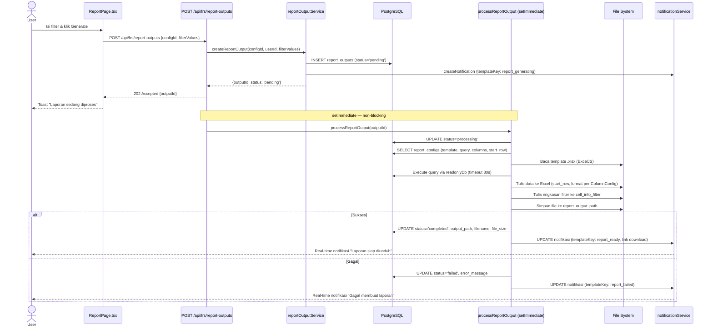
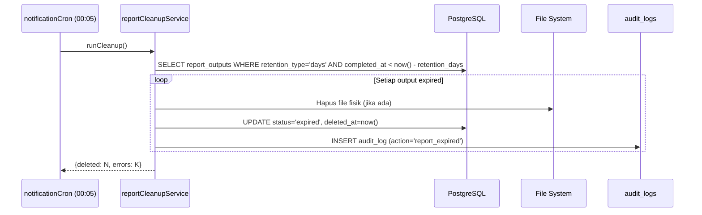
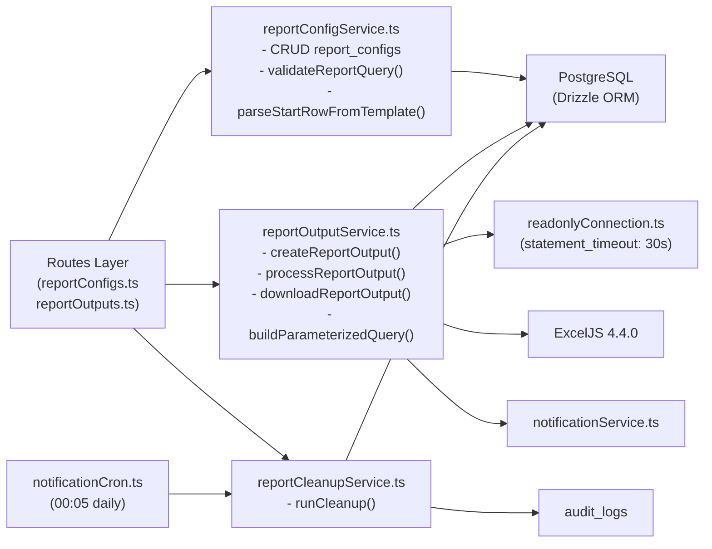
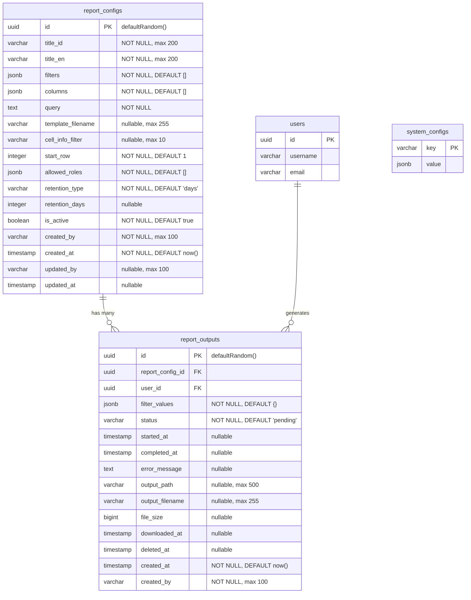

# Design Document — Dynamic Excel Report

## Overview

Fitur **Dynamic Excel Report** memungkinkan admin CFD mengkonfigurasi laporan Excel secara dinamis melalui UI tanpa perlu coding. Setiap konfigurasi mendefinisikan query SQL, filter input, mapping kolom output, dan template file Excel. User yang memiliki akses (berdasarkan role) dapat men-generate laporan secara asinkron, menerima notifikasi saat laporan siap, dan mengunduh hasilnya.

Fitur ini menggantikan laporan Excel statis dengan pendekatan yang sepenuhnya dapat dikonfigurasi. Penambahan laporan baru tidak memerlukan perubahan kode — cukup tambah entri `report_configs` melalui UI admin.

### Tujuan Desain

- **Zero-code report addition**: Admin dapat menambah laporan baru tanpa deploy ulang.
- **Security-first query execution**: Semua query divalidasi dan dieksekusi via read-only connection dengan parameterized query.
- **Async generation**: Generate laporan tidak memblokir UI; user menerima notifikasi saat selesai.
- **Configurable retention**: File output dihapus otomatis sesuai kebijakan retensi per laporan.
- **Consistent UX**: Mengikuti konvensi CFD — UUID PK, audit fields, Drizzle ORM, Zod validasi, i18n, RBAC permission-based, SearchableSelect, skeleton loading.

---

## Architecture

### Alur Async Generate Laporan



### Alur Cleanup Retensi



---

## Components and Interfaces

### Struktur Komponen Frontend

```mermaid
graph TD
    Sidebar["Sidebar Navigation"]
    Sidebar -->|"GET /api/frs/report-configs/menu"| MenuGroup["Grup Menu Laporan"]
    MenuGroup --> ReportItem1["Item: Laporan Keuangan"]
    MenuGroup --> ReportItem2["Item: Laporan Arus Kas"]
    MenuGroup -->|"hidden jika kosong"| Hidden["(tersembunyi)"]

    ReportItem1 -->|"route /reports/:configId"| ReportPage

    subgraph "Admin Area"
        ReportConfigManager["ReportConfigManager.tsx"]
        ReportConfigManager --> TabInfo["Tab: Info Dasar"]
        ReportConfigManager --> TabFilter["Tab: Filter"]
        ReportConfigManager --> TabColumn["Tab: Kolom Output"]
        ReportConfigManager --> TabTemplate["Tab: Template & Output"]
        TabFilter --> FilterArrayEditor["FilterArrayEditor (inline)"]
        TabColumn --> ColumnArrayEditor["ColumnArrayEditor (inline)"]
        TabTemplate --> FileUpload["Upload .xlsx"]
    end

    subgraph "User Area"
        ReportPage["ReportPage.tsx"]
        ReportPage --> DynamicFilterField["DynamicFilterField.tsx (per filter)"]
        DynamicFilterField -->|"type=text"| TextInput["<input type=text>"]
        DynamicFilterField -->|"type=date"| DateInput["<input type=date>"]
        DynamicFilterField -->|"type=dropdown, source=json"| SearchableSelectStatic["SearchableSelect (static)"]
        DynamicFilterField -->|"type=dropdown, source=query"| SearchableSelectDynamic["SearchableSelect (async fetch)"]
        SearchableSelectDynamic -->|"POST /api/frs/report-outputs/dropdown/:configId/:paramName"| DropdownAPI["Dropdown API"]
    end
```



### Backend Service Architecture



---

## Data Models

### ERD Tabel Baru



### Drizzle Schema Definition

```typescript
// src/db/schema/public.ts (additions)

export const reportConfigs = pgTable('report_configs', {
  id: uuid().primaryKey().defaultRandom(),
  titleId: varchar('title_id', { length: 200 }).notNull(),
  titleEn: varchar('title_en', { length: 200 }).notNull(),
  filters: jsonb().notNull().$type<FilterConfig[]>().default([]),
  columns: jsonb().notNull().$type<ColumnConfig[]>().default([]),
  query: text().notNull(),
  templateFilename: varchar('template_filename', { length: 255 }),
  cellInfoFilter: varchar('cell_info_filter', { length: 10 }),
  startRow: integer('start_row').notNull().default(1),
  allowedRoles: jsonb('allowed_roles').notNull().$type<string[]>().default([]),
  retentionType: varchar('retention_type', { length: 20 }).notNull().default('days'),
  retentionDays: integer('retention_days'),
  isActive: boolean('is_active').notNull().default(true),
  createdBy: varchar('created_by', { length: 100 }).notNull(),
  createdAt: timestamp('created_at', { withTimezone: true }).notNull().defaultNow(),
  updatedBy: varchar('updated_by', { length: 100 }),
  updatedAt: timestamp('updated_at', { withTimezone: true }),
});

export const reportOutputs = pgTable('report_outputs', {
  id: uuid().primaryKey().defaultRandom(),
  reportConfigId: uuid('report_config_id').notNull().references(() => reportConfigs.id),
  userId: uuid('user_id').notNull().references(() => users.id),
  filterValues: jsonb('filter_values').notNull().$type<Record<string, unknown>>().default({}),
  status: varchar({ length: 30 }).notNull().default('pending'),
  startedAt: timestamp('started_at', { withTimezone: true }),
  completedAt: timestamp('completed_at', { withTimezone: true }),
  errorMessage: text('error_message'),
  outputPath: varchar('output_path', { length: 500 }),
  outputFilename: varchar('output_filename', { length: 255 }),
  fileSize: bigint('file_size', { mode: 'number' }),
  downloadedAt: timestamp('downloaded_at', { withTimezone: true }),
  deletedAt: timestamp('deleted_at', { withTimezone: true }),
  createdAt: timestamp('created_at', { withTimezone: true }).notNull().defaultNow(),
  createdBy: varchar('created_by', { length: 100 }).notNull(),
});
```

### JSONB Type Definitions

```typescript
// src/types/financial/reportConfig.ts

export interface FilterConfig {
  paramName: string;           // alphanumeric + underscore only
  labelId: string;             // label bahasa Indonesia
  labelEn: string;             // label bahasa Inggris
  type: 'text' | 'date' | 'dropdown';
  order: number;               // urutan tampil (integer positif)
  required?: boolean;
  dropdownSource?: 'json' | 'query';
  dropdownItems?: Array<{ value: string; label: string }>;
  dropdownQuery?: string;      // SQL query untuk source='query'
}

export interface ColumnConfig {
  fieldName: string;           // nama field dari hasil query
  order: number;               // urutan kolom di Excel
  dataType: 'string' | 'number' | 'date' | 'currency';
  format?: string;             // contoh: 'DD/MM/YYYY', '#,##0.00'
  headerLabelId?: string;
  headerLabelEn?: string;
}

export type ReportOutputStatus =
  | 'pending'
  | 'processing'
  | 'completed'
  | 'failed'
  | 'downloaded_deleted'
  | 'expired';
```

### Zod Validation Schemas

```typescript
// src/services/financial/reportConfigService.ts

export const filterConfigSchema = z.object({
  paramName: z.string().regex(/^[a-zA-Z0-9_]+$/, 'paramName hanya boleh alphanumeric dan underscore'),
  labelId: z.string().min(1),
  labelEn: z.string().min(1),
  type: z.enum(['text', 'date', 'dropdown']),
  order: z.number().int().positive(),
  required: z.boolean().optional(),
  dropdownSource: z.enum(['json', 'query']).optional(),
  dropdownItems: z.array(z.object({ value: z.string(), label: z.string() })).optional(),
  dropdownQuery: z.string().optional(),
});

export const columnConfigSchema = z.object({
  fieldName: z.string().min(1),
  order: z.number().int().positive(),
  dataType: z.enum(['string', 'number', 'date', 'currency']),
  format: z.string().optional(),
  headerLabelId: z.string().optional(),
  headerLabelEn: z.string().optional(),
});

export const reportConfigCreateSchema = z.object({
  titleId: z.string().min(1).max(200),
  titleEn: z.string().min(1).max(200),
  filters: z.array(filterConfigSchema).default([]),
  columns: z.array(columnConfigSchema).min(1, 'Minimal satu kolom output wajib diisi'),
  query: z.string().min(1),
  templateFilename: z.string().max(255).optional(),
  cellInfoFilter: z.string().max(10).optional(),
  startRow: z.number().int().positive().default(1),
  allowedRoles: z.array(z.string()).default([]),
  retentionType: z.enum(['immediate', 'days']).default('days'),
  retentionDays: z.number().int().positive().optional(),
  isActive: z.boolean().default(true),
});
```

### system_configs Keys Baru

| Key | Tipe Value | Default | Deskripsi |
|-----|-----------|---------|-----------|
| `report_template_path` | `string` | `"./storage/report-templates"` | Folder penyimpanan template Excel |
| `report_output_path` | `string` | `"./storage/report-outputs"` | Folder penyimpanan file output laporan |

---

## Correctness Properties

*A property is a characteristic or behavior that should hold true across all valid executions of a system — essentially, a formal statement about what the system should do. Properties serve as the bridge between human-readable specifications and machine-verifiable correctness guarantees.*

### Property 1: validateReportQuery idempoten

*For any* query string yang lolos `validateReportQuery` (mengembalikan sukses), menjalankan `validateReportQuery` kembali pada query yang sama SHALL menghasilkan sukses juga — validasi tidak mengubah state dan hasilnya konsisten.

**Validates: Requirements 3.1, 3.2, 3.3**

### Property 2: buildParameterizedQuery — jumlah parameter konsisten

*For any* query string yang mengandung N placeholder unik (format `${PARAM}` atau `{{PARAM}}`), `buildParameterizedQuery` SHALL menghasilkan SQL output dengan tepat N token `$1..$N` dan array `params` dengan panjang tepat N.

**Validates: Requirements 3.6**

### Property 3: FilterConfig round-trip serialization

*For any* array `FilterConfig[]` yang valid (semua field wajib terisi dengan nilai yang sesuai), melakukan `JSON.stringify` kemudian `JSON.parse` dan validasi ulang dengan `filterConfigSchema` SHALL menghasilkan array yang ekuivalen dengan array asli.

**Validates: Requirements 12.1, 12.3**

### Property 4: ColumnConfig round-trip serialization

*For any* array `ColumnConfig[]` yang valid (semua field wajib terisi dengan nilai yang sesuai), melakukan `JSON.stringify` kemudian `JSON.parse` dan validasi ulang dengan `columnConfigSchema` SHALL menghasilkan array yang ekuivalen dengan array asli.

**Validates: Requirements 12.2, 12.4**

### Property 5: Status transition hanya maju

*For any* `report_outputs` entry, urutan pembaruan status SHALL selalu mengikuti arah maju: `pending` → `processing` → `completed` | `failed`. Tidak ada transisi yang memperbolehkan status kembali ke state sebelumnya (contoh: `completed` → `pending` adalah invalid).

**Validates: Requirements 6.1, 6.2, 6.8, 6.9**

### Property 6: Pencarian laporan case-insensitive

*For any* daftar `report_configs` dan query string pencarian, semua hasil yang dikembalikan SHALL memiliki `title_id` atau `title_en` yang mengandung query string tersebut (case-insensitive), dan tidak ada hasil yang tidak relevan dikembalikan.

**Validates: Requirements 1.2**

### Property 7: Download authorization — owner-only

*For any* `report_outputs` entry dengan `user_id = U1`, request download dengan token user `U2` di mana `U2 ≠ U1` SHALL selalu mengembalikan HTTP 403, tanpa pengecualian.

**Validates: Requirements 8.1**

---

## Error Handling

### Backend Error Responses

| Skenario | HTTP Status | Error Code |
|----------|-------------|------------|
| Query mengandung keyword berbahaya | 400 | `REPORT_QUERY_UNSAFE` |
| Query bukan SELECT | 400 | `REPORT_QUERY_NOT_SELECT` |
| Query timeout (>30s) | 408 | `REPORT_QUERY_TIMEOUT` |
| Template file tidak ditemukan | 404 | `REPORT_TEMPLATE_NOT_FOUND` |
| Output file tidak ditemukan saat download | 404 | `REPORT_OUTPUT_NOT_FOUND` |
| User bukan owner output | 403 | `AUTH_FORBIDDEN` |
| Role user tidak ada di allowed_roles | 403 | `AUTH_FORBIDDEN` |
| JSONB config tidak valid | 422 | `REPORT_CONFIG_INVALID` |
| system_configs key tidak ditemukan | — | Warning log, gunakan default |

### Frontend Error Handling

- **Gagal load config laporan**: Tampilkan error state dengan tombol retry (menggunakan `common.errorLoadTable` dan `common.retry`).
- **Gagal load dropdown options**: Tampilkan error inline di dalam `SearchableSelect` dengan opsi retry.
- **Generate gagal (response non-202)**: Toast error dengan pesan dari i18n.
- **Download gagal (404)**: Toast error "File laporan tidak ditemukan atau sudah dihapus".
- **Semua error API**: Gunakan `getErrorMessage(errCode, language)` dari `errorUtils`.

### processReportOutput Error Isolation

Worker `processReportOutput` berjalan via `setImmediate` — error di dalamnya tidak boleh crash server. Semua error di-catch, status diupdate ke `failed`, dan error di-log ke console dengan prefix `[ReportProcessor]`.

```typescript
setImmediate(() =>
  processReportOutput(output.id).catch(err =>
    console.error('[ReportProcessor]', err)
  )
);
```

---

## Testing Strategy

### Dual Testing Approach

Fitur ini menggunakan kombinasi **unit tests** dan **property-based tests** untuk coverage yang komprehensif.

**Unit tests** fokus pada:
- Specific examples untuk setiap endpoint API (happy path + error cases)
- Integration points antara service layers
- Edge cases: query kosong, template tidak ada, file system error

**Property-based tests** fokus pada:
- Universal properties yang harus berlaku untuk semua input valid
- Validasi logika bisnis inti (query validator, parameterized query builder, serialization)

### Property-Based Testing Library

Gunakan **[fast-check](https://github.com/dubzzz/fast-check)** untuk TypeScript/Node.js.

```bash
npm install --save-dev fast-check
```

Setiap property test dikonfigurasi minimum **100 iterasi** (default fast-check).

### Property Test Implementations

#### Property 1: validateReportQuery idempoten

```typescript
// Tag: Feature: dynamic-excel-report, Property 1: validateReportQuery idempoten
it('validateReportQuery is idempotent', () => {
  fc.assert(fc.property(
    fc.string().filter(s => {
      const stripped = stripSqlComments(s);
      return stripped.trim().toUpperCase().startsWith('SELECT');
    }),
    (query) => {
      const result1 = validateReportQuery(query);
      const result2 = validateReportQuery(query);
      expect(result1.valid).toBe(result2.valid);
      expect(result1.error).toBe(result2.error);
    }
  ));
});
```

#### Property 2: buildParameterizedQuery — jumlah parameter konsisten

```typescript
// Tag: Feature: dynamic-excel-report, Property 2: buildParameterizedQuery parameter count
it('buildParameterizedQuery produces N params for N unique placeholders', () => {
  fc.assert(fc.property(
    fc.array(fc.string().filter(s => /^[A-Z_]+$/.test(s)), { minLength: 1, maxLength: 10 }),
    (paramNames) => {
      const uniqueParams = [...new Set(paramNames)];
      const query = uniqueParams.map(p => `SELECT * FROM t WHERE col = \${${p}}`).join(' AND ');
      const filterValues = Object.fromEntries(uniqueParams.map(p => [p, 'value']));
      const { sql, params } = buildParameterizedQuery(query, filterValues);
      const dollarCount = (sql.match(/\$\d+/g) || []).length;
      expect(dollarCount).toBe(uniqueParams.length);
      expect(params.length).toBe(uniqueParams.length);
    }
  ));
});
```

#### Property 3 & 4: Round-trip serialization

```typescript
// Tag: Feature: dynamic-excel-report, Property 3: FilterConfig round-trip
it('FilterConfig round-trip serialization', () => {
  const filterConfigArb = fc.record({
    paramName: fc.stringMatching(/^[a-zA-Z0-9_]+$/),
    labelId: fc.string({ minLength: 1 }),
    labelEn: fc.string({ minLength: 1 }),
    type: fc.constantFrom('text', 'date', 'dropdown'),
    order: fc.integer({ min: 1 }),
  });
  fc.assert(fc.property(
    fc.array(filterConfigArb, { minLength: 1 }),
    (configs) => {
      const serialized = JSON.stringify(configs);
      const deserialized = JSON.parse(serialized);
      const parsed = z.array(filterConfigSchema).safeParse(deserialized);
      expect(parsed.success).toBe(true);
      expect(parsed.data).toEqual(configs);
    }
  ));
});

// Tag: Feature: dynamic-excel-report, Property 4: ColumnConfig round-trip
it('ColumnConfig round-trip serialization', () => {
  const columnConfigArb = fc.record({
    fieldName: fc.string({ minLength: 1 }),
    order: fc.integer({ min: 1 }),
    dataType: fc.constantFrom('string', 'number', 'date', 'currency'),
  });
  fc.assert(fc.property(
    fc.array(columnConfigArb, { minLength: 1 }),
    (configs) => {
      const serialized = JSON.stringify(configs);
      const deserialized = JSON.parse(serialized);
      const parsed = z.array(columnConfigSchema).safeParse(deserialized);
      expect(parsed.success).toBe(true);
      expect(parsed.data).toEqual(configs);
    }
  ));
});
```

#### Property 5: Status transition hanya maju

```typescript
// Tag: Feature: dynamic-excel-report, Property 5: status transition forward-only
it('report output status only moves forward', () => {
  const validTransitions: Record<string, string[]> = {
    'pending': ['processing'],
    'processing': ['completed', 'failed'],
    'completed': ['downloaded_deleted'],
    'failed': [],
    'downloaded_deleted': [],
    'expired': [],
  };
  fc.assert(fc.property(
    fc.constantFrom('pending', 'processing', 'completed', 'failed'),
    fc.constantFrom('pending', 'processing', 'completed', 'failed', 'downloaded_deleted', 'expired'),
    (fromStatus, toStatus) => {
      const isValidTransition = validTransitions[fromStatus]?.includes(toStatus) ?? false;
      const isInvalidBackward = !isValidTransition && fromStatus !== toStatus;
      if (isInvalidBackward) {
        expect(() => assertValidStatusTransition(fromStatus, toStatus)).toThrow();
      }
    }
  ));
});
```

#### Property 6: Pencarian case-insensitive

```typescript
// Tag: Feature: dynamic-excel-report, Property 6: search is case-insensitive
it('search results always contain the query string (case-insensitive)', () => {
  fc.assert(fc.property(
    fc.array(fc.record({
      titleId: fc.string({ minLength: 1 }),
      titleEn: fc.string({ minLength: 1 }),
    }), { minLength: 1 }),
    fc.string({ minLength: 1 }),
    (configs, query) => {
      const results = filterReportConfigs(configs, query);
      results.forEach(r => {
        const matchId = r.titleId.toLowerCase().includes(query.toLowerCase());
        const matchEn = r.titleEn.toLowerCase().includes(query.toLowerCase());
        expect(matchId || matchEn).toBe(true);
      });
    }
  ));
});
```

#### Property 7: Download authorization owner-only

```typescript
// Tag: Feature: dynamic-excel-report, Property 7: download owner-only
it('download returns 403 for non-owner users', () => {
  fc.assert(fc.property(
    fc.uuid(),
    fc.uuid(),
    async (ownerUserId, requestingUserId) => {
      fc.pre(ownerUserId !== requestingUserId);
      const output = createMockOutput({ userId: ownerUserId, status: 'completed' });
      await expect(downloadReportOutput(output.id, requestingUserId))
        .rejects.toMatchObject({ statusCode: 403 });
    }
  ));
});
```

### Unit Test Coverage

| Area | Test Type | Contoh Kasus |
|------|-----------|--------------|
| `validateReportQuery` | Unit | Query valid SELECT, query dengan komentar, query dengan INSERT embedded |
| `buildParameterizedQuery` | Unit | Query tanpa placeholder, query dengan placeholder duplikat |
| `processReportOutput` | Unit (mock) | Template tidak ada, query timeout, write file gagal |
| `downloadReportOutput` | Unit (mock) | File tidak ada (404), owner valid, owner tidak valid (403) |
| `runCleanup` | Unit (mock) | Tidak ada expired, beberapa expired, file fisik tidak ada |
| API endpoints | Integration | Auth required, permission check, response format |

### Test File Structure

```
src/
  services/financial/
    __tests__/
      reportConfigService.test.ts   # Unit + PBT untuk validateReportQuery, parseStartRow
      reportOutputService.test.ts   # Unit + PBT untuk buildParameterizedQuery, status transitions
      reportCleanupService.test.ts  # Unit untuk runCleanup
  routes/financial/
    __tests__/
      reportConfigs.test.ts         # Integration tests untuk API endpoints
      reportOutputs.test.ts         # Integration tests untuk API endpoints
```
