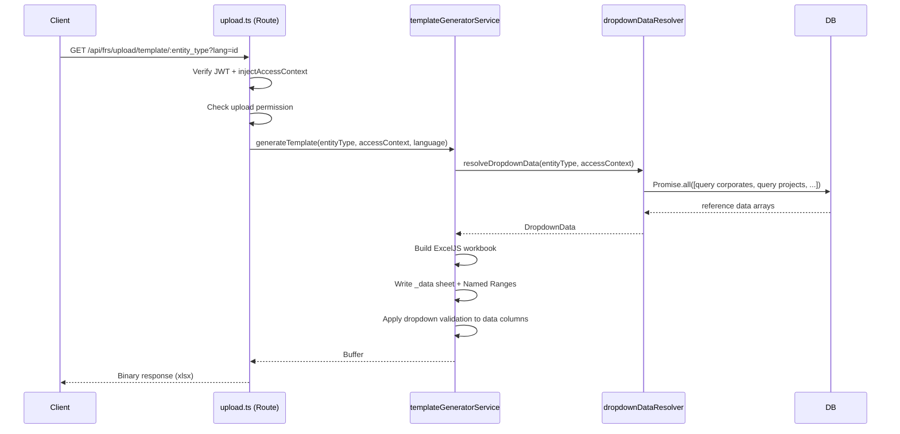
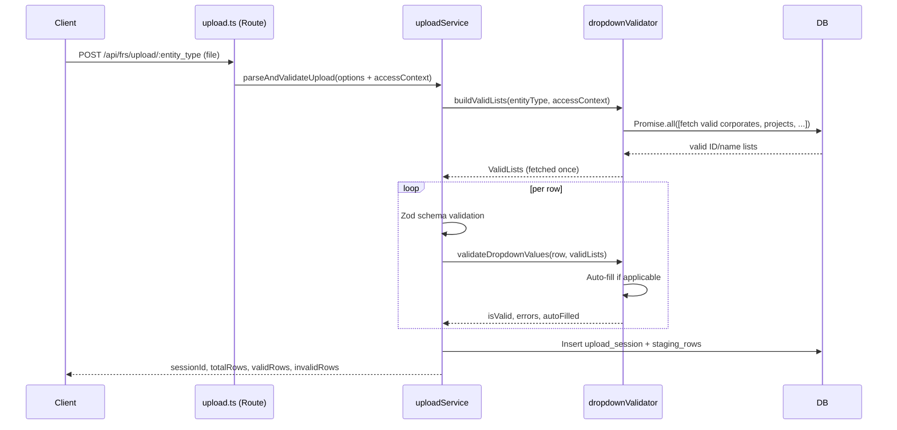

# Design Document — Dynamic Upload Template Dropdown

## Overview

Fitur ini mengubah endpoint download template Excel dari membaca file statis di disk menjadi generate file secara dinamis menggunakan ExcelJS. Template yang dihasilkan menyertakan dropdown yang datanya diambil dari database dan difilter berdasarkan Access_Context user (RBAC). Selain itu, validasi upload diperluas agar nilai yang diterima konsisten dengan opsi dropdown yang valid di database, dan logika auto-fill ditambahkan untuk user dengan akses tunggal.

Tidak ada perubahan pada URL endpoint, contract API, atau alur staging → review → confirm → approval yang sudah ada.

---

## Architecture

### Komponen Baru dan yang Dimodifikasi

```
src/
├── services/financial/
│   ├── templateGeneratorService.ts   [NEW]  — Generate Excel template dinamis
│   ├── dropdownDataResolver.ts       [NEW]  — Fetch & filter reference data dari DB
│   ├── dropdownValidator.ts          [NEW]  — Validasi nilai dropdown per baris
│   └── uploadService.ts              [MODIFIED] — Integrasi dropdownValidator
├── routes/financial/
│   └── upload.ts                     [MODIFIED] — Ganti static file read → templateGeneratorService
└── i18n/
    └── exportUpload.ts               [MODIFIED] — Tambah keys untuk dropdown errors
```

### Alur Request: Template Download



### Alur Request: Upload dan Validasi



---

## Components and Interfaces

### 1. dropdownDataResolver.ts

Bertanggung jawab mengambil semua data referensi dari database secara paralel, difilter berdasarkan AccessContext.

```typescript
// src/services/financial/dropdownDataResolver.ts

export interface ReferenceItem {
  id: string;
  name: string;   // Human-readable label (ditampilkan di dropdown)
  code?: string;  // Untuk currencies (code = IDR, USD, dll.)
}

export interface DropdownData {
  corporates: ReferenceItem[];
  departments: ReferenceItem[];
  projects: ReferenceItem[];
  banks: ReferenceItem[];
  corporateSectors: ReferenceItem[];
  currencies: ReferenceItem[];
  costCenterCategories: ReferenceItem[];
}

/**
 * Menentukan tabel referensi mana yang dibutuhkan per entity_type.
 */
export function getRequiredDropdowns(entityType: EntityType): (keyof DropdownData)[]

/**
 * Mengambil semua data referensi yang diperlukan secara paralel.
 * Requirements: 1.1–1.8, 16.1
 */
export async function resolveDropdownData(
  entityType: EntityType,
  accessContext: AccessContext
): Promise<Partial<DropdownData>>
```

Filter logic per tabel:

| Tabel | Filter |
|-------|--------|
| `corporates` | `is_active = true` + `id IN (corporateIds)` jika `hasFullCorporateAccess = false` |
| `departments` | `is_active = true` + `corporate_id IN (corporateIds)` |
| `projects` | `is_active = true` + JOIN ke `departments` → `departments.corporate_id IN (corporateIds)` |
| `banks` | `status = 'active'` (global, tanpa RBAC filter) |
| `corporate_sectors` | `status = 'active'` (global) |
| `currencies` | `status = 'active'` (global) |
| `cost_center_categories` | `status = 'active'` (global) |

Catatan: Tabel `projects` tidak memiliki kolom `corporate_id` langsung — ia berelasi ke `departments` yang memiliki `corporate_id`. Query harus melakukan JOIN ke `departments` untuk filter berdasarkan `corporateIds`.

---

### 2. templateGeneratorService.ts

Bertanggung jawab membuat file Excel template dengan dropdown dinamis menggunakan ExcelJS.

```typescript
// src/services/financial/templateGeneratorService.ts

export interface GenerateTemplateOptions {
  entityType: EntityType;
  accessContext: AccessContext;
  language: 'id' | 'en';
}

/**
 * Entry point utama — generate template Excel dinamis.
 * Requirements: 1.1, 1.9, 1.12, 17.1, 17.3
 */
export async function generateTemplate(
  options: GenerateTemplateOptions
): Promise<Buffer>

/**
 * Membuat sheet _data tersembunyi dan mendefinisikan Named Ranges.
 * Requirements: 1.9, 15.4
 */
function buildDataSheet(
  workbook: ExcelJS.Workbook,
  dropdownData: Partial<DropdownData>
): void

/**
 * Menerapkan dropdown validation ke kolom yang sesuai.
 * Requirements: 1.9, 4.1, 5.1, 6.1–6.2, 7.1–7.3, 8.1–8.4, 9.1, 10.1–10.4, 11.1–11.3, 12.1, 13.1–13.2, 14.1
 */
function applyDropdownValidations(
  worksheet: ExcelJS.Worksheet,
  entityType: EntityType,
  dropdownData: Partial<DropdownData>,
  language: 'id' | 'en',
  startRow: number
): void
```

Struktur sheet `_data`:

Sheet `_data` bersifat tersembunyi (`worksheet.state = 'veryHidden'`). Setiap Named Range ditulis sebagai kolom vertikal. Kolom ganjil menyimpan UUID (id), kolom genap menyimpan nama (name/code) yang menjadi sumber Named Range.

Named Range convention: `_ref_{table_name}` (contoh: `_ref_corporates`, `_ref_projects`)

Named Range hanya merujuk ke kolom name/code — UUID tidak pernah muncul di sel yang terlihat user.

Dropdown validation formula: `=_ref_corporates` (merujuk ke Named Range)

---

### 3. dropdownValidator.ts

Bertanggung jawab memvalidasi nilai dropdown per baris dan menerapkan logika auto-fill.

```typescript
// src/services/financial/dropdownValidator.ts

export interface ValidLists {
  corporateNameToId: Map<string, string>;   // name → id
  departmentNameToId: Map<string, string>;
  projectNameToId: Map<string, string>;
  bankNameToId: Map<string, string>;
  sectorCodeSet: Set<string>;
  currencyCodeSet: Set<string>;
  costCenterCategoryCodeSet: Set<string>;
  weekSet: Set<string>;
  categorySet: Set<string>;
  creditTypeSet: Set<string>;
  interestTypeSet: Set<string>;
  fiscalMonthSet: Set<number>;
}

export interface DropdownValidationResult {
  isValid: boolean;
  errors: string[];
  autoFilled: {
    corporateId?: string;
    departmentId?: string;
  };
  resolvedIds: {
    corporate_id?: string;
    department_id?: string;
    project_id?: string;
    bank_id?: string;
  };
}

/**
 * Mengambil semua daftar nilai valid sekali di awal sesi upload.
 * Dieksekusi via Promise.all — tidak ada query per-baris.
 * Requirements: 2.10
 */
export async function buildValidLists(
  entityType: EntityType,
  accessContext: AccessContext
): Promise<ValidLists>

/**
 * Memvalidasi satu baris data terhadap ValidLists.
 * Menerapkan auto-fill jika kondisi terpenuhi.
 * Requirements: 2.1–2.9, 3.1–3.4, 18.1, 18.3
 */
export function validateDropdownValues(
  rowData: Record<string, any>,
  rowNumber: number,
  entityType: EntityType,
  accessContext: AccessContext,
  validLists: ValidLists,
  language: 'id' | 'en'
): DropdownValidationResult
```

Auto-fill logic:

```
IF corporateIds.length === 1 AND row.corporate_name is empty:
  → auto-fill corporate_id = corporateIds[0]
  → record in autoFilled.corporateId

IF departmentIds.length === 1 AND row.department_name is empty:
  → auto-fill department_id = departmentIds[0]
  → record in autoFilled.departmentId

IF hasFullCorporateAccess === true AND row.corporate_name is empty:
  → mark row invalid: t.errorDropdownCorporateRequired
```

Name-to-ID mapping: Template menampilkan nama (human-readable) di sel yang terlihat. Saat upload, validator memetakan nama → ID menggunakan ValidLists maps. UUID tidak pernah muncul di sel yang terlihat user.

---

### 4. Modifikasi uploadService.ts

Fungsi `parseAndValidateUpload` diperluas untuk menerima `accessContext` dan mengintegrasikan `dropdownValidator`.

```typescript
export interface ParseAndValidateOptions {
  entityType: EntityType;
  file: Buffer;
  fileName: string;
  fileSize: number;
  userId: string;
  language: Locale;
  accessContext: AccessContext;  // [NEW]
}
```

Urutan eksekusi yang diperbarui:

1. Fetch template config (sudah ada)
2. Parse Excel file (sudah ada)
3. [NEW] Build valid lists via `dropdownValidator.buildValidLists()` — sekali per sesi
4. Per baris: Zod schema validation (sudah ada) + [NEW] `dropdownValidator.validateDropdownValues()`
5. Merge errors dari Zod dan dropdown validator
6. Insert session + staging rows (sudah ada)

Staging row metadata — field `rowData` diperluas dengan `_autoFilled`:

```typescript
rowData: {
  // existing fields
  corporate_id: string,   // resolved UUID
  department_id: string,  // resolved UUID
  _autoFilled: {
    corporateId?: string,
    departmentId?: string,
  }
}
```

---

### 5. Modifikasi upload.ts (Route)

Endpoint `GET /api/frs/upload/template/:entity_type` diubah dari membaca file statis menjadi memanggil `templateGeneratorService`.

```typescript
// BEFORE (static file read):
const fileBuffer = await fs.readFile(fullPath);

// AFTER (dynamic generation):
const fileBuffer = await generateTemplate({
  entityType: entity_type as EntityType,
  accessContext: req.accessContext!,
  language: (req.query.lang as 'id' | 'en') || 'id',
});
```

Endpoint `POST /api/frs/upload/:entity_type` diperbarui untuk meneruskan `accessContext` ke `parseAndValidateUpload`.

---

### 6. Modifikasi exportUpload.ts (i18n)

Tambahan keys pada interface `ExportUploadCopy.upload`:

```typescript
errorDropdownInvalidValue: string;      // "Baris {row}: Kolom {col} memiliki nilai tidak valid: '{val}'"
errorDropdownNoData: string;            // "Tidak ada data {entity} yang dapat diakses untuk modul ini"
errorDropdownCorporateRequired: string; // "Kolom Perusahaan wajib diisi secara eksplisit"
errorNoCorporateAccess: string;         // "Anda tidak memiliki akses ke perusahaan manapun"
headerCommentNoData: string;            // "Tidak ada data tersedia untuk kolom ini"
```

---

## Data Models

### Per-Module Dropdown Matrix

| Module | Dynamic Dropdowns | Static Dropdowns | startRecord |
|--------|-------------------|------------------|-------------|
| `balance_sheet` | Corporate | — | 4 |
| `income_statement` | Corporate | — | 4 |
| `income_statement_projection` | Corporate, Project | — | 4 |
| `weekly_cash_flow` | Corporate, Project | Week (W1–W5) | 4 |
| `realization` | Corporate, Department, Project | Category (cash in/cash out) | 4 |
| `cash_flow_projection` | Corporate | — | 5 |
| `bank_loan` | Bank, Corporate | Credit Type (KMK/KMI), Interest Type (flat/efektif) | 4 |
| `corporate` | Sector, Currency | Fiscal Year Start Month (1–12) | 4 |
| `department` | Corporate | — | 4 |
| `cost_center` | Corporate, Category | — | 4 |
| `project` | Department | — | 4 |

### Template Excel Structure (Standard)

| Row | Content |
|-----|---------|
| 1 | Instruksi pengisian (bold, background color) |
| 2 | (kosong) |
| 3 | Header kolom (bold, sesuai columnOrder dari i18n) |
| 4+ | Data rows (dropdown validation aktif) |

Pengecualian `cash_flow_projection`: Header 2 baris (baris 3 = nama bulan dengan merge cell, baris 4 = Cash In/Cash Out), data mulai baris 5.

### ValidLists Structure

```typescript
interface ValidLists {
  // Maps: human-readable name → UUID
  corporateNameToId: Map<string, string>;
  departmentNameToId: Map<string, string>;
  projectNameToId: Map<string, string>;
  bankNameToId: Map<string, string>;

  // Sets: valid code/name values
  sectorCodeSet: Set<string>;
  currencyCodeSet: Set<string>;
  costCenterCategoryCodeSet: Set<string>;

  // Static dropdown sets (built-in)
  weekSet: Set<string>;           // W1–W5
  categorySet: Set<string>;       // cash in, cash out
  creditTypeSet: Set<string>;     // KMK, KMI
  interestTypeSet: Set<string>;   // flat, efektif
  fiscalMonthSet: Set<number>;    // 1–12
}
```

### Staging Row rowData Extension

```typescript
interface StagingRowData {
  [columnName: string]: any;

  // Resolved UUIDs (ditambahkan oleh dropdownValidator)
  corporate_id?: string;
  department_id?: string;
  project_id?: string;
  bank_id?: string;

  // Auto-fill audit metadata
  _autoFilled?: {
    corporateId?: string;
    departmentId?: string;
  };
}
```

---

## Correctness Properties

*A property is a characteristic or behavior that should hold true across all valid executions of a system — essentially, a formal statement about what the system should do. Properties serve as the bridge between human-readable specifications and machine-verifiable correctness guarantees.*

### Property 1: Dropdown_Data_Resolver RBAC Filtering

*For any* AccessContext with `hasFullCorporateAccess = false` and any non-empty `corporateIds` array, all items returned by `resolveDropdownData` for RBAC-filtered tables (corporates, departments, projects) must have their `corporate_id` (or `id` for corporates) contained within the `corporateIds` array, and must have `is_active = true`.

**Validates: Requirements 1.2, 1.3, 1.4**

### Property 2: Named Range Structure in Generated Template

*For any* valid `entityType` and any `DropdownData` object, the Excel workbook produced by `generateTemplate` must contain a sheet named `_data` with Named Ranges following the convention `_ref_{table_name}` for each dropdown column required by that `entityType`, and the Named Range values must exactly match the `name` (or `code`) fields of the provided `DropdownData`.

**Validates: Requirements 1.9, 4.2, 5.2**

### Property 3: Dropdown Validation Rejects Invalid Values

*For any* row where a dropdown column contains a value not present in the corresponding `ValidLists` entry, `validateDropdownValues` must return `isValid = false` and include an error message that references the column name and the rejected value. This applies to both dynamic dropdowns (corporate, department, project, bank, sector, currency, cost center category) and static dropdowns (week, category, credit type, interest type, fiscal month).

**Validates: Requirements 2.1, 2.2, 2.3, 2.4, 2.5, 2.6, 2.7, 2.9, 15.3**

### Property 4: Auto-Fill for Single-Entity Access

*For any* row with an empty corporate name column when `corporateIds.length === 1`, `validateDropdownValues` must return a result where `resolvedIds.corporate_id` equals `corporateIds[0]` and `autoFilled.corporateId` is set. Similarly, for any row with an empty department name column when `departmentIds.length === 1`, `resolvedIds.department_id` must equal `departmentIds[0]` and `autoFilled.departmentId` must be set.

**Validates: Requirements 3.1, 3.2**

### Property 5: Full Corporate Access Requires Explicit Corporate

*For any* row with an empty or null corporate name column when `hasFullCorporateAccess = true`, `validateDropdownValues` must return `isValid = false` with an error message indicating that the corporate column must be filled explicitly.

**Validates: Requirement 3.3**

### Property 6: Auto-Fill Metadata Is Recorded

*For any* row where auto-fill is triggered (corporate or department), the resulting staging row's `rowData` must contain a `_autoFilled` object with the corresponding `corporateId` and/or `departmentId` fields set to the auto-filled UUID values.

**Validates: Requirement 3.4**

### Property 7: Template Isolation Between Users

*For any* two AccessContexts `A` and `B` where `A.corporateIds` is not equal to `B.corporateIds`, the Named Range `_ref_corporates` in the template generated for `A` must contain a different set of values than the Named Range `_ref_corporates` in the template generated for `B`.

**Validates: Requirement 15.2**

### Property 8: No UUIDs in Visible Cells

*For any* generated template for any `entityType`, no cell in the main data worksheet (the first visible sheet) should contain a value matching the UUID pattern `[0-9a-f]{8}-[0-9a-f]{4}-[0-9a-f]{4}-[0-9a-f]{4}-[0-9a-f]{12}`.

**Validates: Requirement 15.4**

### Property 9: Error Messages Contain Row, Column, and Value

*For any* row marked as invalid by `validateDropdownValues`, each error message in the returned `errors` array must contain: the row number, the column name, and the rejected value that caused the validation failure.

**Validates: Requirement 18.1**

### Property 10: Validation Continues Past First Error

*For any* file containing multiple rows where more than one row has invalid dropdown values, `parseAndValidateUpload` must process and evaluate all rows — the total count of invalid rows in the result must equal the actual number of rows with invalid values, not just 1 (no early termination).

**Validates: Requirement 18.3**

---

## Error Handling

### Template Generation Errors

| Kondisi | HTTP Status | Pesan |
|---------|-------------|-------|
| `entity_type` tidak dikenali | 400 | `Unsupported entity type: {entity_type}` |
| Semua data referensi kosong untuk modul yang memerlukan dynamic dropdown | 422 | `t.errorDropdownNoData.replace('{entity}', ...)` |
| ExcelJS gagal generate | 500 | Internal server error |
| AccessContext tidak tersedia | 401 | Authentication required |
| User tidak punya permission upload | 403 | Permission denied |

### Upload Validation Errors

| Kondisi | Efek | Pesan |
|---------|------|-------|
| Nilai dropdown tidak valid | Row `is_valid = false` | `t.errorDropdownInvalidValue` dengan row/col/val |
| Corporate kosong + `hasFullCorporateAccess = true` | Row `is_valid = false` | `t.errorDropdownCorporateRequired` |
| `corporateIds` kosong + modul butuh corporate | HTTP 403 | `t.errorNoCorporateAccess` |
| Semua baris invalid | HTTP 400 | Error sudah ada (tidak berubah) |

### Graceful Degradation

- Jika data referensi untuk satu kolom kosong (query mengembalikan array kosong), template tetap dihasilkan tanpa dropdown validation pada kolom tersebut. Header kolom diberi komentar sel menggunakan `t.headerCommentNoData`.
- Jika hanya sebagian data referensi kosong (misalnya projects kosong tapi corporates ada), kolom lain tetap mendapat dropdown.
- Validator tetap berjalan untuk semua baris meskipun ada baris yang invalid (no early termination).

---

## Testing Strategy

### Unit Tests

Fokus pada logika spesifik dengan contoh konkret:

- `dropdownDataResolver`: Verifikasi filter query untuk setiap kombinasi scope (system, corporate, department)
- `templateGeneratorService`: Verifikasi struktur workbook (sheet `_data` ada, Named Ranges terdefinisi, sheet tersembunyi)
- `dropdownValidator`: Verifikasi auto-fill logic, error message format, static dropdown validation
- `uploadService`: Verifikasi integrasi antara Zod validation dan dropdown validation (merged errors)
- Edge cases: empty reference data, old template without dropdowns, all-whitespace values

### Property-Based Tests

Library: **fast-check** (TypeScript/Node.js, tidak perlu library baru)

Konfigurasi: minimum **100 iterasi** per property test.

Setiap property test diberi tag komentar:

```typescript
// Feature: dynamic-upload-template-dropdown, Property {N}: {property_text}
```

**Property 1 — RBAC Filtering:**

```typescript
// Feature: dynamic-upload-template-dropdown, Property 1: Dropdown_Data_Resolver RBAC Filtering
fc.assert(fc.asyncProperty(
  fc.array(fc.uuid()),
  fc.boolean(),
  async (corporateIds, hasFullCorporateAccess) => {
    const result = await resolveDropdownData('balance_sheet', {
      scope: hasFullCorporateAccess ? 'system' : 'corporate',
      corporateIds,
      departmentIds: [],
      hasFullCorporateAccess,
    });
    if (!hasFullCorporateAccess && corporateIds.length > 0) {
      result.corporates?.forEach(c => expect(corporateIds).toContain(c.id));
    }
  }
), { numRuns: 100 });
```

**Property 3 — Dropdown Validation Rejects Invalid Values:**

```typescript
// Feature: dynamic-upload-template-dropdown, Property 3: Dropdown Validation Rejects Invalid Values
fc.assert(fc.property(
  fc.record({ corporate_name: fc.string() }),
  fc.integer({ min: 1, max: 1000 }),
  (row, rowNumber) => {
    const validLists = buildMockValidLists(['PT Valid Corp']);
    const result = validateDropdownValues(row, rowNumber, 'balance_sheet', mockContext, validLists, 'id');
    if (!validLists.corporateNameToId.has(row.corporate_name)) {
      expect(result.isValid).toBe(false);
      expect(result.errors.some(e => e.includes(row.corporate_name))).toBe(true);
    }
  }
), { numRuns: 100 });
```

**Property 4 — Auto-Fill:**

```typescript
// Feature: dynamic-upload-template-dropdown, Property 4: Auto-Fill for Single-Entity Access
fc.assert(fc.property(
  fc.record({ corporate_name: fc.constant('') }),
  (row) => {
    const accessContext = {
      corporateIds: ['uuid-123'],
      departmentIds: [],
      hasFullCorporateAccess: false,
      scope: 'corporate' as const,
    };
    const result = validateDropdownValues(row, 1, 'balance_sheet', accessContext, buildMockValidLists([]), 'id');
    expect(result.resolvedIds.corporate_id).toBe('uuid-123');
    expect(result.autoFilled.corporateId).toBe('uuid-123');
  }
), { numRuns: 100 });
```

**Property 8 — No UUIDs in Visible Cells:**

```typescript
// Feature: dynamic-upload-template-dropdown, Property 8: No UUIDs in Visible Cells
const UUID_REGEX = /[0-9a-f]{8}-[0-9a-f]{4}-[0-9a-f]{4}-[0-9a-f]{4}-[0-9a-f]{12}/i;
fc.assert(fc.asyncProperty(
  fc.constantFrom(...ENTITY_TYPES),
  fc.array(fc.record({ id: fc.uuid(), name: fc.string({ minLength: 1 }) })),
  async (entityType, corporates) => {
    const buffer = await generateTemplate({ entityType, accessContext: mockContext, language: 'id' });
    const workbook = new ExcelJS.Workbook();
    await workbook.xlsx.load(buffer);
    const mainSheet = workbook.worksheets.find(ws => ws.state !== 'veryHidden');
    mainSheet?.eachRow(row => {
      row.eachCell(cell => {
        expect(String(cell.value ?? '')).not.toMatch(UUID_REGEX);
      });
    });
  }
), { numRuns: 100 });
```

### Integration Tests

- Endpoint `GET /api/frs/upload/template/:entity_type` mengembalikan file xlsx valid dengan Content-Type dan Content-Disposition yang benar
- Endpoint `POST /api/frs/upload/:entity_type` menerima file dari template lama (tanpa dropdown) dan tetap memvalidasi
- AccessContext selalu diambil dari JWT, bukan dari query params
- Dua request dengan JWT berbeda menghasilkan template dengan dropdown berbeda

### Performance Tests

- Generate template dengan 500 entries per tabel harus selesai dalam ≤5 detik
- `buildValidLists` dipanggil tepat satu kali per sesi upload (verifikasi via mock call count)
