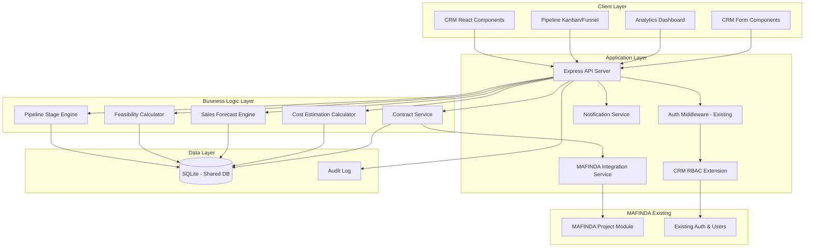
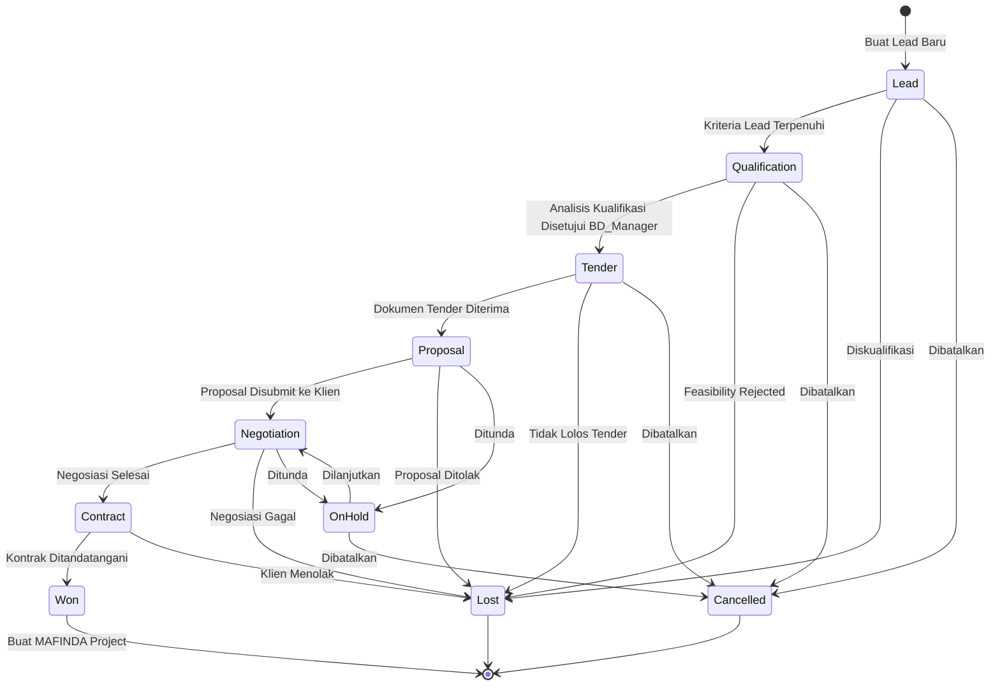
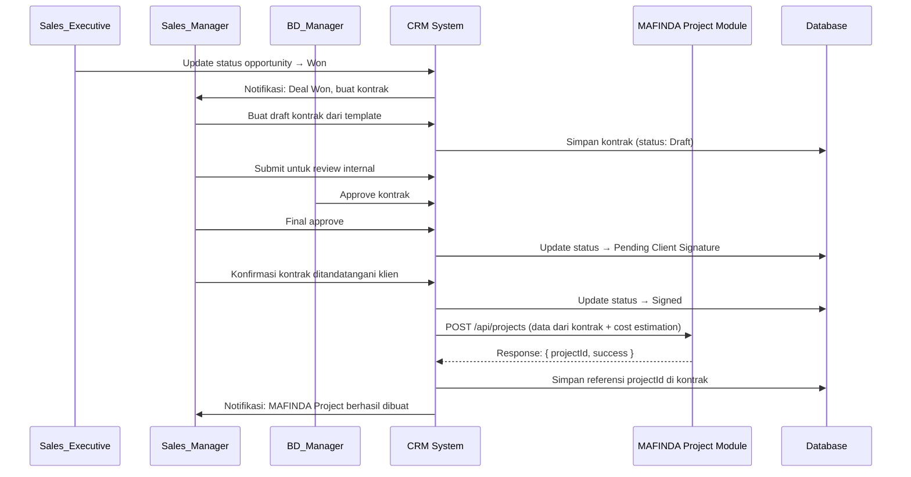

# Design Document: Modul CRM MAFINDA

## Overview

Modul CRM MAFINDA adalah ekstensi dari sistem MAFINDA yang sudah ada, dibangun di atas stack teknologi yang sama (React + TypeScript frontend, Express.js + TypeScript backend, SQLite database). Modul ini mengelola siklus bisnis penuh dari lead hingga kontrak, dengan integrasi otomatis ke MAFINDA_Project ketika deal berhasil ditutup.

### Tujuan Desain Utama

1. **Integrasi Seamless**: CRM berjalan dalam ekosistem MAFINDA yang sudah ada, berbagi auth, RBAC, dan database
2. **Pipeline Visibility**: Visualisasi pipeline real-time dalam format Kanban dan Funnel
3. **Data Integrity**: Setiap transisi stage divalidasi, setiap perubahan dicatat di audit log
4. **Auto-Integration**: Kontrak yang ditandatangani otomatis membuat MAFINDA_Project
5. **Role Separation**: Tiga role CRM baru yang dapat dikombinasikan dengan role MAFINDA yang ada

### Technology Stack

Mengikuti stack yang sudah ada di MAFINDA:
- **Frontend**: React 18+ dengan TypeScript
- **Styling**: Tailwind CSS
- **Backend**: Express.js dengan TypeScript
- **Database**: SQLite (development), PostgreSQL-ready (production)
- **Charts**: Recharts untuk visualisasi pipeline dan analytics
- **State Management**: React Context API / Zustand
- **API**: RESTful API dengan JSON responses
- **Testing (Property-Based)**: fast-check (TypeScript)


## Architecture

### System Architecture



### Pipeline State Machine



### Data Flow: Contract to Project Integration



## Components and Interfaces

### Frontend Components

#### 1. Pipeline Components

**PipelineKanbanBoard**
```typescript
interface PipelineKanbanProps {
  companyId?: string;
  assignedTo?: string; // filter by Sales_Executive
  onStageChange: (opportunityId: string, newStage: PipelineStage) => Promise<void>;
}

interface KanbanColumn {
  stage: PipelineStage;
  opportunities: OpportunitySummary[];
  totalValue: number;
  count: number;
}
```

**PipelineFunnelChart**
```typescript
interface FunnelChartProps {
  data: FunnelStageData[];
  period?: string;
}

interface FunnelStageData {
  stage: PipelineStage;
  count: number;
  totalValue: number;
  conversionRate: number; // % dari stage sebelumnya
}
```

**OpportunityCard**
```typescript
interface OpportunityCardProps {
  opportunity: OpportunitySummary;
  onEdit: (id: string) => void;
  onStageChange: (id: string, stage: PipelineStage) => void;
}

interface OpportunitySummary {
  id: string;
  name: string;
  customerName: string;
  estimatedValue: number;
  stage: PipelineStage;
  assignedTo: string;
  lastActivityDate: Date;
  isStale: boolean; // true jika tidak ada aktivitas > 14 hari
  probability: number;
}
```

#### 2. Lead & Customer Components

**CustomerProfileForm**
```typescript
interface CustomerProfileFormProps {
  initialData?: Customer;
  onSubmit: (data: CreateCustomerInput) => Promise<void>;
}

interface CreateCustomerInput {
  companyName: string;
  industry: string;
  address: string;
  npwp?: string;
  contacts: ContactInput[];
}

interface ContactInput {
  name: string;
  title: string;
  phone: string;
  email: string;
  role: 'PIC' | 'Decision_Maker' | 'Technical' | 'Other';
}
```

**InteractionLogForm**
```typescript
interface InteractionLogFormProps {
  entityId: string;
  entityType: 'lead' | 'customer' | 'opportunity';
  onSubmit: (data: CreateInteractionInput) => Promise<void>;
}

interface CreateInteractionInput {
  type: 'Visit' | 'Phone' | 'Email' | 'Meeting' | 'Other';
  date: Date;
  summary: string;
  nextAction?: string;
  nextActionDate?: Date;
}
```

#### 3. Analytics Dashboard Components

**CRMDashboard**
```typescript
interface CRMDashboardProps {
  userId: string;
  role: CRMRole;
}

interface DashboardMetrics {
  totalPipelineValue: number;
  activeOpportunities: number;
  winRate: number; // periode berjalan
  revenueForecast: number;
  newLeadsThisMonth: number;
  overdueOpportunities: number;
}
```

**SalesKPICard**
```typescript
interface SalesKPICardProps {
  userId: string;
  period: string;
}

interface SalesKPI {
  userId: string;
  userName: string;
  newLeads: number;
  activeOpportunities: number;
  wonDeals: number;
  lostDeals: number;
  winRate: number;
  totalRevenue: number;
  target: number;
  achievementPercentage: number;
}
```

### Backend API Endpoints

#### Lead & Customer Management

```typescript
// Customers
POST   /api/crm/customers                    // Buat pelanggan baru
GET    /api/crm/customers                    // List pelanggan (dengan search)
GET    /api/crm/customers/:id                // Detail pelanggan
PUT    /api/crm/customers/:id                // Update pelanggan
GET    /api/crm/customers/:id/interactions   // Riwayat interaksi

// Contacts
POST   /api/crm/customers/:id/contacts       // Tambah kontak
PUT    /api/crm/contacts/:id                 // Update kontak
DELETE /api/crm/contacts/:id                 // Hapus kontak

// Interactions
POST   /api/crm/interactions                 // Catat interaksi baru
GET    /api/crm/interactions?entityId=&entityType=  // List interaksi
```

#### Pipeline & Opportunity Management

```typescript
// Opportunities
POST   /api/crm/opportunities                // Buat opportunity baru
GET    /api/crm/opportunities                // List (filter: stage, assignedTo, period)
GET    /api/crm/opportunities/:id            // Detail opportunity
PUT    /api/crm/opportunities/:id            // Update opportunity
POST   /api/crm/opportunities/:id/transition // Pindah stage
GET    /api/crm/pipeline/kanban              // Data Kanban board
GET    /api/crm/pipeline/funnel              // Data Funnel chart
GET    /api/crm/pipeline/forecast            // Sales forecast
```

#### Qualification & Feasibility

```typescript
POST   /api/crm/opportunities/:id/qualification   // Buat/update analisis kualifikasi
GET    /api/crm/opportunities/:id/qualification   // Get analisis kualifikasi
POST   /api/crm/opportunities/:id/qualification/approve  // BD_Manager approve
GET    /api/crm/opportunities/:id/qualification/history  // Riwayat versi
```

#### Tender & Proposal

```typescript
POST   /api/crm/opportunities/:id/proposals       // Buat proposal baru
GET    /api/crm/opportunities/:id/proposals       // List proposal
GET    /api/crm/proposals/:id                     // Detail proposal
PUT    /api/crm/proposals/:id                     // Update proposal (auto-increment version)
POST   /api/crm/proposals/:id/documents           // Upload dokumen
POST   /api/crm/proposals/:id/submit              // Submit proposal ke klien
GET    /api/crm/proposals/:id/versions            // Riwayat versi
```

#### Cost & Resource Planning

```typescript
POST   /api/crm/opportunities/:id/cost-estimation  // Buat estimasi biaya
GET    /api/crm/opportunities/:id/cost-estimation  // Get estimasi biaya terbaru
PUT    /api/crm/cost-estimations/:id               // Update estimasi
GET    /api/crm/cost-estimations/:id/versions      // Riwayat versi
```

#### Decision Management

```typescript
POST   /api/crm/opportunities/:id/close           // Tutup deal (Won/Lost/Cancelled)
GET    /api/crm/analytics/win-loss                // Laporan Win/Loss
GET    /api/crm/analytics/win-rate                // Win rate per user/tim
```

#### Contract Management

```typescript
POST   /api/crm/opportunities/:id/contracts       // Buat kontrak dari opportunity Won
GET    /api/crm/contracts/:id                     // Detail kontrak
PUT    /api/crm/contracts/:id                     // Update kontrak
POST   /api/crm/contracts/:id/approve             // Approve kontrak (BD_Manager/Sales_Manager)
POST   /api/crm/contracts/:id/sign                // Konfirmasi kontrak ditandatangani
POST   /api/crm/contracts/:id/documents           // Upload dokumen kontrak
GET    /api/crm/contracts                         // List kontrak
```

#### Analytics & Reporting

```typescript
GET    /api/crm/dashboard/metrics                 // Metrik utama dashboard
GET    /api/crm/dashboard/pipeline-summary        // Ringkasan pipeline
GET    /api/crm/analytics/forecast                // Revenue forecast
GET    /api/crm/analytics/kpi                     // KPI per Sales_Executive
POST   /api/crm/targets                           // Set target penjualan
GET    /api/crm/targets?userId=&period=           // Get target
POST   /api/crm/reports/export                    // Export laporan (PDF/XLSX)
```

## Data Models

### Database Schema

```sql
-- ============================================================
-- CRM ROLE EXTENSION (extends existing users table)
-- ============================================================

CREATE TABLE crm_user_roles (
  id TEXT PRIMARY KEY,
  user_id TEXT NOT NULL,
  crm_role TEXT NOT NULL CHECK(crm_role IN ('Sales_Manager', 'Sales_Executive', 'BD_Manager')),
  assigned_at DATETIME DEFAULT CURRENT_TIMESTAMP,
  assigned_by TEXT NOT NULL,
  FOREIGN KEY (user_id) REFERENCES users(id),
  FOREIGN KEY (assigned_by) REFERENCES users(id),
  UNIQUE(user_id, crm_role)
);

-- ============================================================
-- CUSTOMER & CONTACT
-- ============================================================

CREATE TABLE crm_customers (
  id TEXT PRIMARY KEY,
  company_name TEXT NOT NULL,
  industry TEXT NOT NULL,
  address TEXT,
  npwp TEXT,
  status TEXT NOT NULL DEFAULT 'Active' CHECK(status IN ('Active', 'Inactive')),
  created_by TEXT NOT NULL,
  created_at DATETIME DEFAULT CURRENT_TIMESTAMP,
  updated_at DATETIME DEFAULT CURRENT_TIMESTAMP,
  FOREIGN KEY (created_by) REFERENCES users(id),
  UNIQUE(company_name, npwp)
);

CREATE TABLE crm_contacts (
  id TEXT PRIMARY KEY,
  customer_id TEXT NOT NULL,
  name TEXT NOT NULL,
  title TEXT,
  phone TEXT,
  email TEXT,
  role TEXT NOT NULL CHECK(role IN ('PIC', 'Decision_Maker', 'Technical', 'Other')),
  is_primary BOOLEAN DEFAULT 0,
  created_at DATETIME DEFAULT CURRENT_TIMESTAMP,
  FOREIGN KEY (customer_id) REFERENCES crm_customers(id) ON DELETE CASCADE
);

CREATE TABLE crm_interactions (
  id TEXT PRIMARY KEY,
  entity_id TEXT NOT NULL,
  entity_type TEXT NOT NULL CHECK(entity_type IN ('customer', 'opportunity')),
  type TEXT NOT NULL CHECK(type IN ('Visit', 'Phone', 'Email', 'Meeting', 'Other')),
  interaction_date DATE NOT NULL,
  summary TEXT NOT NULL,
  next_action TEXT,
  next_action_date DATE,
  created_by TEXT NOT NULL,
  created_at DATETIME DEFAULT CURRENT_TIMESTAMP,
  FOREIGN KEY (created_by) REFERENCES users(id)
);

-- ============================================================
-- OPPORTUNITY & PIPELINE
-- ============================================================

CREATE TABLE crm_opportunities (
  id TEXT PRIMARY KEY,
  name TEXT NOT NULL,
  customer_id TEXT NOT NULL,
  stage TEXT NOT NULL DEFAULT 'Lead' CHECK(stage IN (
    'Lead', 'Qualification', 'Tender', 'Proposal', 'Negotiation', 'Contract'
  )),
  status TEXT NOT NULL DEFAULT 'Active' CHECK(status IN (
    'Active', 'Won', 'Lost', 'On_Hold', 'Cancelled'
  )),
  estimated_value REAL,
  probability INTEGER DEFAULT 10, -- % probabilitas konversi
  assigned_to TEXT NOT NULL,
  company_id TEXT NOT NULL, -- MAFINDA company context
  description TEXT,
  tender_name TEXT,
  tender_estimated_value REAL,
  tender_announcement_date DATE,
  close_reason TEXT,
  close_category TEXT CHECK(close_category IN (
    'Harga', 'Teknis', 'Kompetitor', 'Waktu', 'Lainnya'
  )),
  closed_at DATETIME,
  closed_by TEXT,
  created_by TEXT NOT NULL,
  created_at DATETIME DEFAULT CURRENT_TIMESTAMP,
  updated_at DATETIME DEFAULT CURRENT_TIMESTAMP,
  FOREIGN KEY (customer_id) REFERENCES crm_customers(id),
  FOREIGN KEY (assigned_to) REFERENCES users(id),
  FOREIGN KEY (company_id) REFERENCES companies(id),
  FOREIGN KEY (created_by) REFERENCES users(id)
);

CREATE TABLE crm_opportunity_value_history (
  id TEXT PRIMARY KEY,
  opportunity_id TEXT NOT NULL,
  old_value REAL,
  new_value REAL NOT NULL,
  changed_by TEXT NOT NULL,
  changed_at DATETIME DEFAULT CURRENT_TIMESTAMP,
  FOREIGN KEY (opportunity_id) REFERENCES crm_opportunities(id),
  FOREIGN KEY (changed_by) REFERENCES users(id)
);

CREATE TABLE crm_stage_transitions (
  id TEXT PRIMARY KEY,
  opportunity_id TEXT NOT NULL,
  from_stage TEXT,
  to_stage TEXT NOT NULL,
  transitioned_by TEXT NOT NULL,
  transitioned_at DATETIME DEFAULT CURRENT_TIMESTAMP,
  notes TEXT,
  FOREIGN KEY (opportunity_id) REFERENCES crm_opportunities(id),
  FOREIGN KEY (transitioned_by) REFERENCES users(id)
);

CREATE TABLE crm_competitors (
  id TEXT PRIMARY KEY,
  opportunity_id TEXT NOT NULL,
  competitor_name TEXT NOT NULL,
  estimated_bid_value REAL,
  notes TEXT,
  created_by TEXT NOT NULL,
  created_at DATETIME DEFAULT CURRENT_TIMESTAMP,
  FOREIGN KEY (opportunity_id) REFERENCES crm_opportunities(id),
  FOREIGN KEY (created_by) REFERENCES users(id)
);

-- ============================================================
-- QUALIFICATION & FEASIBILITY
-- ============================================================

CREATE TABLE crm_qualifications (
  id TEXT PRIMARY KEY,
  opportunity_id TEXT NOT NULL,
  version INTEGER NOT NULL DEFAULT 1,
  -- Dimensi Teknis (0-10 per kriteria)
  technical_capability_score INTEGER,
  resource_availability_score INTEGER,
  -- Dimensi Bisnis (0-10 per kriteria)
  contract_value_score INTEGER,
  estimated_margin_score INTEGER,
  risk_score INTEGER,
  -- Hasil
  feasibility_score REAL NOT NULL, -- 0-100
  recommendation TEXT NOT NULL CHECK(recommendation IN ('Proceed', 'Hold', 'Reject')),
  notes TEXT,
  resource_plan TEXT, -- JSON: { manpower, duration, equipment }
  status TEXT NOT NULL DEFAULT 'Draft' CHECK(status IN ('Draft', 'Approved', 'Rejected')),
  created_by TEXT NOT NULL,
  created_at DATETIME DEFAULT CURRENT_TIMESTAMP,
  approved_by TEXT,
  approved_at DATETIME,
  FOREIGN KEY (opportunity_id) REFERENCES crm_opportunities(id),
  FOREIGN KEY (created_by) REFERENCES users(id),
  FOREIGN KEY (approved_by) REFERENCES users(id)
);

-- ============================================================
-- PROPOSAL & TENDER
-- ============================================================

CREATE TABLE crm_proposals (
  id TEXT PRIMARY KEY,
  opportunity_id TEXT NOT NULL,
  version TEXT NOT NULL DEFAULT 'v1.0',
  title TEXT NOT NULL,
  template_id TEXT,
  content TEXT, -- JSON atau rich text
  status TEXT NOT NULL DEFAULT 'Draft' CHECK(status IN (
    'Draft', 'In_Review', 'Approved', 'Submitted', 'Revision_Required'
  )),
  submission_deadline DATE,
  submitted_at DATETIME,
  submitted_by TEXT,
  submission_method TEXT,
  client_feedback TEXT,
  created_by TEXT NOT NULL,
  created_at DATETIME DEFAULT CURRENT_TIMESTAMP,
  updated_at DATETIME DEFAULT CURRENT_TIMESTAMP,
  FOREIGN KEY (opportunity_id) REFERENCES crm_opportunities(id),
  FOREIGN KEY (created_by) REFERENCES users(id)
);

CREATE TABLE crm_proposal_documents (
  id TEXT PRIMARY KEY,
  proposal_id TEXT NOT NULL,
  file_name TEXT NOT NULL,
  file_path TEXT NOT NULL,
  file_size INTEGER NOT NULL, -- bytes
  file_type TEXT NOT NULL CHECK(file_type IN ('pdf', 'docx', 'xlsx')),
  uploaded_by TEXT NOT NULL,
  uploaded_at DATETIME DEFAULT CURRENT_TIMESTAMP,
  FOREIGN KEY (proposal_id) REFERENCES crm_proposals(id) ON DELETE CASCADE,
  FOREIGN KEY (uploaded_by) REFERENCES users(id)
);

CREATE TABLE crm_proposal_versions (
  id TEXT PRIMARY KEY,
  proposal_id TEXT NOT NULL,
  version TEXT NOT NULL,
  snapshot TEXT NOT NULL, -- JSON snapshot dari proposal
  created_by TEXT NOT NULL,
  created_at DATETIME DEFAULT CURRENT_TIMESTAMP,
  FOREIGN KEY (proposal_id) REFERENCES crm_proposals(id),
  FOREIGN KEY (created_by) REFERENCES users(id)
);

-- ============================================================
-- COST & RESOURCE ESTIMATION
-- ============================================================

CREATE TABLE crm_cost_estimations (
  id TEXT PRIMARY KEY,
  opportunity_id TEXT NOT NULL,
  version INTEGER NOT NULL DEFAULT 1,
  -- Komponen biaya (IDR)
  material_cost REAL NOT NULL DEFAULT 0,
  labor_cost REAL NOT NULL DEFAULT 0,
  equipment_cost REAL NOT NULL DEFAULT 0,
  subcontractor_cost REAL NOT NULL DEFAULT 0,
  overhead_cost REAL NOT NULL DEFAULT 0,
  total_cost REAL NOT NULL,
  opportunity_value REAL NOT NULL,
  margin_percentage REAL NOT NULL, -- (value - cost) / value * 100
  resource_plan TEXT, -- JSON: [{ position, count, duration_months }]
  notes TEXT,
  created_by TEXT NOT NULL,
  created_at DATETIME DEFAULT CURRENT_TIMESTAMP,
  FOREIGN KEY (opportunity_id) REFERENCES crm_opportunities(id),
  FOREIGN KEY (created_by) REFERENCES users(id)
);

-- ============================================================
-- CONTRACT
-- ============================================================

CREATE TABLE crm_contracts (
  id TEXT PRIMARY KEY,
  opportunity_id TEXT NOT NULL,
  contract_number TEXT UNIQUE,
  title TEXT NOT NULL,
  customer_id TEXT NOT NULL,
  value REAL NOT NULL,
  start_date DATE,
  end_date DATE,
  scope_of_work TEXT,
  status TEXT NOT NULL DEFAULT 'Draft' CHECK(status IN (
    'Draft', 'Internal_Review', 'Approved', 'Pending_Client_Signature',
    'Signed', 'Active', 'Completed', 'Terminated'
  )),
  -- Approval tracking
  bd_manager_approved_by TEXT,
  bd_manager_approved_at DATETIME,
  sales_manager_approved_by TEXT,
  sales_manager_approved_at DATETIME,
  -- Signing
  signed_at DATETIME,
  signed_by TEXT,
  -- MAFINDA integration
  mafinda_project_id TEXT, -- referensi ke MAFINDA project
  integration_status TEXT CHECK(integration_status IN ('Pending', 'Success', 'Failed')),
  integration_error TEXT,
  -- Metadata
  created_by TEXT NOT NULL,
  created_at DATETIME DEFAULT CURRENT_TIMESTAMP,
  updated_at DATETIME DEFAULT CURRENT_TIMESTAMP,
  FOREIGN KEY (opportunity_id) REFERENCES crm_opportunities(id),
  FOREIGN KEY (customer_id) REFERENCES crm_customers(id),
  FOREIGN KEY (created_by) REFERENCES users(id)
);

CREATE TABLE crm_contract_documents (
  id TEXT PRIMARY KEY,
  contract_id TEXT NOT NULL,
  file_name TEXT NOT NULL,
  file_path TEXT NOT NULL,
  file_size INTEGER NOT NULL,
  version INTEGER NOT NULL DEFAULT 1,
  uploaded_by TEXT NOT NULL,
  uploaded_at DATETIME DEFAULT CURRENT_TIMESTAMP,
  FOREIGN KEY (contract_id) REFERENCES crm_contracts(id) ON DELETE CASCADE,
  FOREIGN KEY (uploaded_by) REFERENCES users(id)
);

-- ============================================================
-- SALES TARGETS
-- ============================================================

CREATE TABLE crm_sales_targets (
  id TEXT PRIMARY KEY,
  user_id TEXT NOT NULL,
  period TEXT NOT NULL, -- format: YYYY-MM atau YYYY-QN atau YYYY
  target_revenue REAL NOT NULL,
  target_deals INTEGER,
  set_by TEXT NOT NULL,
  created_at DATETIME DEFAULT CURRENT_TIMESTAMP,
  FOREIGN KEY (user_id) REFERENCES users(id),
  FOREIGN KEY (set_by) REFERENCES users(id),
  UNIQUE(user_id, period)
);

-- ============================================================
-- CRM AUDIT LOG
-- ============================================================

CREATE TABLE crm_audit_log (
  id TEXT PRIMARY KEY,
  user_id TEXT NOT NULL,
  action TEXT NOT NULL CHECK(action IN ('create', 'update', 'delete', 'transition', 'approve', 'reject')),
  entity_type TEXT NOT NULL,
  entity_id TEXT NOT NULL,
  old_values TEXT, -- JSON
  new_values TEXT, -- JSON
  created_at DATETIME DEFAULT CURRENT_TIMESTAMP,
  FOREIGN KEY (user_id) REFERENCES users(id)
);

-- ============================================================
-- INDEXES
-- ============================================================

CREATE INDEX idx_crm_opportunities_stage ON crm_opportunities(stage, status);
CREATE INDEX idx_crm_opportunities_assigned ON crm_opportunities(assigned_to);
CREATE INDEX idx_crm_opportunities_customer ON crm_opportunities(customer_id);
CREATE INDEX idx_crm_interactions_entity ON crm_interactions(entity_id, entity_type);
CREATE INDEX idx_crm_proposals_opportunity ON crm_proposals(opportunity_id);
CREATE INDEX idx_crm_contracts_opportunity ON crm_contracts(opportunity_id);
CREATE INDEX idx_crm_audit_log_entity ON crm_audit_log(entity_type, entity_id);
```

### TypeScript Type Definitions

```typescript
// CRM Role Types
export type CRMRole = 'Sales_Manager' | 'Sales_Executive' | 'BD_Manager';

export type PipelineStage = 
  'Lead' | 'Qualification' | 'Tender' | 'Proposal' | 'Negotiation' | 'Contract';

export type OpportunityStatus = 'Active' | 'Won' | 'Lost' | 'On_Hold' | 'Cancelled';

export type ContractStatus = 
  'Draft' | 'Internal_Review' | 'Approved' | 'Pending_Client_Signature' |
  'Signed' | 'Active' | 'Completed' | 'Terminated';

// Stage probability defaults
export const STAGE_PROBABILITY: Record<PipelineStage, number> = {
  Lead: 10,
  Qualification: 25,
  Tender: 40,
  Proposal: 55,
  Negotiation: 75,
  Contract: 90,
};

// Stage transition validation rules
export const STAGE_TRANSITION_REQUIREMENTS: Record<PipelineStage, string[]> = {
  Lead: [],
  Qualification: ['customer_id', 'estimated_value', 'assigned_to'],
  Tender: ['qualification_approved'],
  Proposal: ['tender_documents_received'],
  Negotiation: ['proposal_submitted'],
  Contract: ['negotiation_complete'],
};

export interface Customer {
  id: string;
  companyName: string;
  industry: string;
  address?: string;
  npwp?: string;
  status: 'Active' | 'Inactive';
  contacts: Contact[];
  createdBy: string;
  createdAt: Date;
}

export interface Contact {
  id: string;
  customerId: string;
  name: string;
  title?: string;
  phone?: string;
  email?: string;
  role: 'PIC' | 'Decision_Maker' | 'Technical' | 'Other';
  isPrimary: boolean;
}

export interface Opportunity {
  id: string;
  name: string;
  customerId: string;
  customerName: string;
  stage: PipelineStage;
  status: OpportunityStatus;
  estimatedValue?: number;
  probability: number;
  assignedTo: string;
  companyId: string;
  description?: string;
  tenderName?: string;
  closeReason?: string;
  closeCategory?: string;
  createdBy: string;
  createdAt: Date;
  updatedAt: Date;
  lastActivityDate?: Date;
}

export interface CostEstimation {
  id: string;
  opportunityId: string;
  version: number;
  materialCost: number;
  laborCost: number;
  equipmentCost: number;
  subcontractorCost: number;
  overheadCost: number;
  totalCost: number;
  opportunityValue: number;
  marginPercentage: number;
  resourcePlan?: ResourcePlanItem[];
  createdBy: string;
  createdAt: Date;
}

export interface ResourcePlanItem {
  position: string;
  count: number;
  durationMonths: number;
}

export interface Contract {
  id: string;
  opportunityId: string;
  contractNumber?: string;
  title: string;
  customerId: string;
  value: number;
  startDate?: Date;
  endDate?: Date;
  scopeOfWork?: string;
  status: ContractStatus;
  mafindaProjectId?: string;
  integrationStatus?: 'Pending' | 'Success' | 'Failed';
  createdBy: string;
  createdAt: Date;
}

export interface SalesForecast {
  period: string;
  weightedPipelineValue: number; // sum(value * probability) per stage
  expectedRevenue: number;
  opportunityCount: number;
  byStage: {
    stage: PipelineStage;
    count: number;
    totalValue: number;
    weightedValue: number;
  }[];
}
```

## Correctness Properties

*A property is a characteristic or behavior that should hold true across all valid executions of a system — essentially, a formal statement about what the system should do. Properties serve as the bridge between human-readable specifications and machine-verifiable correctness guarantees.*

### Property 1: Kelengkapan Data Pelanggan

*Untuk setiap* data pelanggan yang berhasil disimpan, semua field wajib (nama perusahaan, industri) harus tersimpan dengan nilai yang tidak kosong, dan minimal satu kontak dengan role PIC harus terhubung ke pelanggan tersebut.

**Validates: Requirements 1.1, 1.2, 1.4**

---

### Property 2: Inisialisasi Lead Baru

*Untuk setiap* lead yang dibuat oleh Sales_Executive, stage awal harus selalu "Lead", status harus "Active", dan metadata (created_by, created_at) harus selalu terisi dengan identitas pembuat dan timestamp pembuatan.

**Validates: Requirements 1.3**

---

### Property 3: Keunikan Data Pelanggan

*Untuk setiap* pasangan (company_name, npwp) yang sudah ada di database, upaya menyimpan pelanggan baru dengan kombinasi yang sama harus selalu ditolak oleh sistem.

**Validates: Requirements 1.10**

---

### Property 4: Kelengkapan Data Interaksi

*Untuk setiap* interaksi yang berhasil dicatat, semua field wajib (entity_id, entity_type, type, interaction_date, summary, created_by) harus tersimpan dengan nilai yang valid dan tidak kosong.

**Validates: Requirements 1.6, 1.7**

---

### Property 5: Validasi Transisi Stage Pipeline

*Untuk setiap* upaya transisi stage opportunity, transisi hanya boleh berhasil jika semua kriteria wajib stage saat ini telah terpenuhi; jika ada kriteria yang belum terpenuhi, transisi harus ditolak dan sistem harus mengembalikan daftar kriteria yang belum lengkap.

**Validates: Requirements 2.1, 2.2**

---

### Property 6: Audit Trail Perubahan Nilai Opportunity

*Untuk setiap* perubahan nilai estimasi opportunity, sistem harus selalu membuat satu entry baru di tabel `crm_opportunity_value_history` yang mencatat nilai lama, nilai baru, identitas pengubah, dan timestamp perubahan.

**Validates: Requirements 2.5**

---

### Property 7: Kalkulasi Total Nilai Pipeline

*Untuk setiap* set opportunity aktif dalam satu stage, total nilai pipeline yang dihitung oleh sistem harus sama dengan hasil penjumlahan manual semua `estimated_value` opportunity dalam stage tersebut.

**Validates: Requirements 2.6**

---

### Property 8: Kalkulasi Weighted Sales Forecast

*Untuk setiap* set opportunity aktif, revenue forecast yang dihasilkan harus sama dengan `sum(estimated_value * probability / 100)` untuk semua opportunity aktif, dikelompokkan per stage.

**Validates: Requirements 2.8, 8.6**

---

### Property 9: Deteksi Opportunity Stale

*Untuk setiap* opportunity aktif, flag `isStale` harus bernilai `true` jika dan hanya jika selisih antara tanggal saat ini dan `lastActivityDate` lebih dari 14 hari.

**Validates: Requirements 2.9**

---

### Property 10: Kalkulasi Feasibility Score

*Untuk setiap* analisis kualifikasi yang diselesaikan, Feasibility_Score yang dihasilkan harus selalu berada dalam rentang 0-100, dan rekomendasi harus konsisten dengan score: score < 40 → "Reject", 40-70 → "Hold", > 70 → "Proceed".

**Validates: Requirements 3.2, 3.3**

---

### Property 11: Versioning Dokumen dan Estimasi

*Untuk setiap* update pada proposal, analisis kualifikasi, atau cost estimation, sistem harus selalu menyimpan snapshot versi sebelumnya sebelum menerapkan perubahan, sehingga jumlah versi yang tersimpan selalu bertambah satu setiap kali ada update.

**Validates: Requirements 3.7, 4.3, 5.3, 5.8**

---

### Property 12: Inisialisasi Versi Proposal

*Untuk setiap* proposal baru yang dibuat, nomor versi awal harus selalu "v1.0" dan setiap update berikutnya harus menghasilkan nomor versi yang lebih tinggi secara monoton (v1.0 → v1.1 → v1.2, dst.).

**Validates: Requirements 4.2, 4.3**

---

### Property 13: Validasi Ukuran dan Tipe File

*Untuk setiap* upaya unggah dokumen, sistem harus menolak file yang ukurannya melebihi 25 MB atau yang tipe filenya bukan PDF, DOCX, atau XLSX; dan hanya menerima file yang memenuhi kedua kriteria tersebut.

**Validates: Requirements 4.4**

---

### Property 14: Kelengkapan Metadata Proposal Submitted

*Untuk setiap* proposal yang berstatus "Submitted", field `submitted_at`, `submitted_by`, dan `submission_method` harus selalu terisi dengan nilai yang valid dan tidak null.

**Validates: Requirements 4.9**

---

### Property 15: Kalkulasi Margin Biaya

*Untuk setiap* cost estimation yang dibuat, nilai `total_cost` harus sama dengan jumlah semua komponen biaya (material + labor + equipment + subcontractor + overhead), dan `margin_percentage` harus sama dengan `(opportunity_value - total_cost) / opportunity_value * 100`.

**Validates: Requirements 5.2**

---

### Property 16: Validasi Margin Minimum

*Untuk setiap* cost estimation yang akan digunakan dalam proposal, jika `margin_percentage` lebih rendah dari batas minimum yang dikonfigurasi, sistem harus menolak persetujuan proposal tanpa konfirmasi eksplisit dari Sales_Manager.

**Validates: Requirements 5.6**

---

### Property 17: Validasi Alasan Penutupan Deal

*Untuk setiap* upaya mengubah status opportunity menjadi "Lost" atau "Cancelled", perubahan harus ditolak jika field `close_reason` dan `close_category` tidak diisi; perubahan hanya boleh berhasil jika kedua field tersebut memiliki nilai yang valid.

**Validates: Requirements 6.2**

---

### Property 18: Kalkulasi Win Rate

*Untuk setiap* set opportunity yang sudah ditutup (Won atau Lost) dalam periode tertentu per Sales_Executive, Win_Rate yang dihitung harus sama dengan `(jumlah Won / (jumlah Won + jumlah Lost)) * 100`.

**Validates: Requirements 6.6**

---

### Property 19: Propagasi Data Kontrak dari Opportunity

*Untuk setiap* kontrak yang dibuat dari opportunity berstatus "Won", field `customer_id`, `value`, dan data terkait lainnya di kontrak harus selalu sama dengan data yang ada di opportunity sumber.

**Validates: Requirements 7.2**

---

### Property 20: Integrasi Kontrak ke MAFINDA Project

*Untuk setiap* kontrak yang berstatus "Signed", sistem harus selalu mencoba membuat MAFINDA_Project baru dengan data dari kontrak dan cost estimation terkait; jika berhasil, `mafinda_project_id` di kontrak harus terisi; jika gagal, `integration_status` harus "Failed" dan error harus dicatat.

**Validates: Requirements 7.6, 7.7, 10.1, 10.2, 10.3**

---

### Property 21: Konsistensi Referensi MAFINDA Project

*Untuk setiap* kontrak yang memiliki `mafinda_project_id`, jika project MAFINDA yang direferensikan dihapus atau dinonaktifkan, status referensi di kontrak CRM harus diperbarui untuk mencerminkan kondisi tersebut.

**Validates: Requirements 10.5**

---

### Property 22: Validasi Format Data Integrasi

*Untuk setiap* data yang akan dikirim ke MAFINDA_Project, sistem harus memvalidasi bahwa semua field wajib (nama proyek, customer, nilai kontrak, tanggal mulai) terisi dan memenuhi format yang diperlukan sebelum melakukan request integrasi.

**Validates: Requirements 10.6**

---

### Property 23: RBAC Enforcement

*Untuk setiap* request ke endpoint CRM, sistem harus menolak akses jika role pengguna tidak memiliki izin yang diperlukan; Sales_Executive hanya boleh mengakses data yang ditugaskan kepadanya, BD_Manager hanya boleh approve qualification dan kontrak, dan Sales_Manager boleh mengakses semua data CRM.

**Validates: Requirements 9.2, 9.3, 9.4, 2.10**

---

### Property 24: Audit Log Completeness

*Untuk setiap* operasi create, update, delete, transition, atau approve pada entitas CRM, sistem harus selalu membuat satu entry di `crm_audit_log` yang mencatat user_id, action, entity_type, entity_id, dan timestamp; tidak boleh ada operasi yang lolos tanpa dicatat.

**Validates: Requirements 9.6**

---

### Property 25: Akurasi Filter Dashboard

*Untuk setiap* query dashboard dengan filter (periode, Sales_Executive, atau stage), semua data yang dikembalikan harus memenuhi semua kriteria filter yang diterapkan; tidak boleh ada data yang tidak sesuai filter muncul dalam hasil.

**Validates: Requirements 8.4**

## Error Handling

### Strategi Error Handling

**1. Validasi Input (400 Bad Request)**
- Field wajib tidak diisi → kembalikan daftar field yang hilang
- Format data tidak valid → kembalikan pesan deskriptif per field
- Ukuran file melebihi batas → kembalikan batas yang diizinkan
- Margin di bawah minimum → kembalikan nilai minimum yang dikonfigurasi

**2. Authorization Errors (403 Forbidden)**
- Akses ke resource di luar izin role → kembalikan role yang diperlukan
- Sales_Executive mengakses opportunity orang lain → 403 dengan pesan jelas

**3. Business Logic Errors (422 Unprocessable Entity)**
- Transisi stage tidak valid → kembalikan kriteria yang belum terpenuhi
- Duplikasi pelanggan (company_name + NPWP) → kembalikan ID pelanggan yang sudah ada
- Proposal tidak bisa disubmit karena status tidak valid → kembalikan status saat ini

**4. Integration Errors (Integrasi MAFINDA)**
- Kegagalan pembuatan MAFINDA_Project → catat di `integration_error`, set `integration_status = 'Failed'`, kirim notifikasi ke Sales_Manager
- Kontrak tetap berstatus "Signed" untuk retry manual
- Endpoint retry tersedia: `POST /api/crm/contracts/:id/retry-integration`

**5. Not Found (404)**
- Resource tidak ditemukan → pesan generik tanpa expose detail internal

### Format Error Response

```typescript
interface ErrorResponse {
  error: {
    code: string;        // e.g., "VALIDATION_ERROR", "STAGE_TRANSITION_INVALID"
    message: string;     // Pesan yang dapat dibaca manusia
    details?: Record<string, string[]>; // Field-level errors untuk validasi
  };
}
```

## Testing Strategy

### Pendekatan Dual Testing

Modul CRM menggunakan dua pendekatan testing yang saling melengkapi:

1. **Unit Tests**: Memverifikasi contoh spesifik, edge cases, dan kondisi error
2. **Property-Based Tests**: Memverifikasi properti universal yang berlaku untuk semua input

### Library Property-Based Testing

Menggunakan **fast-check** (TypeScript) untuk property-based testing:
```bash
npm install --save-dev fast-check
```

Setiap property test dikonfigurasi dengan minimum **100 iterasi** (default fast-check).

### Konfigurasi Property Tests

Setiap property test harus diberi tag komentar dengan format:
```typescript
// Feature: mafinda-crm-module, Property N: <deskripsi singkat property>
```

Setiap correctness property dalam design document harus diimplementasikan oleh **satu** property-based test.

### Contoh Implementasi Property Test

```typescript
import * as fc from 'fast-check';

// Feature: mafinda-crm-module, Property 15: Kalkulasi Margin Biaya
describe('CostEstimation - Kalkulasi Margin', () => {
  it('total_cost harus sama dengan jumlah semua komponen biaya', () => {
    fc.assert(
      fc.property(
        fc.record({
          materialCost: fc.float({ min: 0, max: 1_000_000_000 }),
          laborCost: fc.float({ min: 0, max: 1_000_000_000 }),
          equipmentCost: fc.float({ min: 0, max: 1_000_000_000 }),
          subcontractorCost: fc.float({ min: 0, max: 1_000_000_000 }),
          overheadCost: fc.float({ min: 0, max: 1_000_000_000 }),
          opportunityValue: fc.float({ min: 1, max: 10_000_000_000 }),
        }),
        (costs) => {
          const result = calculateCostEstimation(costs);
          const expectedTotal = costs.materialCost + costs.laborCost + 
            costs.equipmentCost + costs.subcontractorCost + costs.overheadCost;
          const expectedMargin = (costs.opportunityValue - expectedTotal) / 
            costs.opportunityValue * 100;
          
          expect(result.totalCost).toBeCloseTo(expectedTotal, 2);
          expect(result.marginPercentage).toBeCloseTo(expectedMargin, 2);
        }
      )
    );
  });
});
```

### Cakupan Testing per Modul

| Modul | Unit Tests | Property Tests |
|-------|-----------|----------------|
| Customer & Contact | Validasi duplikasi, format NPWP | Property 1, 3, 4 |
| Pipeline Engine | Transisi stage valid/invalid | Property 5, 6, 7, 8, 9 |
| Qualification | Scoring, approval flow | Property 10, 11 |
| Proposal | Version control, file upload | Property 12, 13, 14 |
| Cost Estimation | Kalkulasi margin | Property 15, 16 |
| Win/Loss | Close validation, win rate | Property 17, 18 |
| Contract | Approval flow, integration | Property 19, 20, 21, 22 |
| RBAC | Role enforcement | Property 23, 24 |
| Dashboard | Filter accuracy, KPI calc | Property 25 |

### Unit Test Focus Areas

- Validasi format NPWP
- Edge cases: opportunity dengan nilai 0, margin tepat di batas minimum
- Error messages untuk setiap jenis validasi error
- Integration retry logic ketika MAFINDA API gagal
- Notifikasi deadline proposal (7 hari dan 3 hari sebelum deadline)
