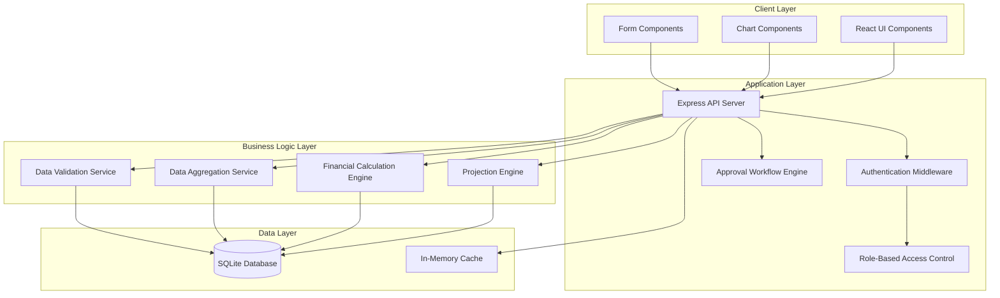
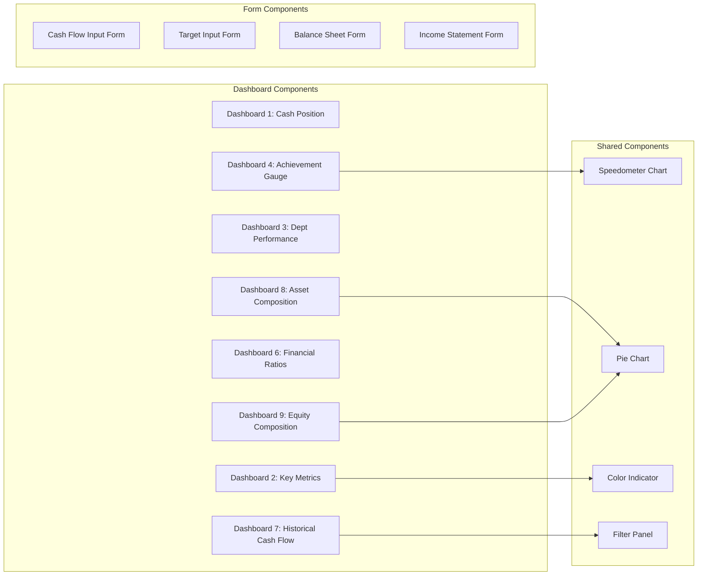
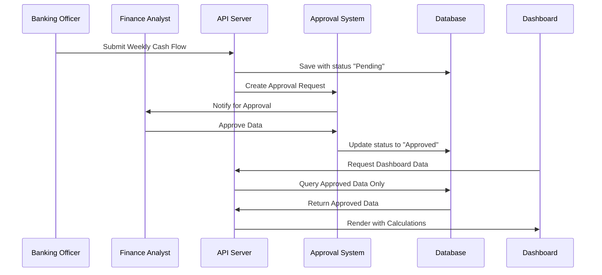
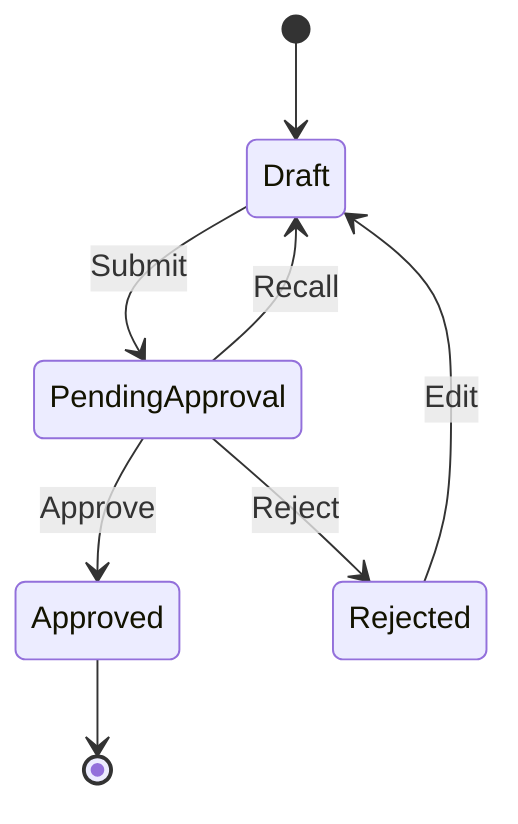

# Design Document: MAFINDA Dashboard Revamp

## Overview

MAFINDA (Management Finance Dashboard) adalah sistem dashboard keuangan terintegrasi yang dirancang untuk perusahaan holding dengan fokus pada monitoring cash flow mingguan, pencapaian target per divisi dan proyek, serta analisis rasio keuangan yang komprehensif. Sistem ini menggantikan pendekatan month-based dengan period-based reporting yang lebih fleksibel, mendukung tracking saldo kas mingguan (W1-W5), dan menyediakan approval workflow untuk data keuangan.

### Key Design Goals

1. **Flexibility**: Period-based reporting menggantikan month-based untuk mendukung berbagai siklus pelaporan
2. **Real-time Monitoring**: Weekly cash flow tracking (W1-W5) untuk monitoring yang lebih akurat
3. **Role-Based Access**: Pemisahan jelas antara Banking Officer dan Finance Analyst
4. **Visual Analytics**: Dashboard dengan speedometer, pie charts, dan color indicators untuk quick insights
5. **Data Integrity**: Approval workflow untuk memastikan data terverifikasi sebelum ditampilkan
6. **Scalability**: Mendukung multiple companies, divisions, dan projects dalam struktur holding

### Technology Stack

- **Frontend**: React 18+ dengan TypeScript
- **Styling**: Tailwind CSS untuk responsive design
- **Backend**: Express.js dengan TypeScript
- **Database**: SQLite untuk development, PostgreSQL-ready untuk production
- **Charts**: Recharts atau Chart.js untuk visualisasi
- **State Management**: React Context API atau Zustand
- **API**: RESTful API dengan JSON responses

## Architecture

### System Architecture



### Component Architecture



### Data Flow Architecture



## Components and Interfaces

### Frontend Components

#### 1. Dashboard Components

**Dashboard1CashPosition**
```typescript
interface Dashboard1Props {
  companyId?: string;
  refreshInterval?: number;
}

interface CashPositionData {
  companyName: string;
  cashPosition: number;
  lastUpdated: Date;
  weeklyBreakdown: {
    week: 'W1' | 'W2' | 'W3' | 'W4' | 'W5';
    revenue: number;
    cashIn: number;
    cashOut: number;
  }[];
}
```

**Dashboard2KeyMetrics**
```typescript
interface Dashboard2Props {
  companyId?: string;
  period: string;
}

interface KeyMetricsData {
  totalAssets: number;
  currentAssets: number;
  totalLiabilities: number;
  currentLiabilities: number;
  netProfit: number;
  currentRatio: number;
  der: number;
  lastUpdated: {
    balanceSheet: Date;
    incomeStatement: Date;
  };
}
```

**Dashboard3DeptPerformance**
```typescript
interface Dashboard3Props {
  companyId?: string;
  period: string;
}

interface DeptPerformanceData {
  highest: {
    divisionName: string;
    achievement: number;
    target: number;
    actual: number;
  };
  lowest: {
    divisionName: string;
    achievement: number;
    target: number;
    actual: number;
  };
}
```

**Dashboard4AchievementGauge**
```typescript
interface Dashboard4Props {
  companyId?: string;
  period: string;
}

interface AchievementGaugeData {
  overallAchievement: number;
  colorZone: 'red' | 'yellow' | 'green';
  divisionBreakdown: {
    divisionName: string;
    achievement: number;
    weight: number;
  }[];
}
```

**Dashboard6FinancialRatios**
```typescript
interface Dashboard6Props {
  companyId?: string;
  period: string;
}

interface FinancialRatioGroup {
  groupName: 'Liquidity' | 'Profitability' | 'Leverage';
  ratios: {
    name: string;
    value: number;
    status: 'healthy' | 'warning' | 'critical';
    trend: 'up' | 'down' | 'stable';
    previousValue?: number;
  }[];
}
```

**Dashboard7HistoricalCashFlow**
```typescript
interface Dashboard7Props {
  companyId?: string;
  divisionId?: string;
  projectId?: string;
  monthsToShow?: number;
}

interface HistoricalCashFlowData {
  period: string;
  cashIn: number;
  cashOut: number;
  netCashFlow: number;
}
```

**Dashboard8AssetComposition**
```typescript
interface Dashboard8Props {
  companyId?: string;
  period: string;
}

interface AssetCompositionData {
  currentAssets: number;
  fixedAssets: number;
  otherAssets: number;
  total: number;
}
```

**Dashboard9EquityComposition**
```typescript
interface Dashboard9Props {
  companyId?: string;
  period: string;
}

interface EquityCompositionData {
  modal: number;
  labaDitahan: number;
  deviden: number;
  total: number;
}
```

#### 2. Shared Visualization Components

**SpeedometerChart**
```typescript
interface SpeedometerProps {
  value: number; // 0-100
  min?: number;
  max?: number;
  zones: {
    min: number;
    max: number;
    color: string;
  }[];
  label?: string;
  tooltip?: React.ReactNode;
}
```

**PieChartComponent**
```typescript
interface PieChartProps {
  data: {
    name: string;
    value: number;
    color?: string;
  }[];
  showPercentage?: boolean;
  showValues?: boolean;
  interactive?: boolean;
}
```

**ColorIndicator**
```typescript
interface ColorIndicatorProps {
  value: number;
  target: number;
  type: 'cashIn' | 'cashOut' | 'ratio';
  showDeviation?: boolean;
}

// Logic:
// cashIn: green if value > target, red otherwise
// cashOut: green if value < target, red otherwise
// ratio: based on threshold rules (e.g., currentRatio < 1.0 = red)
```

#### 3. Form Components

**WeeklyCashFlowForm**
```typescript
interface WeeklyCashFlowFormProps {
  projectId: string;
  week: 'W1' | 'W2' | 'W3' | 'W4' | 'W5';
  initialData?: WeeklyCashFlowData;
  onSubmit: (data: WeeklyCashFlowData) => Promise<void>;
}

interface WeeklyCashFlowData {
  revenue: number;
  cashIn: number;
  cashOut: number;
  notes?: string;
}
```

**TargetManagementForm**
```typescript
interface TargetFormProps {
  projectId: string;
  period: string;
  initialData?: TargetData;
  onSubmit: (data: TargetData) => Promise<void>;
}

interface TargetData {
  revenueTarget: number;
  cashInTarget: number;
  cashOutTarget: number;
  notes?: string;
}
```

**BalanceSheetForm**
```typescript
interface BalanceSheetFormProps {
  companyId: string;
  period: string;
  initialData?: BalanceSheetData;
  onSubmit: (data: BalanceSheetData) => Promise<void>;
}

interface BalanceSheetData {
  // Assets
  currentAssets: {
    kas: number;
    piutang: number;
    persediaan: number;
    lainLain: number;
  };
  fixedAssets: {
    tanahBangunan: number;
    mesinPeralatan: number;
    kendaraan: number;
    akumulasiPenyusutan: number;
  };
  otherAssets: number;
  
  // Liabilities
  currentLiabilities: {
    hutangUsaha: number;
    hutangBank: number;
    lainLain: number; // NEW FIELD
  };
  longTermLiabilities: {
    hutangJangkaPanjang: number;
  };
  
  // Equity
  equity: {
    modal: number;
    labaDitahan: number;
    deviden: number; // NEW FIELD
  };
}
```

### Backend API Endpoints

#### Authentication & Authorization

```typescript
POST /api/auth/login
Request: { username: string, password: string }
Response: { token: string, user: UserProfile }

GET /api/auth/profile
Headers: { Authorization: "Bearer <token>" }
Response: UserProfile

interface UserProfile {
  id: string;
  username: string;
  role: 'banking_officer' | 'finance_analyst' | 'admin';
  companyAccess: string[]; // Array of company IDs
}
```

#### Division & Project Management

```typescript
// Divisions
GET /api/divisions?companyId=<id>
Response: Division[]

POST /api/divisions
Request: { companyId: string, name: string }
Response: Division

DELETE /api/divisions/:id
Response: { success: boolean, message: string }

// Projects
GET /api/projects?divisionId=<id>
Response: Project[]

POST /api/projects
Request: { divisionId: string, name: string, description: string }
Response: Project

DELETE /api/projects/:id
Response: { success: boolean, message: string }

interface Division {
  id: string;
  companyId: string;
  name: string;
  createdAt: Date;
}

interface Project {
  id: string;
  divisionId: string;
  name: string;
  description: string;
  createdAt: Date;
}
```

#### Weekly Cash Flow

```typescript
POST /api/cash-flow/weekly
Request: {
  projectId: string;
  period: string;
  week: 'W1' | 'W2' | 'W3' | 'W4' | 'W5';
  revenue: number;
  cashIn: number;
  cashOut: number;
  notes?: string;
}
Response: { id: string, status: 'pending_approval' }

GET /api/cash-flow/weekly?projectId=<id>&period=<period>
Response: WeeklyCashFlow[]

PUT /api/cash-flow/weekly/:id
Request: { revenue: number, cashIn: number, cashOut: number }
Response: WeeklyCashFlow

interface WeeklyCashFlow {
  id: string;
  projectId: string;
  period: string;
  week: 'W1' | 'W2' | 'W3' | 'W4' | 'W5';
  revenue: number;
  cashIn: number;
  cashOut: number;
  notes?: string;
  status: 'pending_approval' | 'approved' | 'rejected';
  submittedBy: string;
  submittedAt: Date;
  approvedBy?: string;
  approvedAt?: Date;
}
```

#### Target Management

```typescript
POST /api/targets
Request: {
  projectId: string;
  period: string;
  revenueTarget: number;
  cashInTarget: number;
  cashOutTarget: number;
}
Response: Target

GET /api/targets?projectId=<id>&period=<period>
Response: Target[]

PUT /api/targets/:id
Request: { revenueTarget: number, cashInTarget: number, cashOutTarget: number }
Response: Target

interface Target {
  id: string;
  projectId: string;
  period: string;
  revenueTarget: number;
  cashInTarget: number;
  cashOutTarget: number;
  status: 'pending_approval' | 'approved' | 'rejected';
  createdBy: string;
  createdAt: Date;
}
```

#### Financial Statements

```typescript
POST /api/financial/balance-sheet
Request: {
  companyId: string;
  period: string;
  data: BalanceSheetData;
}
Response: { id: string, status: 'pending_approval' }

GET /api/financial/balance-sheet?companyId=<id>&period=<period>
Response: BalanceSheet

POST /api/financial/income-statement
Request: {
  companyId: string;
  period: string;
  data: IncomeStatementData;
}
Response: { id: string, status: 'pending_approval' }

GET /api/financial/income-statement?companyId=<id>&period=<period>
Response: IncomeStatement
```

#### Approval Workflow

```typescript
GET /api/approvals/pending
Response: ApprovalRequest[]

POST /api/approvals/:id/approve
Request: { notes?: string }
Response: { success: boolean }

POST /api/approvals/:id/reject
Request: { reason: string }
Response: { success: boolean }

interface ApprovalRequest {
  id: string;
  type: 'cash_flow' | 'target' | 'balance_sheet' | 'income_statement';
  entityId: string;
  submittedBy: string;
  submittedAt: Date;
  data: any;
  status: 'pending' | 'approved' | 'rejected';
}
```

#### Dashboard Data

```typescript
GET /api/dashboard/cash-position?companyId=<id>
Response: CashPositionData

GET /api/dashboard/key-metrics?companyId=<id>&period=<period>
Response: KeyMetricsData

GET /api/dashboard/dept-performance?companyId=<id>&period=<period>
Response: DeptPerformanceData

GET /api/dashboard/achievement-gauge?companyId=<id>&period=<period>
Response: AchievementGaugeData

GET /api/dashboard/financial-ratios?companyId=<id>&period=<period>
Response: FinancialRatioGroup[]

GET /api/dashboard/historical-cash-flow?companyId=<id>&divisionId=<id>&projectId=<id>&months=<n>
Response: HistoricalCashFlowData[]

GET /api/dashboard/asset-composition?companyId=<id>&period=<period>
Response: AssetCompositionData

GET /api/dashboard/equity-composition?companyId=<id>&period=<period>
Response: EquityCompositionData
```

#### Projections

```typescript
GET /api/projections/revenue?projectId=<id>&periods=<n>
Response: RevenueProjection[]

GET /api/projections/cash-flow/weekly?projectId=<id>&period=<period>
Response: WeeklyCashFlowProjection[]

interface RevenueProjection {
  period: string;
  projectedRevenue: number;
  confidenceInterval: {
    lower: number;
    upper: number;
  };
  basedOn: {
    historicalAchievement: number;
    targetValue: number;
    trendAdjustment: number;
  };
}

interface WeeklyCashFlowProjection {
  week: 'W1' | 'W2' | 'W3' | 'W4' | 'W5';
  projectedCashIn: number;
  projectedCashOut: number;
  projectedBalance: number;
  isActual: boolean;
}
```

#### Cost Control

```typescript
GET /api/cost-control?companyId=<id>&period=<period>
Response: CostControlData[]

POST /api/cost-control/note
Request: {
  categoryId: string;
  period: string;
  note: string;
  actionPlan: string;
}
Response: { success: boolean }

interface CostControlData {
  category: string;
  budgeted: number;
  actual: number;
  variance: number;
  variancePercentage: number;
  trend: number[]; // Historical variance percentages
  alert: boolean;
  notes?: string;
  actionPlan?: string;
}

// 7 predefined categories:
// 1. Operational Expenses
// 2. Marketing & Sales
// 3. Administrative Costs
// 4. IT & Technology
// 5. Human Resources
// 6. Maintenance & Repairs
// 7. Miscellaneous
```

## Data Models

### Database Schema

```sql
-- Companies
CREATE TABLE companies (
  id TEXT PRIMARY KEY,
  name TEXT NOT NULL,
  code TEXT UNIQUE NOT NULL,
  created_at DATETIME DEFAULT CURRENT_TIMESTAMP
);

-- Divisions
CREATE TABLE divisions (
  id TEXT PRIMARY KEY,
  company_id TEXT NOT NULL,
  name TEXT NOT NULL,
  created_at DATETIME DEFAULT CURRENT_TIMESTAMP,
  FOREIGN KEY (company_id) REFERENCES companies(id),
  UNIQUE(company_id, name)
);

-- Projects
CREATE TABLE projects (
  id TEXT PRIMARY KEY,
  division_id TEXT NOT NULL,
  name TEXT NOT NULL,
  description TEXT,
  created_at DATETIME DEFAULT CURRENT_TIMESTAMP,
  FOREIGN KEY (division_id) REFERENCES divisions(id),
  UNIQUE(division_id, name)
);

-- Users
CREATE TABLE users (
  id TEXT PRIMARY KEY,
  username TEXT UNIQUE NOT NULL,
  password_hash TEXT NOT NULL,
  role TEXT NOT NULL CHECK(role IN ('banking_officer', 'finance_analyst', 'admin')),
  created_at DATETIME DEFAULT CURRENT_TIMESTAMP
);

-- User Company Access
CREATE TABLE user_company_access (
  user_id TEXT NOT NULL,
  company_id TEXT NOT NULL,
  PRIMARY KEY (user_id, company_id),
  FOREIGN KEY (user_id) REFERENCES users(id),
  FOREIGN KEY (company_id) REFERENCES companies(id)
);

-- Weekly Cash Flow
CREATE TABLE weekly_cash_flow (
  id TEXT PRIMARY KEY,
  project_id TEXT NOT NULL,
  period TEXT NOT NULL,
  week TEXT NOT NULL CHECK(week IN ('W1', 'W2', 'W3', 'W4', 'W5')),
  revenue REAL NOT NULL,
  cash_in REAL NOT NULL,
  cash_out REAL NOT NULL,
  notes TEXT,
  status TEXT NOT NULL DEFAULT 'pending_approval' CHECK(status IN ('pending_approval', 'approved', 'rejected')),
  submitted_by TEXT NOT NULL,
  submitted_at DATETIME DEFAULT CURRENT_TIMESTAMP,
  approved_by TEXT,
  approved_at DATETIME,
  rejection_reason TEXT,
  FOREIGN KEY (project_id) REFERENCES projects(id),
  FOREIGN KEY (submitted_by) REFERENCES users(id),
  FOREIGN KEY (approved_by) REFERENCES users(id),
  UNIQUE(project_id, period, week)
);

-- Targets
CREATE TABLE targets (
  id TEXT PRIMARY KEY,
  project_id TEXT NOT NULL,
  period TEXT NOT NULL,
  revenue_target REAL NOT NULL,
  cash_in_target REAL NOT NULL,
  cash_out_target REAL NOT NULL,
  status TEXT NOT NULL DEFAULT 'pending_approval' CHECK(status IN ('pending_approval', 'approved', 'rejected')),
  created_by TEXT NOT NULL,
  created_at DATETIME DEFAULT CURRENT_TIMESTAMP,
  approved_by TEXT,
  approved_at DATETIME,
  FOREIGN KEY (project_id) REFERENCES projects(id),
  FOREIGN KEY (created_by) REFERENCES users(id),
  FOREIGN KEY (approved_by) REFERENCES users(id),
  UNIQUE(project_id, period)
);

-- Balance Sheet
CREATE TABLE balance_sheets (
  id TEXT PRIMARY KEY,
  company_id TEXT NOT NULL,
  period TEXT NOT NULL,
  
  -- Current Assets
  kas REAL NOT NULL,
  piutang REAL NOT NULL,
  persediaan REAL NOT NULL,
  current_assets_lain_lain REAL NOT NULL DEFAULT 0,
  
  -- Fixed Assets
  tanah_bangunan REAL NOT NULL,
  mesin_peralatan REAL NOT NULL,
  kendaraan REAL NOT NULL,
  akumulasi_penyusutan REAL NOT NULL,
  
  -- Other Assets
  other_assets REAL NOT NULL DEFAULT 0,
  
  -- Current Liabilities
  hutang_usaha REAL NOT NULL,
  hutang_bank REAL NOT NULL,
  current_liabilities_lain_lain REAL NOT NULL DEFAULT 0,
  
  -- Long Term Liabilities
  hutang_jangka_panjang REAL NOT NULL,
  
  -- Equity
  modal REAL NOT NULL,
  laba_ditahan REAL NOT NULL,
  deviden REAL NOT NULL DEFAULT 0,
  
  status TEXT NOT NULL DEFAULT 'pending_approval' CHECK(status IN ('pending_approval', 'approved', 'rejected')),
  submitted_by TEXT NOT NULL,
  submitted_at DATETIME DEFAULT CURRENT_TIMESTAMP,
  approved_by TEXT,
  approved_at DATETIME,
  
  FOREIGN KEY (company_id) REFERENCES companies(id),
  FOREIGN KEY (submitted_by) REFERENCES users(id),
  FOREIGN KEY (approved_by) REFERENCES users(id),
  UNIQUE(company_id, period)
);

-- Income Statement
CREATE TABLE income_statements (
  id TEXT PRIMARY KEY,
  company_id TEXT NOT NULL,
  period TEXT NOT NULL,
  
  -- Revenue
  revenue REAL NOT NULL,
  
  -- Cost of Goods Sold
  cogs REAL NOT NULL,
  
  -- Operating Expenses
  operational_expenses REAL NOT NULL,
  marketing_sales REAL NOT NULL,
  administrative_costs REAL NOT NULL,
  it_technology REAL NOT NULL,
  human_resources REAL NOT NULL,
  maintenance_repairs REAL NOT NULL,
  miscellaneous REAL NOT NULL,
  
  -- Other Income/Expenses
  other_income REAL NOT NULL DEFAULT 0,
  other_expenses REAL NOT NULL DEFAULT 0,
  
  -- Tax
  tax REAL NOT NULL,
  
  status TEXT NOT NULL DEFAULT 'pending_approval' CHECK(status IN ('pending_approval', 'approved', 'rejected')),
  submitted_by TEXT NOT NULL,
  submitted_at DATETIME DEFAULT CURRENT_TIMESTAMP,
  approved_by TEXT,
  approved_at DATETIME,
  
  FOREIGN KEY (company_id) REFERENCES companies(id),
  FOREIGN KEY (submitted_by) REFERENCES users(id),
  FOREIGN KEY (approved_by) REFERENCES users(id),
  UNIQUE(company_id, period)
);

-- Cost Control Budget
CREATE TABLE cost_control_budgets (
  id TEXT PRIMARY KEY,
  company_id TEXT NOT NULL,
  period TEXT NOT NULL,
  category TEXT NOT NULL CHECK(category IN (
    'operational_expenses',
    'marketing_sales',
    'administrative_costs',
    'it_technology',
    'human_resources',
    'maintenance_repairs',
    'miscellaneous'
  )),
  budgeted_amount REAL NOT NULL,
  notes TEXT,
  action_plan TEXT,
  created_by TEXT NOT NULL,
  created_at DATETIME DEFAULT CURRENT_TIMESTAMP,
  FOREIGN KEY (company_id) REFERENCES companies(id),
  FOREIGN KEY (created_by) REFERENCES users(id),
  UNIQUE(company_id, period, category)
);

-- Approval Audit Log
CREATE TABLE approval_audit_log (
  id TEXT PRIMARY KEY,
  entity_type TEXT NOT NULL CHECK(entity_type IN ('cash_flow', 'target', 'balance_sheet', 'income_statement')),
  entity_id TEXT NOT NULL,
  action TEXT NOT NULL CHECK(action IN ('submitted', 'approved', 'rejected')),
  performed_by TEXT NOT NULL,
  performed_at DATETIME DEFAULT CURRENT_TIMESTAMP,
  notes TEXT,
  FOREIGN KEY (performed_by) REFERENCES users(id)
);

-- Projection Parameters
CREATE TABLE projection_parameters (
  id TEXT PRIMARY KEY,
  project_id TEXT NOT NULL,
  growth_rate REAL NOT NULL DEFAULT 0.05,
  seasonality_factor REAL NOT NULL DEFAULT 1.0,
  confidence_level REAL NOT NULL DEFAULT 0.95,
  updated_by TEXT NOT NULL,
  updated_at DATETIME DEFAULT CURRENT_TIMESTAMP,
  FOREIGN KEY (project_id) REFERENCES projects(id),
  FOREIGN KEY (updated_by) REFERENCES users(id),
  UNIQUE(project_id)
);
```

### TypeScript Data Models

```typescript
// Core Entities
interface Company {
  id: string;
  name: string;
  code: string;
  createdAt: Date;
}

interface Division {
  id: string;
  companyId: string;
  name: string;
  createdAt: Date;
}

interface Project {
  id: string;
  divisionId: string;
  name: string;
  description: string;
  createdAt: Date;
}

interface User {
  id: string;
  username: string;
  role: 'banking_officer' | 'finance_analyst' | 'admin';
  companyAccess: string[];
}

// Financial Data
interface WeeklyCashFlow {
  id: string;
  projectId: string;
  period: string;
  week: 'W1' | 'W2' | 'W3' | 'W4' | 'W5';
  revenue: number;
  cashIn: number;
  cashOut: number;
  notes?: string;
  status: ApprovalStatus;
  submittedBy: string;
  submittedAt: Date;
  approvedBy?: string;
  approvedAt?: Date;
  rejectionReason?: string;
}

interface Target {
  id: string;
  projectId: string;
  period: string;
  revenueTarget: number;
  cashInTarget: number;
  cashOutTarget: number;
  status: ApprovalStatus;
  createdBy: string;
  createdAt: Date;
  approvedBy?: string;
  approvedAt?: Date;
}

interface BalanceSheet {
  id: string;
  companyId: string;
  period: string;
  currentAssets: {
    kas: number;
    piutang: number;
    persediaan: number;
    lainLain: number;
  };
  fixedAssets: {
    tanahBangunan: number;
    mesinPeralatan: number;
    kendaraan: number;
    akumulasiPenyusutan: number;
  };
  otherAssets: number;
  currentLiabilities: {
    hutangUsaha: number;
    hutangBank: number;
    lainLain: number;
  };
  longTermLiabilities: {
    hutangJangkaPanjang: number;
  };
  equity: {
    modal: number;
    labaDitahan: number;
    deviden: number;
  };
  status: ApprovalStatus;
  submittedBy: string;
  submittedAt: Date;
  approvedBy?: string;
  approvedAt?: Date;
}

interface IncomeStatement {
  id: string;
  companyId: string;
  period: string;
  revenue: number;
  cogs: number;
  operatingExpenses: {
    operationalExpenses: number;
    marketingSales: number;
    administrativeCosts: number;
    itTechnology: number;
    humanResources: number;
    maintenanceRepairs: number;
    miscellaneous: number;
  };
  otherIncome: number;
  otherExpenses: number;
  tax: number;
  status: ApprovalStatus;
  submittedBy: string;
  submittedAt: Date;
  approvedBy?: string;
  approvedAt?: Date;
}

type ApprovalStatus = 'pending_approval' | 'approved' | 'rejected';

// Calculated Data
interface FinancialRatios {
  currentRatio: number;
  der: number;
  roa: number;
  roe: number;
  npm: number;
  grossProfitMargin: number;
}

interface Achievement {
  divisionId: string;
  divisionName: string;
  targetRevenue: number;
  actualRevenue: number;
  achievementPercentage: number;
  weight: number;
}

interface CostControlCategory {
  category: string;
  budgeted: number;
  actual: number;
  variance: number;
  variancePercentage: number;
  alert: boolean;
}
```


## Projection Algorithms

### Revenue Projection Algorithm

The revenue projection engine calculates future revenue based on historical achievement rates, target values, and trend analysis.

**Algorithm Steps:**

1. **Historical Achievement Analysis**
   ```typescript
   function calculateHistoricalAchievement(projectId: string, periods: number): number {
     const historicalData = getApprovedCashFlow(projectId, periods);
     const achievements = historicalData.map(data => {
       const target = getTarget(data.projectId, data.period);
       return data.revenue / target.revenueTarget;
     });
     return average(achievements);
   }
   ```

2. **Trend Adjustment**
   ```typescript
   function calculateTrendAdjustment(achievements: number[]): number {
     // Linear regression to find trend slope
     const n = achievements.length;
     const xValues = Array.from({length: n}, (_, i) => i);
     const slope = linearRegression(xValues, achievements).slope;
     return slope;
   }
   ```

3. **Seasonality Factor**
   ```typescript
   function getSeasonalityFactor(period: string, projectId: string): number {
     const params = getProjectionParameters(projectId);
     // Apply seasonality based on historical patterns
     const historicalSeasonality = calculateSeasonalityFromHistory(projectId);
     return historicalSeasonality * params.seasonalityFactor;
   }
   ```

4. **Projection Calculation**
   ```typescript
   function projectRevenue(
     projectId: string,
     targetPeriod: string,
     confidenceLevel: number = 0.95
   ): RevenueProjection {
     const target = getTarget(projectId, targetPeriod);
     const historicalAchievement = calculateHistoricalAchievement(projectId, 6);
     const trend = calculateTrendAdjustment(getRecentAchievements(projectId, 6));
     const seasonality = getSeasonalityFactor(targetPeriod, projectId);
     const params = getProjectionParameters(projectId);
     
     // Base projection
     const baseProjection = target.revenueTarget * historicalAchievement * 
                           (1 + trend) * seasonality * (1 + params.growthRate);
     
     // Confidence interval
     const stdDev = calculateStandardDeviation(getRecentRevenues(projectId, 6));
     const zScore = getZScore(confidenceLevel);
     const margin = zScore * stdDev;
     
     return {
       period: targetPeriod,
       projectedRevenue: baseProjection,
       confidenceInterval: {
         lower: baseProjection - margin,
         upper: baseProjection + margin
       },
       basedOn: {
         historicalAchievement,
         targetValue: target.revenueTarget,
         trendAdjustment: trend
       }
     };
   }
   ```

### Weekly Cash Flow Projection Algorithm

The weekly cash flow projection updates dynamically as actual data becomes available.

**Algorithm Steps:**

1. **Pattern Recognition**
   ```typescript
   function analyzeWeeklyPattern(projectId: string, periods: number): WeeklyPattern {
     const historicalData = getHistoricalWeeklyCashFlow(projectId, periods);
     
     // Calculate average distribution across weeks
     const weeklyDistribution = {
       W1: calculateAveragePercentage(historicalData, 'W1'),
       W2: calculateAveragePercentage(historicalData, 'W2'),
       W3: calculateAveragePercentage(historicalData, 'W3'),
       W4: calculateAveragePercentage(historicalData, 'W4'),
       W5: calculateAveragePercentage(historicalData, 'W5')
     };
     
     return weeklyDistribution;
   }
   ```

2. **Dynamic Projection Update**
   ```typescript
   function projectWeeklyCashFlow(
     projectId: string,
     period: string
   ): WeeklyCashFlowProjection[] {
     const target = getTarget(projectId, period);
     const actualData = getWeeklyCashFlow(projectId, period);
     const pattern = analyzeWeeklyPattern(projectId, 6);
     
     const projections: WeeklyCashFlowProjection[] = [];
     let remainingCashIn = target.cashInTarget;
     let remainingCashOut = target.cashOutTarget;
     let cumulativeBalance = 0;
     
     for (const week of ['W1', 'W2', 'W3', 'W4', 'W5']) {
       const actual = actualData.find(d => d.week === week);
       
       if (actual && actual.status === 'approved') {
         // Use actual data
         projections.push({
           week,
           projectedCashIn: actual.cashIn,
           projectedCashOut: actual.cashOut,
           projectedBalance: cumulativeBalance + actual.cashIn - actual.cashOut,
           isActual: true
         });
         remainingCashIn -= actual.cashIn;
         remainingCashOut -= actual.cashOut;
         cumulativeBalance += actual.cashIn - actual.cashOut;
       } else {
         // Project based on pattern
         const weekPercentage = pattern[week];
         const projectedCashIn = remainingCashIn * weekPercentage;
         const projectedCashOut = remainingCashOut * weekPercentage;
         
         projections.push({
           week,
           projectedCashIn,
           projectedCashOut,
           projectedBalance: cumulativeBalance + projectedCashIn - projectedCashOut,
           isActual: false
         });
         cumulativeBalance += projectedCashIn - projectedCashOut;
       }
     }
     
     return projections;
   }
   ```

3. **Minimum Threshold Alert**
   ```typescript
   function checkCashPositionThreshold(
     projections: WeeklyCashFlowProjection[],
     minimumThreshold: number
   ): WeeklyAlert[] {
     const alerts: WeeklyAlert[] = [];
     
     for (const projection of projections) {
       if (projection.projectedBalance < minimumThreshold && !projection.isActual) {
         alerts.push({
           week: projection.week,
           projectedBalance: projection.projectedBalance,
           threshold: minimumThreshold,
           severity: projection.projectedBalance < 0 ? 'critical' : 'warning'
         });
       }
     }
     
     return alerts;
   }
   ```

### Financial Ratio Calculation Engine

```typescript
class FinancialCalculationEngine {
  calculateCurrentRatio(balanceSheet: BalanceSheet): number {
    const currentAssets = 
      balanceSheet.currentAssets.kas +
      balanceSheet.currentAssets.piutang +
      balanceSheet.currentAssets.persediaan +
      balanceSheet.currentAssets.lainLain;
    
    const currentLiabilities =
      balanceSheet.currentLiabilities.hutangUsaha +
      balanceSheet.currentLiabilities.hutangBank +
      balanceSheet.currentLiabilities.lainLain;
    
    return currentLiabilities === 0 ? Infinity : currentAssets / currentLiabilities;
  }
  
  calculateDER(balanceSheet: BalanceSheet): number {
    const totalLiabilities =
      balanceSheet.currentLiabilities.hutangUsaha +
      balanceSheet.currentLiabilities.hutangBank +
      balanceSheet.currentLiabilities.lainLain +
      balanceSheet.longTermLiabilities.hutangJangkaPanjang;
    
    const totalEquity =
      balanceSheet.equity.modal +
      balanceSheet.equity.labaDitahan +
      balanceSheet.equity.deviden;
    
    return totalEquity === 0 ? Infinity : totalLiabilities / totalEquity;
  }
  
  calculateROA(incomeStatement: IncomeStatement, balanceSheet: BalanceSheet): number {
    const netProfit = this.calculateNetProfit(incomeStatement);
    const totalAssets = this.calculateTotalAssets(balanceSheet);
    
    return totalAssets === 0 ? 0 : (netProfit / totalAssets) * 100;
  }
  
  calculateNetProfit(incomeStatement: IncomeStatement): number {
    const grossProfit = incomeStatement.revenue - incomeStatement.cogs;
    const totalOperatingExpenses =
      incomeStatement.operatingExpenses.operationalExpenses +
      incomeStatement.operatingExpenses.marketingSales +
      incomeStatement.operatingExpenses.administrativeCosts +
      incomeStatement.operatingExpenses.itTechnology +
      incomeStatement.operatingExpenses.humanResources +
      incomeStatement.operatingExpenses.maintenanceRepairs +
      incomeStatement.operatingExpenses.miscellaneous;
    
    const operatingProfit = grossProfit - totalOperatingExpenses;
    const profitBeforeTax = operatingProfit + incomeStatement.otherIncome - incomeStatement.otherExpenses;
    const netProfit = profitBeforeTax - incomeStatement.tax;
    
    return netProfit;
  }
  
  calculateTotalAssets(balanceSheet: BalanceSheet): number {
    const currentAssets =
      balanceSheet.currentAssets.kas +
      balanceSheet.currentAssets.piutang +
      balanceSheet.currentAssets.persediaan +
      balanceSheet.currentAssets.lainLain;
    
    const fixedAssets =
      balanceSheet.fixedAssets.tanahBangunan +
      balanceSheet.fixedAssets.mesinPeralatan +
      balanceSheet.fixedAssets.kendaraan -
      balanceSheet.fixedAssets.akumulasiPenyusutan;
    
    return currentAssets + fixedAssets + balanceSheet.otherAssets;
  }
  
  validateBalanceSheet(balanceSheet: BalanceSheet): boolean {
    const totalAssets = this.calculateTotalAssets(balanceSheet);
    
    const totalLiabilities =
      balanceSheet.currentLiabilities.hutangUsaha +
      balanceSheet.currentLiabilities.hutangBank +
      balanceSheet.currentLiabilities.lainLain +
      balanceSheet.longTermLiabilities.hutangJangkaPanjang;
    
    const totalEquity =
      balanceSheet.equity.modal +
      balanceSheet.equity.labaDitahan +
      balanceSheet.equity.deviden;
    
    const totalLiabilitiesAndEquity = totalLiabilities + totalEquity;
    
    // Allow 0.01% tolerance
    const tolerance = totalAssets * 0.0001;
    return Math.abs(totalAssets - totalLiabilitiesAndEquity) <= tolerance;
  }
}
```

### Achievement Calculation Engine

```typescript
class AchievementCalculationEngine {
  calculateProjectAchievement(projectId: string, period: string): number {
    const target = getApprovedTarget(projectId, period);
    const actualData = getApprovedWeeklyCashFlow(projectId, period);
    
    if (!target || actualData.length === 0) return 0;
    
    const totalRevenue = actualData.reduce((sum, week) => sum + week.revenue, 0);
    return (totalRevenue / target.revenueTarget) * 100;
  }
  
  calculateDivisionAchievement(divisionId: string, period: string): Achievement {
    const projects = getProjectsByDivision(divisionId);
    let totalTarget = 0;
    let totalActual = 0;
    
    for (const project of projects) {
      const target = getApprovedTarget(project.id, period);
      const actualData = getApprovedWeeklyCashFlow(project.id, period);
      
      if (target) {
        totalTarget += target.revenueTarget;
        totalActual += actualData.reduce((sum, week) => sum + week.revenue, 0);
      }
    }
    
    const division = getDivision(divisionId);
    return {
      divisionId,
      divisionName: division.name,
      targetRevenue: totalTarget,
      actualRevenue: totalActual,
      achievementPercentage: totalTarget === 0 ? 0 : (totalActual / totalTarget) * 100,
      weight: totalTarget // Weight by target size
    };
  }
  
  calculateOverallAchievement(companyId: string, period: string): number {
    const divisions = getDivisionsByCompany(companyId);
    const achievements = divisions.map(div => 
      this.calculateDivisionAchievement(div.id, period)
    );
    
    const totalWeight = achievements.reduce((sum, ach) => sum + ach.weight, 0);
    if (totalWeight === 0) return 0;
    
    const weightedSum = achievements.reduce(
      (sum, ach) => sum + (ach.achievementPercentage * ach.weight),
      0
    );
    
    return weightedSum / totalWeight;
  }
  
  getHighestPerformingDivision(companyId: string, period: string): Achievement {
    const divisions = getDivisionsByCompany(companyId);
    const achievements = divisions.map(div =>
      this.calculateDivisionAchievement(div.id, period)
    );
    
    return achievements.reduce((max, current) =>
      current.achievementPercentage > max.achievementPercentage ? current : max
    );
  }
  
  getLowestPerformingDivision(companyId: string, period: string): Achievement {
    const divisions = getDivisionsByCompany(companyId);
    const achievements = divisions.map(div =>
      this.calculateDivisionAchievement(div.id, period)
    );
    
    return achievements.reduce((min, current) =>
      current.achievementPercentage < min.achievementPercentage ? current : min
    );
  }
}
```

### Cost Control Monitoring Engine

```typescript
class CostControlEngine {
  private readonly CATEGORIES = [
    'operational_expenses',
    'marketing_sales',
    'administrative_costs',
    'it_technology',
    'human_resources',
    'maintenance_repairs',
    'miscellaneous'
  ];
  
  analyzeCostControl(companyId: string, period: string): CostControlData[] {
    const budget = getCostControlBudget(companyId, period);
    const incomeStatement = getApprovedIncomeStatement(companyId, period);
    
    if (!incomeStatement) return [];
    
    const results: CostControlData[] = [];
    
    for (const category of this.CATEGORIES) {
      const budgeted = budget[category] || 0;
      const actual = incomeStatement.operatingExpenses[this.mapCategoryToField(category)];
      const variance = actual - budgeted;
      const variancePercentage = budgeted === 0 ? 0 : (variance / budgeted) * 100;
      
      results.push({
        category: this.formatCategoryName(category),
        budgeted,
        actual,
        variance,
        variancePercentage,
        trend: this.calculateTrend(companyId, category, 6),
        alert: variance > 0 && variancePercentage > 10, // Alert if over budget by >10%
        notes: budget.notes,
        actionPlan: budget.actionPlan
      });
    }
    
    // Sort by variance magnitude (highest overspend first)
    return results.sort((a, b) => b.variance - a.variance);
  }
  
  calculateTrend(companyId: string, category: string, periods: number): number[] {
    const historicalData = getHistoricalIncomeStatements(companyId, periods);
    const budgets = getHistoricalBudgets(companyId, periods);
    
    return historicalData.map((stmt, index) => {
      const budget = budgets[index];
      const actual = stmt.operatingExpenses[this.mapCategoryToField(category)];
      const budgeted = budget[category] || 0;
      return budgeted === 0 ? 0 : ((actual - budgeted) / budgeted) * 100;
    });
  }
  
  getCumulativeVariance(companyId: string, period: string): number {
    const analysis = this.analyzeCostControl(companyId, period);
    return analysis.reduce((sum, item) => sum + item.variance, 0);
  }
  
  private mapCategoryToField(category: string): string {
    const mapping: Record<string, string> = {
      'operational_expenses': 'operationalExpenses',
      'marketing_sales': 'marketingSales',
      'administrative_costs': 'administrativeCosts',
      'it_technology': 'itTechnology',
      'human_resources': 'humanResources',
      'maintenance_repairs': 'maintenanceRepairs',
      'miscellaneous': 'miscellaneous'
    };
    return mapping[category];
  }
  
  private formatCategoryName(category: string): string {
    return category.split('_').map(word =>
      word.charAt(0).toUpperCase() + word.slice(1)
    ).join(' ');
  }
}
```

## Approval Workflow System

### Workflow State Machine



### Approval Service Implementation

```typescript
class ApprovalService {
  async submitForApproval(
    entityType: 'cash_flow' | 'target' | 'balance_sheet' | 'income_statement',
    entityId: string,
    submittedBy: string
  ): Promise<ApprovalRequest> {
    // Update entity status
    await this.updateEntityStatus(entityType, entityId, 'pending_approval');
    
    // Create approval request
    const approvalRequest = await this.createApprovalRequest({
      entityType,
      entityId,
      submittedBy,
      submittedAt: new Date(),
      status: 'pending'
    });
    
    // Log audit trail
    await this.logAuditTrail({
      entityType,
      entityId,
      action: 'submitted',
      performedBy: submittedBy,
      performedAt: new Date()
    });
    
    // Notify approvers
    await this.notifyApprovers(approvalRequest);
    
    return approvalRequest;
  }
  
  async approve(
    approvalRequestId: string,
    approvedBy: string,
    notes?: string
  ): Promise<void> {
    const request = await this.getApprovalRequest(approvalRequestId);
    
    // Validate approver has permission
    if (!this.canApprove(approvedBy, request.entityType)) {
      throw new Error('User does not have approval permission');
    }
    
    // Update entity status
    await this.updateEntityStatus(request.entityType, request.entityId, 'approved');
    
    // Update approval request
    await this.updateApprovalRequest(approvalRequestId, {
      status: 'approved',
      approvedBy,
      approvedAt: new Date(),
      notes
    });
    
    // Log audit trail
    await this.logAuditTrail({
      entityType: request.entityType,
      entityId: request.entityId,
      action: 'approved',
      performedBy: approvedBy,
      performedAt: new Date(),
      notes
    });
    
    // Notify submitter
    await this.notifySubmitter(request, 'approved');
  }
  
  async reject(
    approvalRequestId: string,
    rejectedBy: string,
    reason: string
  ): Promise<void> {
    const request = await this.getApprovalRequest(approvalRequestId);
    
    // Validate approver has permission
    if (!this.canApprove(rejectedBy, request.entityType)) {
      throw new Error('User does not have approval permission');
    }
    
    // Update entity status
    await this.updateEntityStatus(request.entityType, request.entityId, 'rejected');
    
    // Update approval request
    await this.updateApprovalRequest(approvalRequestId, {
      status: 'rejected',
      rejectedBy,
      rejectedAt: new Date(),
      rejectionReason: reason
    });
    
    // Log audit trail
    await this.logAuditTrail({
      entityType: request.entityType,
      entityId: request.entityId,
      action: 'rejected',
      performedBy: rejectedBy,
      performedAt: new Date(),
      notes: reason
    });
    
    // Notify submitter with reason
    await this.notifySubmitter(request, 'rejected', reason);
  }
  
  private canApprove(userId: string, entityType: string): boolean {
    const user = getUser(userId);
    
    // Admin can approve everything
    if (user.role === 'admin') return true;
    
    // Finance Analyst can approve cash flow data
    if (user.role === 'finance_analyst' && entityType === 'cash_flow') return true;
    
    // Banking Officer cannot approve anything
    return false;
  }
  
  async getPendingApprovals(userId: string): Promise<ApprovalRequest[]> {
    const user = getUser(userId);
    const companyIds = user.companyAccess;
    
    // Get all pending approvals for companies user has access to
    return await this.db.query(`
      SELECT ar.* FROM approval_requests ar
      JOIN entities e ON ar.entity_id = e.id
      WHERE ar.status = 'pending'
        AND e.company_id IN (${companyIds.join(',')})
      ORDER BY ar.submitted_at DESC
    `);
  }
}
```

### Role-Based Access Control

```typescript
class RBACMiddleware {
  checkPermission(
    requiredRole: string[],
    requiredPermission?: string
  ): express.RequestHandler {
    return async (req, res, next) => {
      const user = req.user as User;
      
      if (!user) {
        return res.status(401).json({ error: 'Unauthorized' });
      }
      
      // Check role
      if (!requiredRole.includes(user.role)) {
        return res.status(403).json({ error: 'Forbidden: Insufficient role' });
      }
      
      // Check specific permission if provided
      if (requiredPermission) {
        const hasPermission = this.hasPermission(user, requiredPermission);
        if (!hasPermission) {
          return res.status(403).json({ error: 'Forbidden: Insufficient permission' });
        }
      }
      
      next();
    };
  }
  
  checkCompanyAccess(companyIdParam: string = 'companyId'): express.RequestHandler {
    return async (req, res, next) => {
      const user = req.user as User;
      const companyId = req.params[companyIdParam] || req.query[companyIdParam];
      
      if (!companyId) {
        return res.status(400).json({ error: 'Company ID required' });
      }
      
      // Admin has access to all companies
      if (user.role === 'admin') {
        return next();
      }
      
      // Check if user has access to this company
      if (!user.companyAccess.includes(companyId)) {
        return res.status(403).json({ error: 'Forbidden: No access to this company' });
      }
      
      next();
    };
  }
  
  private hasPermission(user: User, permission: string): boolean {
    const rolePermissions: Record<string, string[]> = {
      'admin': ['*'],
      'finance_analyst': [
        'read:dashboard',
        'write:target',
        'read:target',
        'approve:cash_flow',
        'read:cash_flow',
        'write:financial_statements',
        'read:financial_statements'
      ],
      'banking_officer': [
        'read:dashboard',
        'write:cash_flow',
        'read:cash_flow',
        'read:target'
      ]
    };
    
    const permissions = rolePermissions[user.role] || [];
    return permissions.includes('*') || permissions.includes(permission);
  }
}

// Usage in routes
app.post('/api/cash-flow/weekly',
  authenticate,
  rbac.checkPermission(['banking_officer', 'admin'], 'write:cash_flow'),
  rbac.checkCompanyAccess('companyId'),
  cashFlowController.createWeeklyCashFlow
);

app.post('/api/targets',
  authenticate,
  rbac.checkPermission(['finance_analyst', 'admin'], 'write:target'),
  rbac.checkCompanyAccess('companyId'),
  targetController.createTarget
);

app.post('/api/approvals/:id/approve',
  authenticate,
  rbac.checkPermission(['finance_analyst', 'admin'], 'approve:cash_flow'),
  approvalController.approve
);
```


## Error Handling

### Error Categories

The system implements comprehensive error handling across multiple categories:

1. **Validation Errors**: Input data validation failures
2. **Authorization Errors**: Permission and access control violations
3. **Business Logic Errors**: Constraint violations and business rule failures
4. **Database Errors**: Data persistence and query failures
5. **External Service Errors**: Third-party service failures (notifications, etc.)

### Error Response Format

All API errors follow a consistent format:

```typescript
interface ErrorResponse {
  error: {
    code: string;
    message: string;
    details?: any;
    timestamp: string;
    requestId: string;
  };
}

// Example responses:
{
  "error": {
    "code": "VALIDATION_ERROR",
    "message": "Balance sheet equation does not balance",
    "details": {
      "totalAssets": 1000000,
      "totalLiabilitiesAndEquity": 999500,
      "difference": 500,
      "tolerance": 10
    },
    "timestamp": "2024-01-15T10:30:00Z",
    "requestId": "req_abc123"
  }
}

{
  "error": {
    "code": "AUTHORIZATION_ERROR",
    "message": "Banking Officer cannot modify target values",
    "details": {
      "requiredRole": "finance_analyst",
      "userRole": "banking_officer"
    },
    "timestamp": "2024-01-15T10:30:00Z",
    "requestId": "req_def456"
  }
}
```

### Error Handling Strategies

**Frontend Error Handling**:
```typescript
class ErrorHandler {
  handleApiError(error: ErrorResponse): void {
    switch (error.error.code) {
      case 'VALIDATION_ERROR':
        this.showValidationError(error.error.message, error.error.details);
        break;
      case 'AUTHORIZATION_ERROR':
        this.showAuthorizationError(error.error.message);
        break;
      case 'NOT_FOUND':
        this.showNotFoundError(error.error.message);
        break;
      case 'DUPLICATE_ENTRY':
        this.showDuplicateError(error.error.message);
        break;
      case 'CONSTRAINT_VIOLATION':
        this.showConstraintError(error.error.message, error.error.details);
        break;
      default:
        this.showGenericError('An unexpected error occurred');
    }
  }
  
  private showValidationError(message: string, details: any): void {
    // Display inline validation errors on form fields
    toast.error(message, { duration: 5000 });
    if (details) {
      console.error('Validation details:', details);
    }
  }
  
  private showAuthorizationError(message: string): void {
    // Redirect to login or show permission denied message
    toast.error(message, { duration: 5000 });
  }
}
```

**Backend Error Handling**:
```typescript
class ErrorMiddleware {
  handle(err: Error, req: Request, res: Response, next: NextFunction): void {
    const requestId = req.id || generateRequestId();
    
    // Log error
    logger.error({
      requestId,
      error: err.message,
      stack: err.stack,
      path: req.path,
      method: req.method,
      user: req.user?.id
    });
    
    // Determine error type and response
    if (err instanceof ValidationError) {
      res.status(400).json({
        error: {
          code: 'VALIDATION_ERROR',
          message: err.message,
          details: err.details,
          timestamp: new Date().toISOString(),
          requestId
        }
      });
    } else if (err instanceof AuthorizationError) {
      res.status(403).json({
        error: {
          code: 'AUTHORIZATION_ERROR',
          message: err.message,
          timestamp: new Date().toISOString(),
          requestId
        }
      });
    } else if (err instanceof NotFoundError) {
      res.status(404).json({
        error: {
          code: 'NOT_FOUND',
          message: err.message,
          timestamp: new Date().toISOString(),
          requestId
        }
      });
    } else if (err instanceof DuplicateEntryError) {
      res.status(409).json({
        error: {
          code: 'DUPLICATE_ENTRY',
          message: err.message,
          details: err.details,
          timestamp: new Date().toISOString(),
          requestId
        }
      });
    } else {
      // Generic server error
      res.status(500).json({
        error: {
          code: 'INTERNAL_SERVER_ERROR',
          message: 'An unexpected error occurred',
          timestamp: new Date().toISOString(),
          requestId
        }
      });
    }
  }
}
```

### Specific Error Scenarios

**Balance Sheet Validation**:
```typescript
function validateBalanceSheet(data: BalanceSheetData): void {
  const totalAssets = calculateTotalAssets(data);
  const totalLiabilitiesAndEquity = calculateTotalLiabilitiesAndEquity(data);
  const tolerance = totalAssets * 0.0001; // 0.01% tolerance
  
  if (Math.abs(totalAssets - totalLiabilitiesAndEquity) > tolerance) {
    throw new ValidationError('Balance sheet equation does not balance', {
      totalAssets,
      totalLiabilitiesAndEquity,
      difference: totalAssets - totalLiabilitiesAndEquity,
      tolerance
    });
  }
}
```

**Deletion Constraints**:
```typescript
async function deleteDivision(divisionId: string): Promise<void> {
  const projects = await getProjectsByDivision(divisionId);
  
  if (projects.length > 0) {
    throw new ConstraintViolationError(
      'Cannot delete division with associated projects',
      {
        divisionId,
        projectCount: projects.length,
        projectIds: projects.map(p => p.id)
      }
    );
  }
  
  await db.divisions.delete(divisionId);
}

async function deleteProject(projectId: string): Promise<void> {
  const hasFinancialData = await checkFinancialData(projectId);
  
  if (hasFinancialData) {
    throw new ConstraintViolationError(
      'Cannot delete project with financial data',
      {
        projectId,
        dataTypes: ['cash_flow', 'targets']
      }
    );
  }
  
  await db.projects.delete(projectId);
}
```

**Duplicate Entry Prevention**:
```typescript
async function createBalanceSheet(data: BalanceSheetInput): Promise<BalanceSheet> {
  const existing = await db.balanceSheets.findOne({
    companyId: data.companyId,
    period: data.period
  });
  
  if (existing) {
    throw new DuplicateEntryError(
      'Balance sheet already exists for this company and period',
      {
        companyId: data.companyId,
        period: data.period,
        existingId: existing.id
      }
    );
  }
  
  return await db.balanceSheets.create(data);
}
```

## Testing Strategy

### Dual Testing Approach

The MAFINDA system requires both unit testing and property-based testing for comprehensive coverage:

**Unit Tests**: Focus on specific examples, edge cases, and integration points
- Specific calculation examples with known inputs and outputs
- Edge cases (empty data, boundary values, null handling)
- Error conditions and validation failures
- Integration between components
- API endpoint behavior with specific payloads

**Property-Based Tests**: Verify universal properties across all inputs
- Calculations that must hold for any valid input
- Invariants that must be maintained
- Relationships between entities
- Business rules that apply universally
- Round-trip properties (serialization, parsing)

### Property-Based Testing Configuration

**Library Selection**: 
- **JavaScript/TypeScript**: fast-check
- **Python**: Hypothesis
- **Java**: jqwik

**Configuration Requirements**:
- Minimum 100 iterations per property test
- Each test must reference its design document property
- Tag format: `Feature: mafinda-dashboard-revamp, Property {number}: {property_text}`

**Example Property Test**:
```typescript
import fc from 'fast-check';

describe('Feature: mafinda-dashboard-revamp, Property 1: Balance sheet equation', () => {
  it('should maintain accounting equation for any valid balance sheet', () => {
    fc.assert(
      fc.property(
        balanceSheetArbitrary(),
        (balanceSheet) => {
          const totalAssets = calculateTotalAssets(balanceSheet);
          const totalLiabilitiesAndEquity = calculateTotalLiabilitiesAndEquity(balanceSheet);
          const tolerance = totalAssets * 0.0001;
          
          expect(Math.abs(totalAssets - totalLiabilitiesAndEquity)).toBeLessThanOrEqual(tolerance);
        }
      ),
      { numRuns: 100 }
    );
  });
});
```

### Test Coverage Requirements

**Backend Coverage**:
- API endpoints: 100% of routes tested
- Business logic: 90%+ code coverage
- Database operations: All CRUD operations tested
- Error handling: All error paths tested

**Frontend Coverage**:
- Components: 80%+ coverage
- Calculation logic: 100% coverage
- User interactions: Critical paths tested
- Error states: All error displays tested

### Integration Testing

**API Integration Tests**:
```typescript
describe('Cash Flow Workflow Integration', () => {
  it('should complete full cash flow submission and approval workflow', async () => {
    // Banking Officer submits cash flow
    const cashFlow = await api.post('/api/cash-flow/weekly', {
      projectId: 'proj_1',
      period: '2024-Q1',
      week: 'W1',
      revenue: 100000,
      cashIn: 80000,
      cashOut: 60000
    }, { user: bankingOfficer });
    
    expect(cashFlow.status).toBe('pending_approval');
    
    // Finance Analyst approves
    await api.post(`/api/approvals/${cashFlow.approvalId}/approve`, {
      notes: 'Approved'
    }, { user: financeAnalyst });
    
    // Verify data appears in dashboard
    const dashboard = await api.get('/api/dashboard/cash-position', {
      companyId: 'comp_1'
    }, { user: bankingOfficer });
    
    expect(dashboard.cashPosition).toBeDefined();
  });
});
```

### Performance Testing

**Load Testing Requirements**:
- Dashboard load time: < 2 seconds for 1 year of data
- API response time: < 500ms for 95th percentile
- Concurrent users: Support 50+ simultaneous users
- Database queries: < 100ms for most queries

**Performance Test Example**:
```typescript
describe('Dashboard Performance', () => {
  it('should load Dashboard 1 within 2 seconds', async () => {
    const startTime = Date.now();
    
    await api.get('/api/dashboard/cash-position', {
      companyId: 'comp_1'
    });
    
    const loadTime = Date.now() - startTime;
    expect(loadTime).toBeLessThan(2000);
  });
});
```

