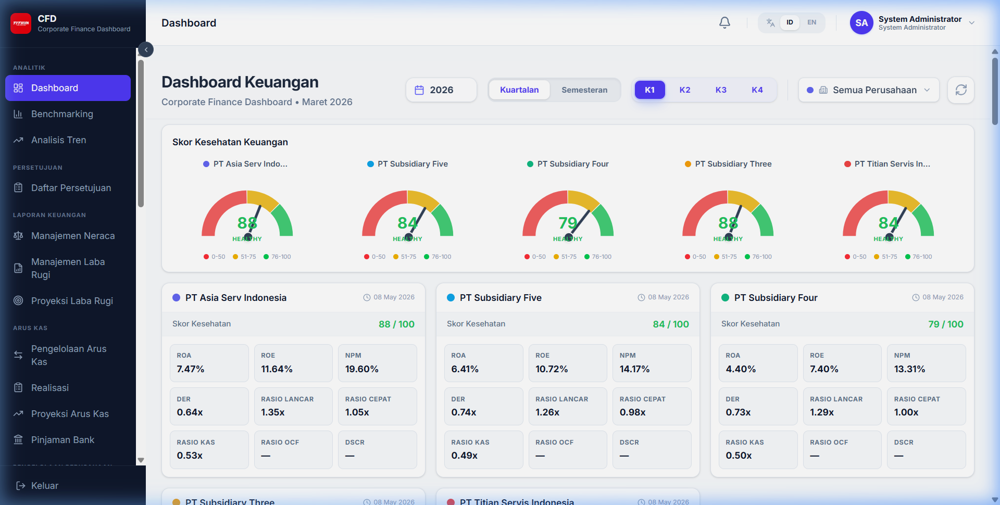
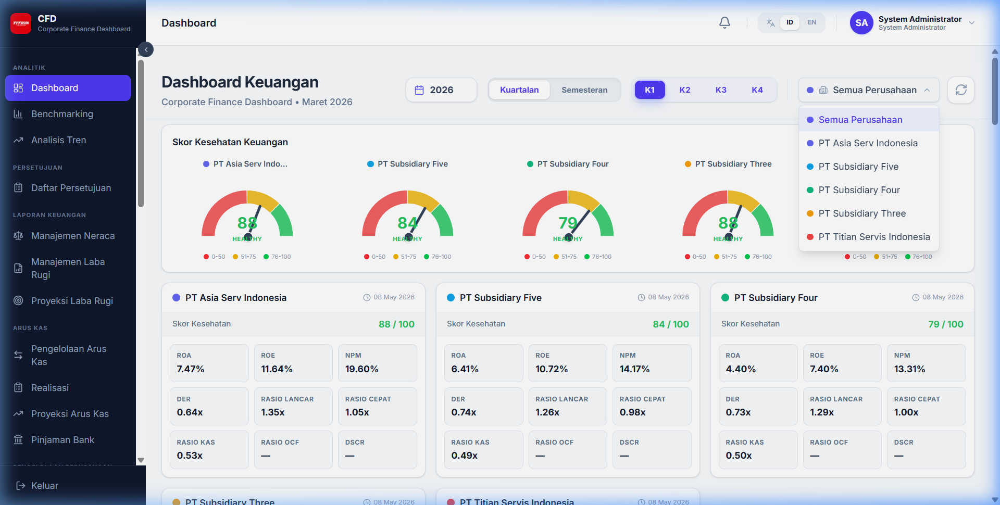
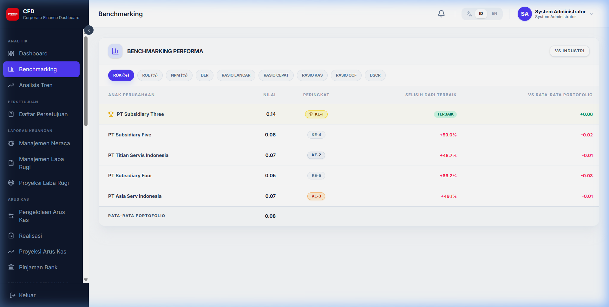
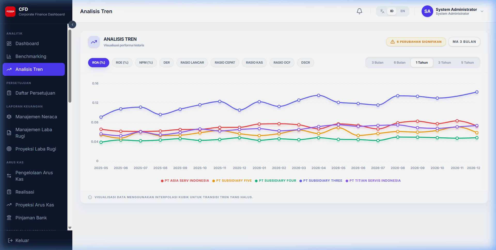

# Analitik & Dashboard

Sistem menyediakan visualisasi data finansial untuk membantu pengambilan keputusan yang cepat dan akurat.

## 1. Dashboard Utama

Dashboard memberikan ringkasan KPI (Key Performance Indicators) dalam bentuk grafik interaktif.

### 1.1 Filter Dashboard
Anda dapat menyaring data pada dashboard berdasarkan Perusahaan dan Periode.

- **Filter Perusahaan**: Memilih satu atau lebih perusahaan (subsidiary) untuk ditampilkan.
- **Filter Periode**: Memilih bulan dan tahun data yang ingin dianalisis.
- **Terapkan**: Klik tombol apply untuk memperbarui grafik.

## 2. Benchmarking

Menu ini digunakan untuk membandingkan performa rasio keuangan antar perusahaan atau antar periode secara berdampingan.

- **Pilih Rasio**: Pilih metrik yang ingin dibandingkan (misal: ROA, Current Ratio).
- **Pilih Entitas**: Centang perusahaan yang akan dibandingkan.
- **Visualisasi**: Hasil perbandingan ditampilkan dalam tabel dan grafik batang.

## 3. Analisis Tren (Trend Analysis)

Analisis Tren membantu Anda melihat perkembangan performa keuangan dari waktu ke waktu.

- **Grafik Tren**: Menampilkan garis perkembangan rasio bulanan.
- **Pemilihan Tahun**: Anda dapat melihat tren untuk tahun berjalan atau tahun sebelumnya.
- **Tooltips**: Arahkan kursor ke titik grafik untuk melihat nilai detail pada bulan tersebut.
