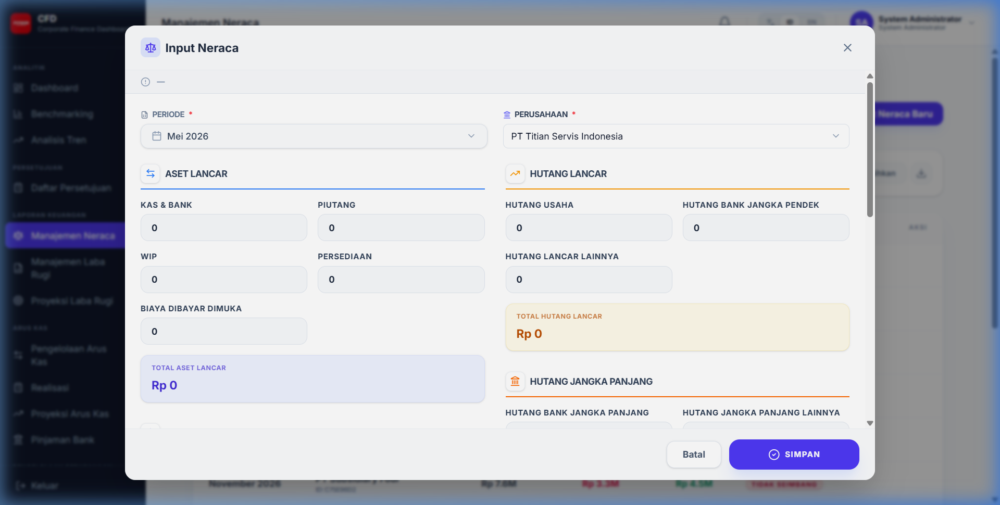
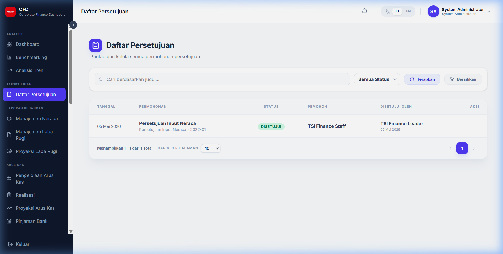
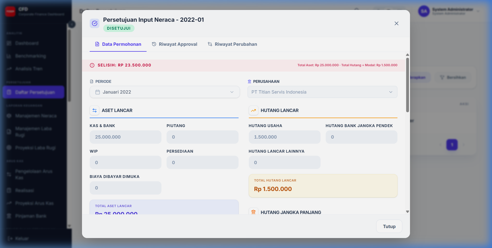

# Persetujuan & Notifikasi

Sistem dilengkapi dengan alur persetujuan dinamis (Approval Workflow) untuk menjaga integritas data finansial.

## 1. Alur Persetujuan (Workflow)

Setiap entri data finansial baru atau perubahan data harus melalui proses persetujuan.

### 1.1 Tahap Maker (Pembuat Data)
Maker adalah pengguna yang menginput data ke dalam sistem.

- **Simpan sebagai Draft**: Data disimpan tetapi belum masuk ke alur persetujuan. Masih bisa diedit.
- **Submit**: Data dikirim ke alur persetujuan. Status berubah menjadi "Pending".

### 1.2 Monitoring Persetujuan
Semua pengguna yang terlibat dalam alur dapat memantau status melalui menu Monitoring Persetujuan.

### 1.3 Tahap Approver (Pemberi Persetujuan)
Approver menerima notifikasi dan melakukan review terhadap data yang diajukan.

1. **Review Data**: Melihat detail data yang diinput oleh Maker.
2. **Berikan Komentar**: Menulis catatan (opsional untuk Approve, wajib untuk Reject).
3. **Approve**: Menyetujui data untuk dipublikasikan ke laporan utama.
4. **Reject**: Menolak data. Data akan dikembalikan ke Maker untuk diperbaiki.

## 2. Notifikasi

Sistem mengirimkan notifikasi secara real-time untuk setiap peristiwa penting.

- **Notifikasi Persetujuan**: Menginformasikan Maker jika data di-Approve/Reject, dan menginformasikan Approver jika ada data baru yang butuh review.
- **Broadcast Notifikasi**: Pengumuman dari administrator sistem kepada seluruh pengguna.
- **Ikon Lonceng**: Klik ikon lonceng di pojok kanan atas untuk melihat daftar notifikasi terbaru.
