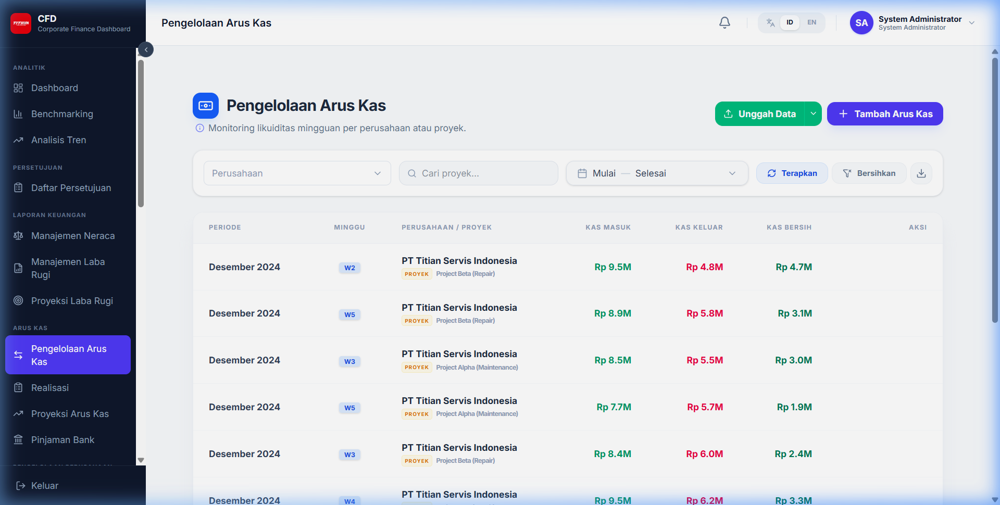
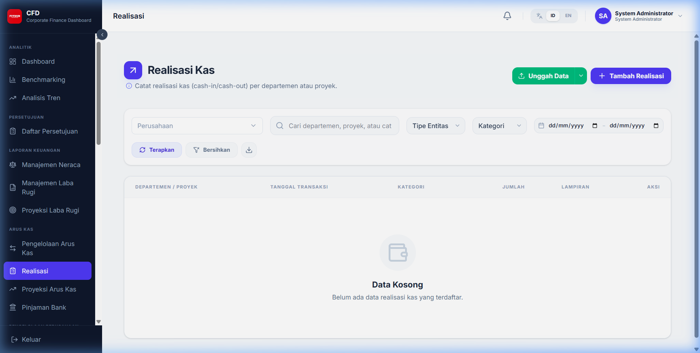
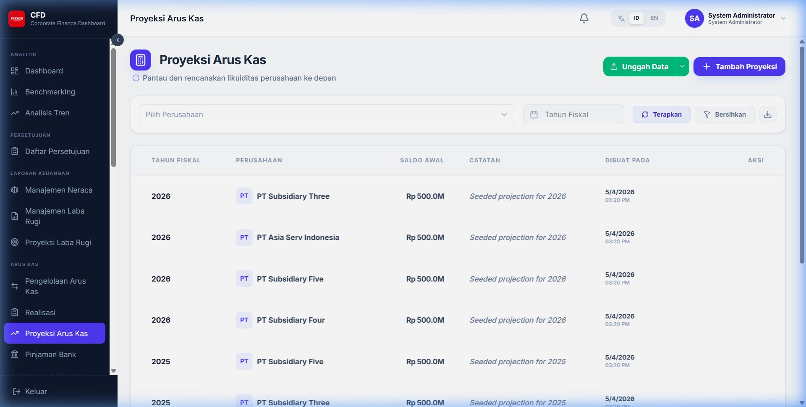
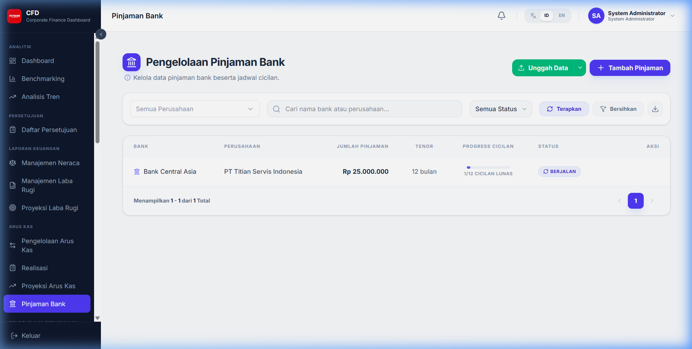

# Arus Kas & Pinjaman

Modul ini berfokus pada manajemen likuiditas perusahaan dan kewajiban pinjaman bank.

## 1. Arus Kas Mingguan (Weekly Cash Flow)

Digunakan untuk memonitor mutasi kas masuk dan keluar dalam skala mingguan.

- **Input Saldo Awal**: Masukkan saldo kas di awal minggu.
- **Kategori Kas**: Pisahkan antara operasional, investasi, dan pendanaan.

## 2. Realisasi (Realization)

Halaman ini digunakan untuk mencatatkan realisasi dari anggaran atau proyeksi yang telah dibuat.

- **Pilih Komponen**: Pilih akun biaya atau pendapatan yang direalisasikan.
- **Nilai Realisasi**: Masukkan nominal aktual yang terjadi.

## 3. Proyeksi Arus Kas

Membantu perencanaan keuangan jangka pendek dan menengah dengan memproyeksikan saldo kas masa depan.

## 4. Pinjaman Bank (Bank Loan)

Mengelola daftar pinjaman dari pihak ketiga/bank serta jadwal angsurannya.

- **Detail Pinjaman**: Nama Bank, Plafon, Suku Bunga, dan Tenor.
- **Jadwal Angsuran**: Menampilkan rincian pembayaran pokok dan bunga setiap bulannya.
