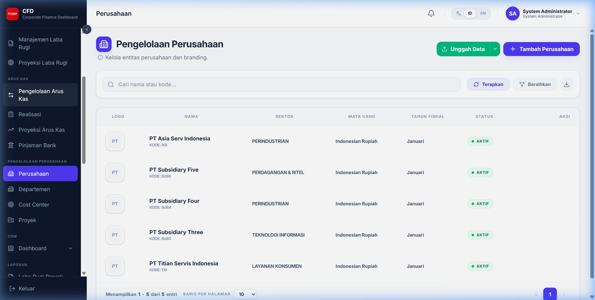
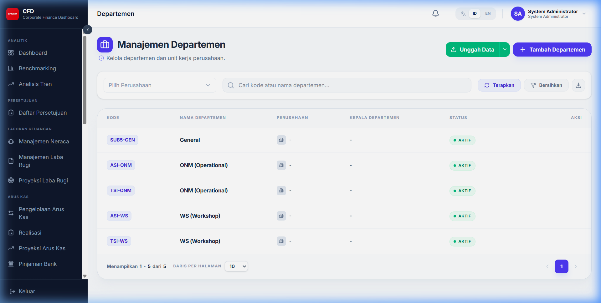
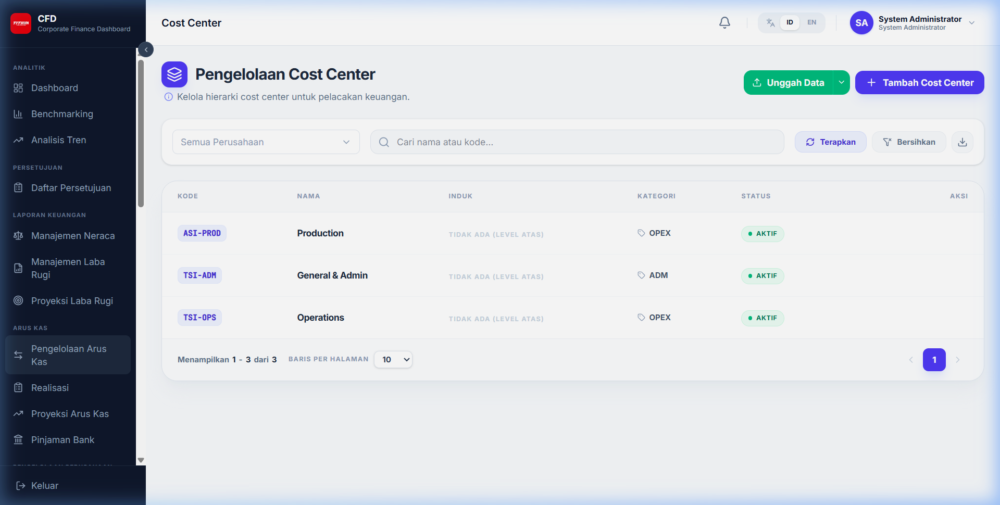
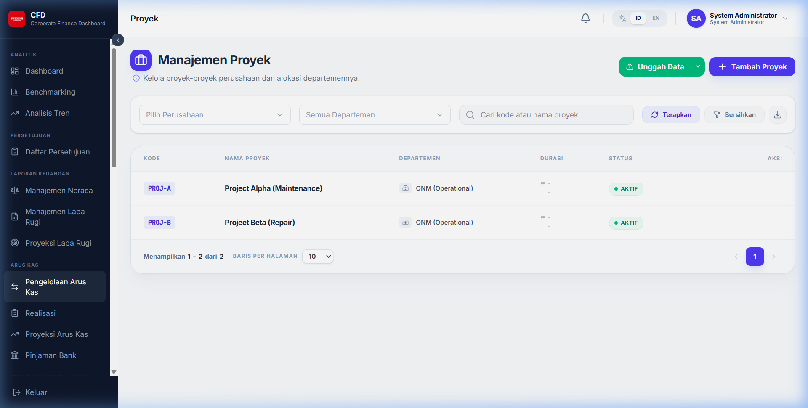

# Pengelolaan Perusahaan

Modul master data untuk mengatur struktur organisasi dan entitas bisnis di dalam sistem.

## 1. Perusahaan (Corporate)

Daftar seluruh entitas perusahaan atau anak perusahaan (subsidiary).

- **Kode Perusahaan**: Identitas unik (misal: TSI, TSM).
- **Nama Perusahaan**: Nama resmi entitas.
- **Status**: Mengaktifkan atau menonaktifkan akses data untuk perusahaan tertentu.

## 2. Departemen

Mengatur pembagian kerja di dalam masing-masing perusahaan.

## 3. Cost Center

Pusat biaya yang digunakan untuk melakukan alokasi anggaran dan pelacakan pengeluaran secara lebih detail.

## 4. Proyek

Master data untuk daftar proyek yang sedang berjalan, yang akan dihubungkan dengan laporan Laba Rugi Proyek.

