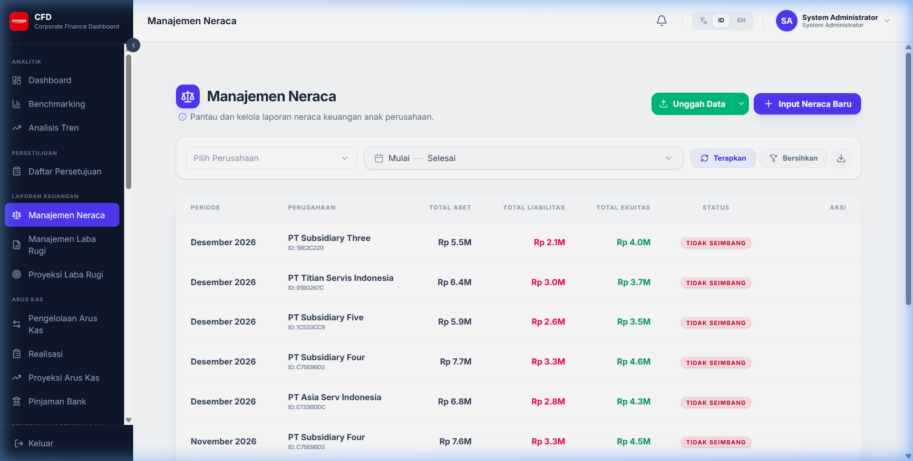
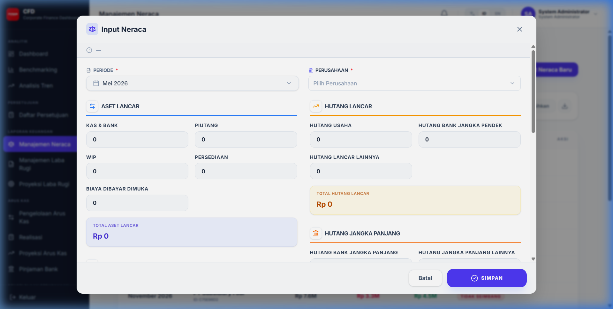
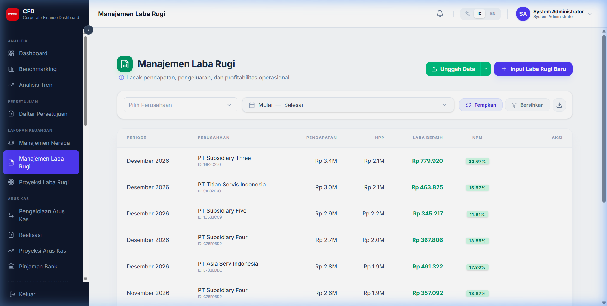
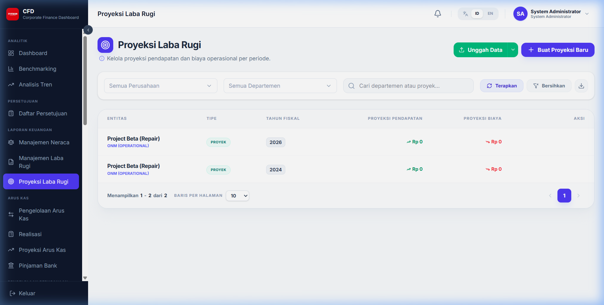

# Laporan Keuangan

Bagian ini menjelaskan cara mengelola data Neraca, Laba Rugi, dan Proyeksi Laba Rugi.

## 1. Navigasi Umum (DataTable)

Setiap modul laporan keuangan memiliki struktur halaman yang serupa.

- **Index DataTable**: Menampilkan daftar record data yang sudah tersimpan.
- **Pencarian**: Gunakan kolom search untuk mencari data berdasarkan Corporate atau Periode.
- **Pagination**: Navigasi antar halaman data.

## 2. Filter Data

Anda dapat menyaring daftar data menggunakan komponen filter yang disediakan.

- **Filter Perusahaan & Periode**: Saring data spesifik yang ingin ditampilkan di tabel.
- **Clear Filter**: Klik tombol hapus/bersihkan filter untuk kembali menampilkan seluruh data.

## 3. Ekspor Data

Fitur ekspor memungkinkan Anda mengunduh data dalam format Excel.

- **Hubungan dengan Filter**: Data yang diekspor adalah data yang tampil pada tabel (sesuai dengan filter yang sedang aktif).
- **Cara Ekspor**: Klik tombol **Export Excel** di bagian kanan atas tabel.

## 4. Input Data Baru

Klik tombol **Tambah** atau **Input Baru** untuk membuka formulir.

- **Corporate**: Pilih perusahaan pemilik data (Wajib).
- **Department**: Pilih departemen terkait (Wajib).
- **Periode**: Tentukan bulan dan tahun data (Wajib).
- **Nominal**: Masukkan nilai angka untuk setiap baris akun. Gunakan format angka yang benar.
- **Simpan**: Data akan tersimpan sesuai status yang dipilih (Draft atau Submit).

## 5. Hapus Data

Untuk menghapus data yang salah (Hanya berlaku untuk data berstatus Draft atau sesuai kebijakan hak akses):
1. Klik ikon **Sampah/Delete** pada kolom aksi di tabel.
2. Konfirmasi penghapusan pada dialog yang muncul.

## 6. Upload Data (Bulk Upload)

Fitur ini digunakan untuk memasukkan data dalam jumlah banyak sekaligus menggunakan file Excel.

1. **Buka Modal Upload**: Klik tombol **Upload**.
2. **Unduh Template**: Klik link "Download Template" untuk mendapatkan file Excel dengan format yang benar.
3. **Isi Data**: Masukkan data Anda ke dalam template tersebut. Jangan mengubah struktur kolom.
4. **Pilih File**: Klik area upload atau drag-and-drop file Excel Anda.
5. **Review**: Sistem akan memvalidasi data. Jika ada error (baris berwarna merah), perbaiki file Anda dan upload ulang.
6. **Submit**: Klik simpan untuk memasukkan data ke sistem (akan masuk ke alur persetujuan).

## 7. Modul Laporan

### 7.1 Neraca (Balance Sheet)
Mengelola posisi aset, kewajiban, dan ekuitas.

### 7.2 Laba Rugi (Income Statement)
Mengelola pendapatan dan biaya operasional.

### 7.3 Proyeksi Laba Rugi
Mengelola estimasi performa keuangan untuk periode mendatang.

