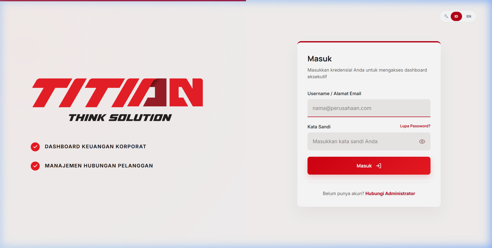
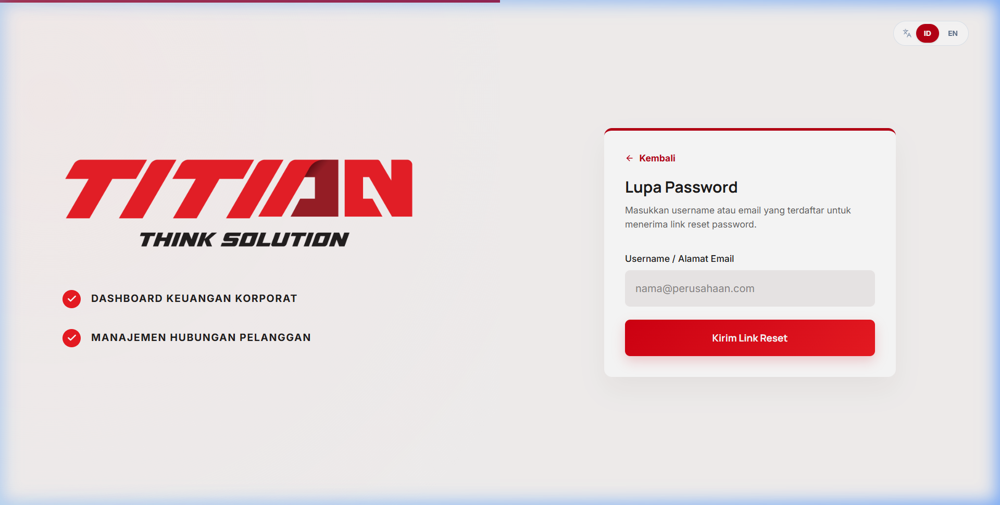
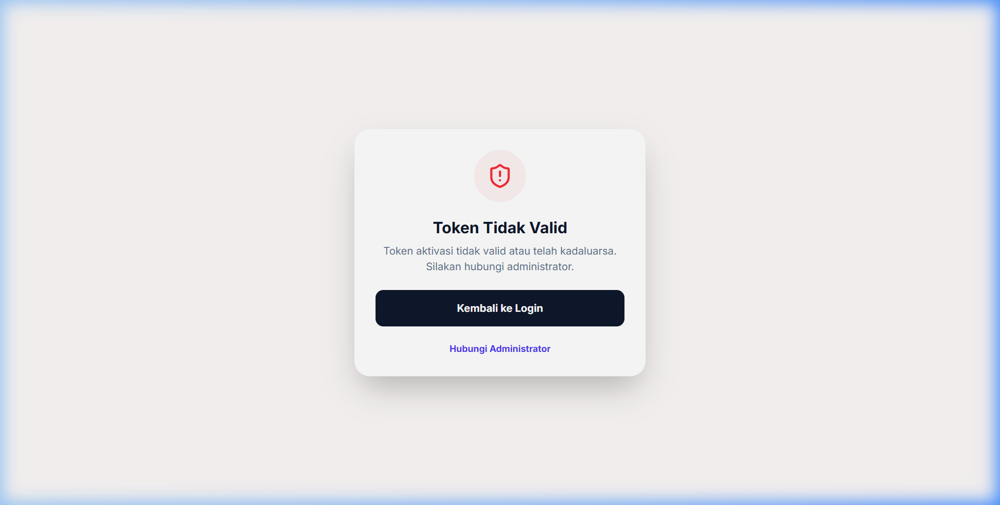
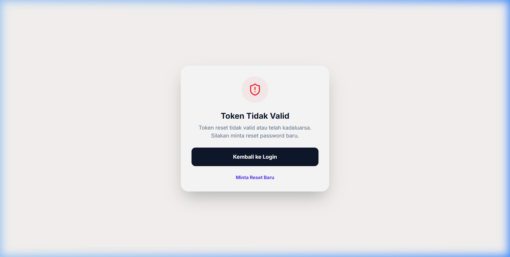
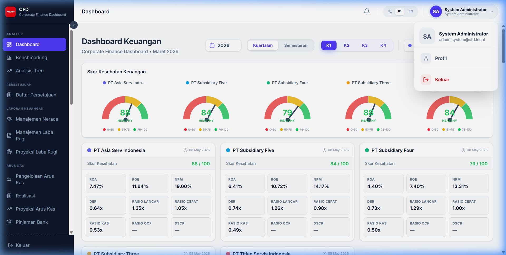
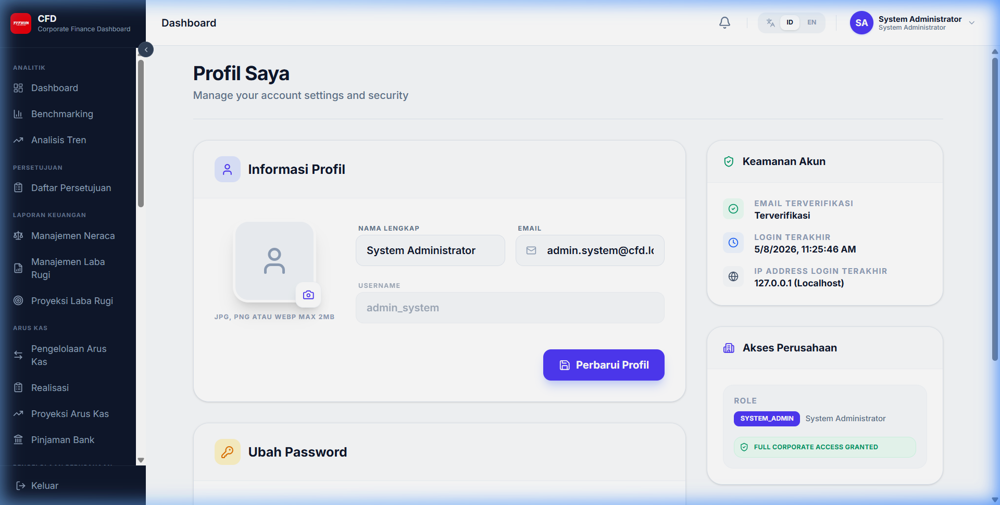

# RBAC & Autentikasi

Bagian ini menjelaskan mekanisme keamanan sistem, proses autentikasi, serta pengelolaan profil pengguna.

## 1. Peran Pengguna (RBAC)

Sistem menggunakan kontrol akses berbasis peran (Role-Based Access Control). Berikut adalah daftar peran yang tersedia:

| Peran | Deskripsi | Hak Akses Utama |
|---|---|---|
| **Admin System** | Pengelola sistem utama | Akses penuh ke seluruh menu, manajemen user, dan konfigurasi sistem. |
| **Finance Manager** | Pengelola keuangan | Input, verifikasi, ekspor data finansial, dan memberikan persetujuan (Approve). |
| **Finance Staff** | Pelaksana input data | Input data finansial, melihat dashboard, dan melakukan ekspor data. |
| **Viewer / Executive** | Pengamat data | Akses baca saja (read-only) untuk Dashboard, Analitik, dan Laporan. |
| **Management** | Pihak manajemen | Akses laporan konsolidasi dan persetujuan tingkat lanjut. |

## 2. Autentikasi

### 2.1 Login
Masukkan username dan password Anda pada halaman login untuk mengakses dashboard.

### 2.2 Lupa Password
Jika Anda lupa kata sandi, gunakan fitur "Lupa Password" untuk mendapatkan link reset melalui email.

1. Klik tautan **Lupa Password?** pada halaman login.
2. Masukkan email atau username terdaftar.
3. Klik **Kirim Link Reset**.

### 2.3 Aktivasi Akun
Bagi pengguna baru, Anda wajib melakukan aktivasi akun melalui link yang dikirimkan admin ke email Anda.

### 2.4 Reset Password
Gunakan halaman ini untuk mengubah kata sandi Anda setelah meminta reset atau saat aktivasi.

### 2.5 Logout
Untuk keluar dari sistem, klik menu profil di pojok kanan atas dan pilih **Logout**.

## 3. Profil Pengguna

Halaman ini memungkinkan Anda untuk melihat detail akun dan mengubah informasi personal.

- **Informasi Akun**: Nama, Email, Username, dan Peran.
- **Akses Perusahaan**: Daftar perusahaan yang dapat Anda akses.
- **Ubah Password**: Fitur untuk memperbarui kata sandi secara berkala.
