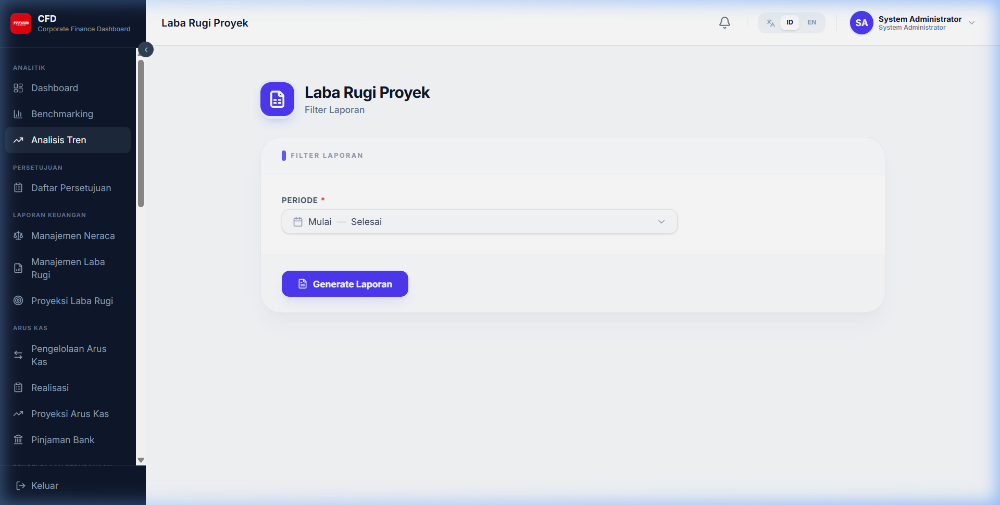

# Laporan Manajerial

Selain dashboard interaktif, sistem menyediakan laporan manajerial mendalam dalam format tabel dan cetak.

## 1. Laba Rugi Proyek

Laporan yang merinci pendapatan dan beban khusus untuk satu proyek tertentu.

## 2. Laba Rugi Proyek per Cost Center

Pengembangan dari laporan laba rugi proyek yang dipecah berdasarkan masing-masing cost center yang terlibat dalam proyek tersebut.

---
*Catatan: Gunakan filter pada setiap laporan untuk menyesuaikan periode dan entitas yang ingin dianalisis.*
