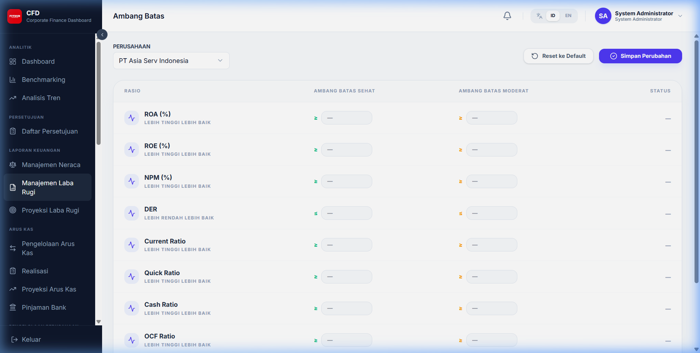
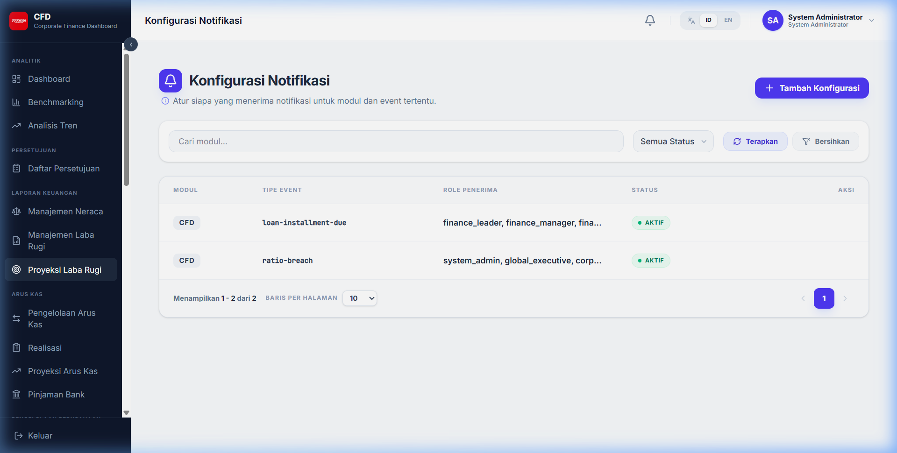
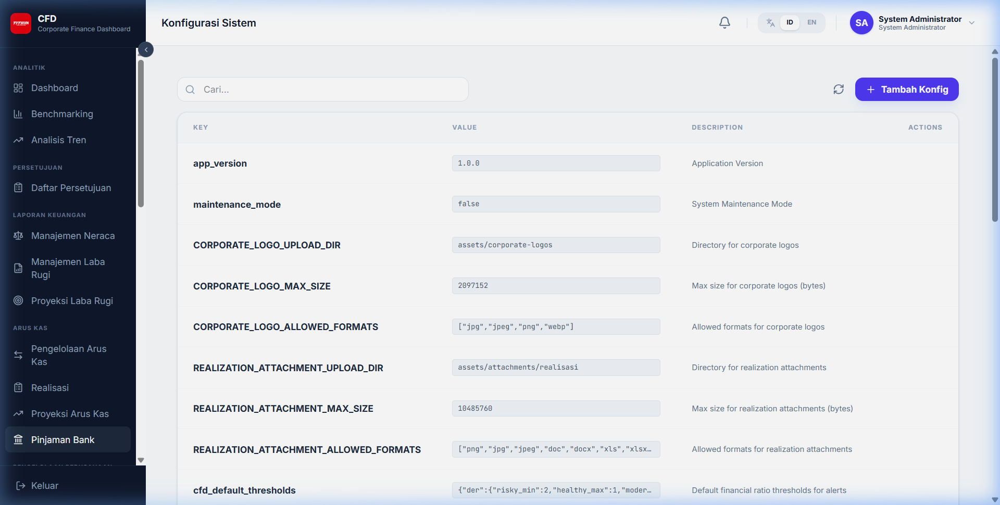
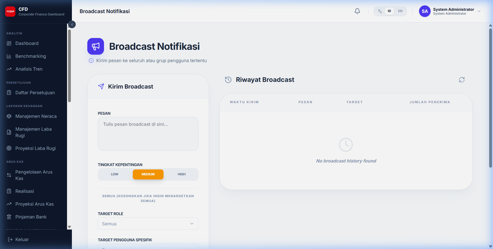
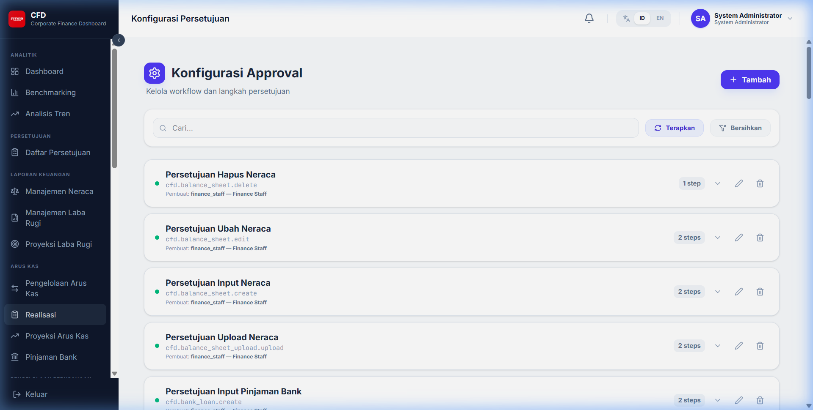
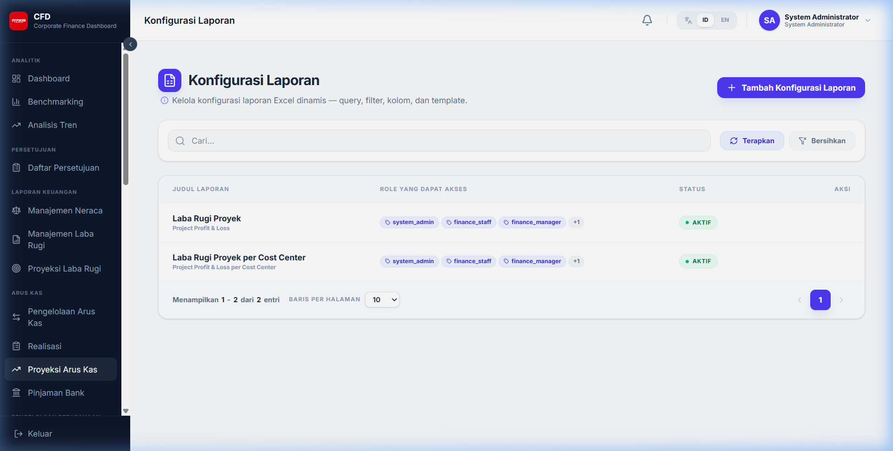
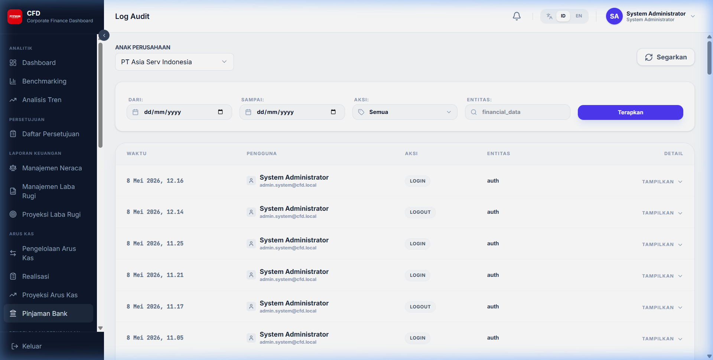

# Pengelolaan & Monitoring Sistem

Bagian ini dikhususkan bagi administrator sistem untuk melakukan konfigurasi teknis dan audit.

## 1. Ambang Batas (Thresholds)

Mengatur batas nilai aman untuk setiap rasio keuangan. Rasio yang melewati ambang batas akan muncul sebagai peringatan (Alert) pada dashboard.

## 2. Konfigurasi Notifikasi

Mengatur kanal pengiriman (Email/Sistem) untuk setiap jenis pemberitahuan.

## 3. Konfigurasi Sistem

Pengaturan parameter global aplikasi.

## 4. Broadcast Notifikasi

Fitur untuk mengirimkan pesan pengumuman kepada seluruh pengguna aktif.

## 5. Konfigurasi Persetujuan (Approval Config)

Menentukan urutan persetujuan dan siapa saja yang berhak memberikan keputusan (Approver) untuk setiap modul.

## 6. Konfigurasi Laporan

Mengatur template laporan Excel, termasuk urutan kolom dan pemetaan data.

## 7. Log Audit (Audit Trail)

Mencatat setiap aksi yang dilakukan oleh pengguna (Siapa, Kapan, Melakukan Apa, pada Data Apa).

