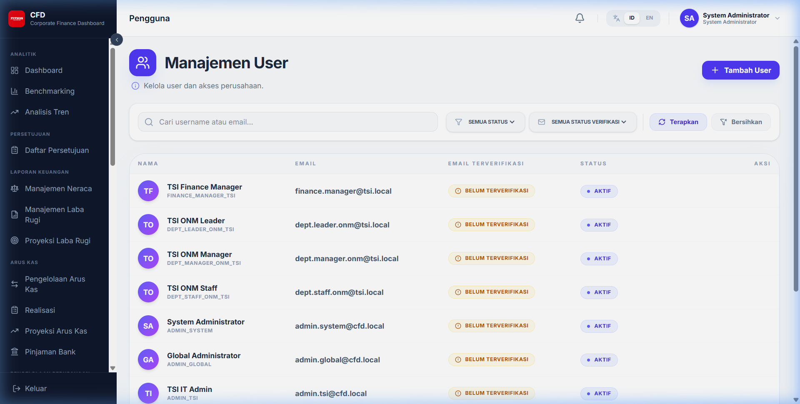
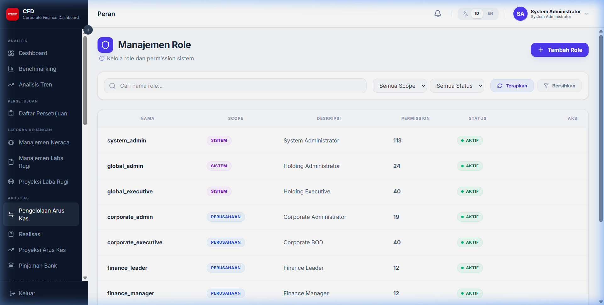
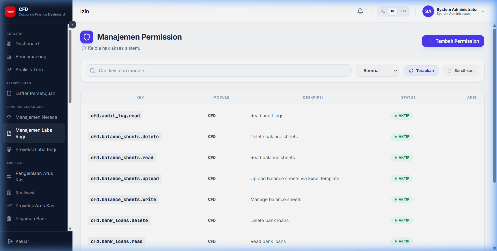

# Pengelolaan Pengguna

Administrator dapat mengelola akses pengguna melalui tiga komponen utama: User, Role, dan Permission.

## 1. Manajemen User

Menambah, mengedit, atau menonaktifkan akun pengguna.

- **Input User**: Username, Email, Password, dan pemilihan Role.
- **Akses Corporate**: Menentukan perusahaan mana saja yang boleh dilihat oleh user tersebut.

## 2. Manajemen Role (Peran)

Mendefinisikan grup hak akses.

- **Mapping Role**: Menentukan kumpulan permission apa saja yang dimiliki oleh sebuah role (misal: Role Finance Manager memiliki permission untuk input dan approve).

## 3. Manajemen Permission (Izin)

Daftar seluruh fungsi atau aksi teknis di dalam sistem yang dapat dikontrol aksesnya.

*Catatan: Sangat disarankan untuk tidak mengubah data Permission tanpa koordinasi dengan tim teknis.*
